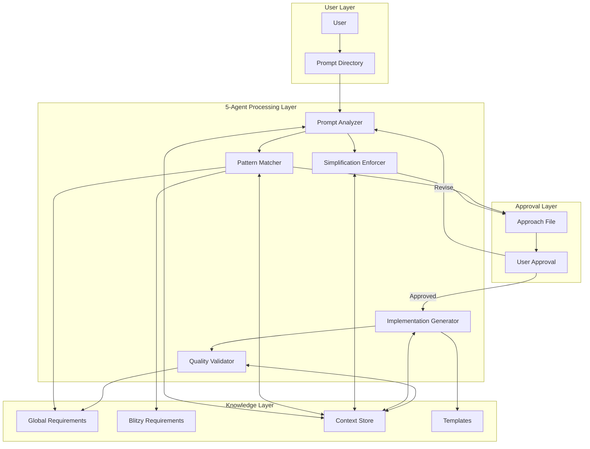
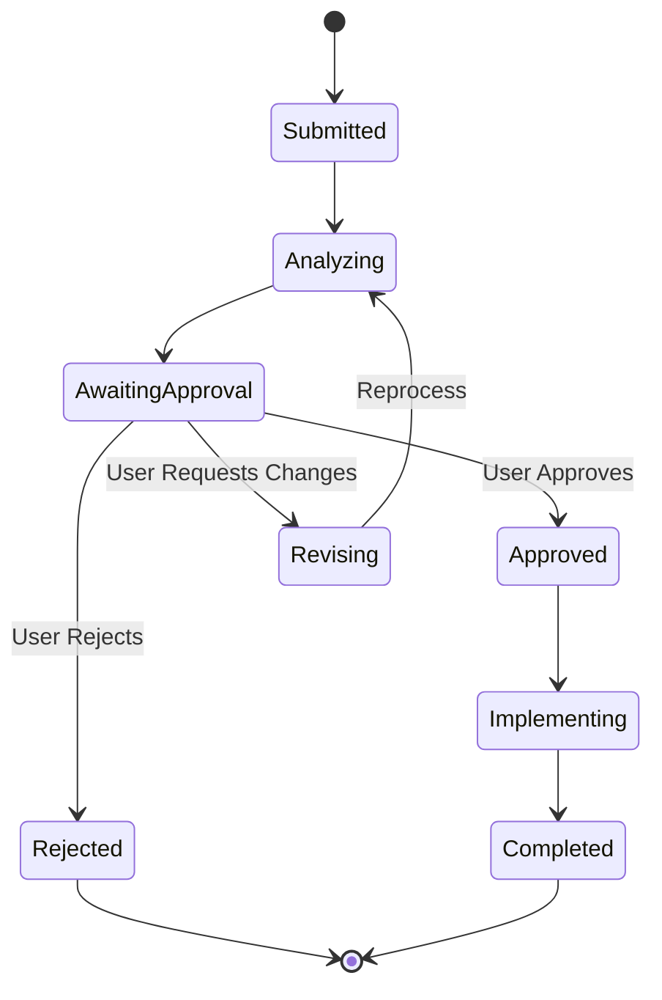
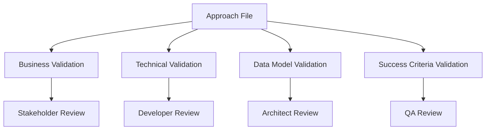
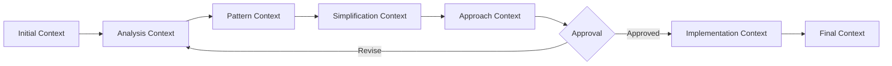
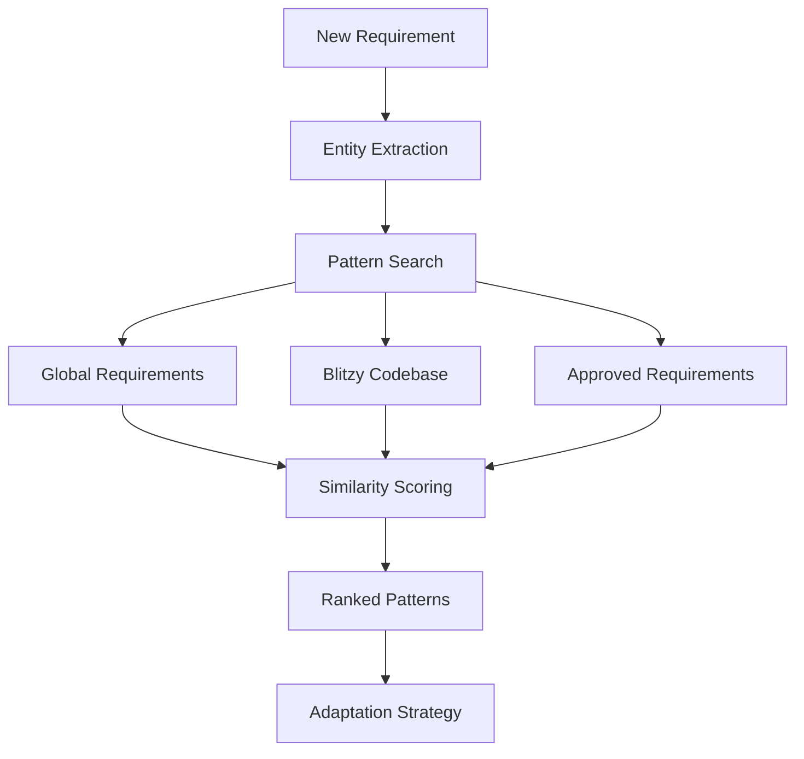
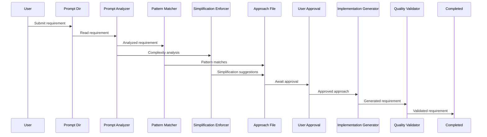
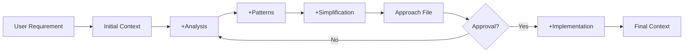

# Requirements Generation System Architecture

## Overview

This document provides comprehensive technical details of the simplified 5-agent requirements generation system architecture. The system emphasizes simplification, pattern reuse, and mandatory approval workflows to ensure high-quality requirements with first-approach accuracy.

## Table of Contents

- [Simplification Principles](#simplification-principles)
- [System Architecture](#system-architecture)
- [Directory Structure](#directory-structure)
- [Agent Configuration](#agent-configuration)
- [Approval Workflow Architecture](#approval-workflow-architecture)
- [Context Preservation Strategy](#context-preservation-strategy)
- [Pattern Reuse Architecture](#pattern-reuse-architecture)
- [Data Flow Architecture](#data-flow-architecture)
- [Performance and Scalability](#performance-and-scalability)
- [Technical Implementation Details](#technical-implementation-details)

## Simplification Principles

### Core Philosophy
"Make everything as simple as possible, but not simpler." - This principle drives every architectural decision.

### Architectural Simplifications

#### 1. Reduced Agent Count
- **Streamlined to 5 agents**: Optimized for clarity and efficiency
- **Clear responsibilities**: Each agent has a single, well-defined purpose
- **No overlapping functionality**: Eliminates confusion and redundancy
- **Sequential flow**: Simple, predictable processing path

#### 2. Mandatory Approval Checkpoint
- **Single approval point**: Between approach and implementation
- **No auto-proceed**: Human oversight prevents wasted effort
- **Clear decision options**: Approve, Revise, Reject, Defer
- **Context preservation**: All decisions and feedback retained

#### 3. Pattern-First Design
- **85%+ pattern reuse target**: Most requirements use existing patterns
- **GlobalRequirements leverage**: 64+ proven patterns ready to use
- **Codebase reference**: Real implementations guide new requirements
- **Minimal new patterns**: Only create when absolutely necessary

#### 4. Direct Implementation
- **No abstraction layers**: Direct mapping from requirement to implementation
- **Clear data flow**: Traceable path through the system
- **Explicit over implicit**: All behavior clearly documented
- **Minimal dependencies**: Reduce coupling between components

### Technical Simplifications

#### 1. Single Context Store
- **Unified storage**: One place for all context information
- **Simple JSON format**: Easy to read, debug, and modify
- **Version control friendly**: Track changes over time
- **No complex synchronization**: Sequential processing eliminates conflicts

#### 2. Template-Based Generation
- **Two templates only**: Approach and requirement templates
- **Consistent structure**: Every output follows the same format
- **Fill-in-the-blanks**: Simple variable substitution
- **No complex generation logic**: Templates drive the output

#### 3. File-Based Queue System
- **Simple directory structure**: Pending → In-Progress → Completed
- **No message brokers**: File system as the queue
- **Easy monitoring**: Simple file listings show status
- **Manual intervention possible**: Move files to adjust processing

#### 4. Synchronous Processing
- **Sequential agent execution**: No complex parallel coordination
- **Predictable order**: Always follows the same path
- **Easy debugging**: Clear execution trace
- **No race conditions**: Sequential processing prevents conflicts

## System Architecture

### High-Level Architecture



### Core Components

#### 5-Agent System

**1. Prompt Analyzer (PA)**
- **Purpose**: Deep requirement understanding and initial analysis
- **Inputs**: Raw requirement from prompt directory
- **Outputs**: Requirement summary, domain classification, complexity assessment
- **Context**: Creates initial context for all other agents

**2. Pattern Matcher (PM)**
- **Purpose**: Find reusable patterns from existing sources
- **Inputs**: Analyzed requirement, context from PA
- **Outputs**: Applicable GRs, reference implementations, pattern recommendations
- **Resources**: GlobalRequirements, blitzy-requirements (read-only)

**3. Simplification Enforcer (SE)**
- **Purpose**: Ensure solutions remain simple and maintainable
- **Inputs**: Requirement analysis, pattern matches
- **Outputs**: Complexity analysis, simplification suggestions, trade-offs
- **Focus**: Reducing complexity while maintaining functionality

**4. Implementation Generator (IG)**
- **Purpose**: Create detailed requirement after approval
- **Inputs**: Approved approach, full context
- **Outputs**: Complete requirement document using template
- **Trigger**: Only runs after user approval

**5. Quality Validator (QV)**
- **Purpose**: Final validation against all standards
- **Inputs**: Generated requirement
- **Outputs**: Validation report, compliance checklist
- **Checks**: GR compliance, pattern consistency, quality standards

### Active Shared Infrastructure

The shared-infrastructure directory contains actively maintained components that are essential to the system's operation:

#### Context Store
```
/shared-infrastructure/context-store/
├── domain-contexts/        # Domain-specific knowledge (actively used)
├── pattern-applications.json    # Applied patterns log (updated per requirement)
├── simplification-decisions.json # Simplification history (grows over time)
└── approval-history.json        # User feedback and decisions (audit trail)
```

#### Templates
```
/shared-infrastructure/templates/
├── approach-template.md    # For -approach.md files (enhanced with validation sections)
└── requirement-template.md # For final requirements (standardized output)
```

#### Agent Configurations
```
/shared-infrastructure/agent-configurations/
├── prompt-analyzer.yaml         # Current 5-agent system config
├── pattern-matcher.yaml         # Current 5-agent system config
├── simplification-enforcer.yaml # Current 5-agent system config
├── implementation-generator.yaml # Current 5-agent system config
├── quality-validator.yaml       # Current 5-agent system config
└── archived-11-agent-system/    # Historical reference only
```

#### Knowledge Base
```
/shared-infrastructure/knowledge-base/
├── entity-catalogs/        # Reusable entity definitions
├── pattern-libraries/      # Common pattern implementations
├── relationship-mappings/  # Entity relationship templates
└── architecture-decisions/ # ADRs and design choices
```

#### Processing Queues
```
/processing-queues/{domain}/
├── prompt/                 # User submissions
├── pending/               # Waiting for processing
├── in-progress/
│   ├── approaches/        # -approach.md files for review
│   └── implementations/   # Active implementation work
└── completed/             # Finished requirements
```

## Directory Structure

### Simplified System Organization

```
/app/workspace/requirements/
├── shared-infrastructure/           # Simplified shared components
│   ├── templates/                  # Only 2 templates needed
│   │   ├── approach-template.md    # For -approach.md files
│   │   └── requirement-template.md # For final requirements
│   ├── context-store/             # Simple context preservation
│   │   ├── domain-contexts/       # Domain knowledge JSONs
│   │   │   ├── producer-portal.json
│   │   │   ├── accounting.json
│   │   │   └── [domain].json
│   │   ├── pattern-applications.json
│   │   ├── simplification-decisions.json
│   │   └── approval-history.json
│   └── agent-configurations/       # 5 agent configs only
│       ├── prompt-analyzer.yaml
│       ├── pattern-matcher.yaml
│       ├── simplification-enforcer.yaml
│       ├── implementation-generator.yaml
│       └── quality-validator.yaml
├── processing-queues/              # Simple file-based queues
│   ├── [domain]/                  # Each domain has same structure
│   │   ├── prompt/               # WHERE USERS SUBMIT
│   │   ├── pending/              # Waiting for processing
│   │   ├── in-progress/          
│   │   │   ├── approaches/       # -approach.md FILES FOR REVIEW
│   │   │   └── implementations/  # After approval
│   │   └── completed/            # Finished requirements
│   └── multi-domain/             # For cross-domain requirements
├── GlobalRequirements/            # Existing 64+ patterns
├── [Domain]/                      # Domain documentation
│   ├── CLAUDE.md                 # Domain standards
│   └── approved-requirements/     # Domain patterns
├── blitzy-requirements/           # READ-ONLY reference
├── CLAUDE.md                     # System standards
├── README.md                     # Quick start guide
├── PROCESS_GUIDE.md             # Process documentation
├── USER_GUIDE.md                # User instructions
└── ARCHITECTURE.md              # This file
```

### Queue Flow Simplification

```
User Action                    Directory                     System Action
-----------                    ---------                     -------------
1. Submit requirement   -->    prompt/                  -->  Prompt Analyzer starts
2. System processes     -->    in-progress/approaches/  -->  Creates -approach.md
3. User reviews         <--    in-progress/approaches/  <--  WAITS FOR APPROVAL
4. User approves        -->    in-progress/implementations/ --> Implementation begins
5. System completes     -->    completed/               -->  Final requirement ready
```

### Context Store Design

Each requirement maintains a simple context file throughout its lifecycle:

```json
{
  "requirement_id": "IP269-UW-Questions",
  "domain": "producer-portal",
  "status": "awaiting_approval",
  "created": "2025-01-14T10:00:00Z",
  "analysis": {
    "complexity": "medium",
    "entities": ["quote", "uw_question", "driver"],
    "domain_classification": "single"
  },
  "patterns": {
    "global_requirements": ["GR-52", "GR-44", "GR-41"],
    "reference_implementations": ["quote-questions.tsx", "uw-api.php"],
    "reuse_score": 0.85
  },
  "simplification": {
    "original_complexity": "high",
    "simplified_to": "medium",
    "trade_offs": ["Removed real-time sync", "Simplified to batch updates"],
    "rationale": "Batch updates sufficient for UW questions"
  },
  "approval": {
    "status": "pending",
    "feedback": [],
    "revision_count": 0
  }
}

## Agent Configuration

### Simplified 5-Agent Configurations

#### 1. Prompt Analyzer Configuration
```yaml
# shared-infrastructure/agent-configurations/prompt-analyzer.yaml
agent:
  name: "Prompt Analyzer"
  type: "analysis"
  purpose: "Deep requirement understanding"

capabilities:
  - requirement_parsing
  - domain_classification
  - complexity_assessment
  - context_initialization

inputs:
  - requirement_text
  - domain_hint (optional)

outputs:
  - requirement_summary
  - domain_classification
  - complexity_score
  - initial_context

knowledge_base:
  - all_global_requirements
  - domain_patterns
  - entity_catalog
```

#### 2. Pattern Matcher Configuration
```yaml
# shared-infrastructure/agent-configurations/pattern-matcher.yaml
agent:
  name: "Pattern Matcher"
  type: "discovery"
  purpose: "Find reusable patterns"

capabilities:
  - global_requirements_search
  - codebase_pattern_search
  - similarity_scoring
  - pattern_adaptation

search_locations:
  - /GlobalRequirements/
  - /blitzy-requirements/ (read-only)
  - /{domain}/approved-requirements/

outputs:
  - applicable_grs
  - reference_implementations
  - pattern_recommendations
  - reuse_score
```

#### 3. Simplification Enforcer Configuration
```yaml
# shared-infrastructure/agent-configurations/simplification-enforcer.yaml
agent:
  name: "Simplification Enforcer"
  type: "optimization"
  purpose: "Ensure simplicity"

principles:
  - prefer_existing_patterns
  - direct_over_abstract
  - clear_over_clever
  - document_decisions

checks:
  - complexity_analysis
  - alternative_approaches
  - trade_off_documentation
  - simplification_opportunities

outputs:
  - complexity_score
  - simplification_suggestions
  - trade_offs
  - approval_readiness
```

#### 4. Implementation Generator Configuration
```yaml
# shared-infrastructure/agent-configurations/implementation-generator.yaml
agent:
  name: "Implementation Generator"
  type: "generation"
  purpose: "Create detailed requirement"

trigger: "user_approval"

template: "/shared-infrastructure/templates/requirement-template.md"

inputs:
  - approved_approach
  - full_context
  - user_feedback

outputs:
  - complete_requirement
  - implementation_details
  - api_specifications
  - database_schemas
```

#### 5. Quality Validator Configuration
```yaml
# shared-infrastructure/agent-configurations/quality-validator.yaml
agent:
  name: "Quality Validator"
  type: "validation"
  purpose: "Final quality check"

validation_checks:
  - global_requirements_compliance
  - pattern_consistency
  - infrastructure_alignment
  - documentation_completeness

thresholds:
  gr_compliance: 0.95
  pattern_reuse: 0.80
  quality_score: 0.90

outputs:
  - validation_report
  - compliance_checklist
  - quality_score
  - recommendations
```

## Approval Workflow Architecture

### Workflow States


### Approval File Structure
Each requirement generates an approach file for approval:

```markdown
# [Requirement ID] - Implementation Approach

## Status: AWAITING APPROVAL

## Requirement Understanding
[System's interpretation of the requirement]

## Pattern Analysis
- Applicable GRs: [List]
- Reference implementations: [List]
- Reuse score: [85%+]

## Simplification Approach
- Original complexity: [High/Medium/Low]
- Simplified solution: [Description]
- Trade-offs: [What we gain/lose]

## Proposed Implementation
[High-level implementation plan]

## Approval Section
**Decision**: [ ] APPROVED [ ] REVISE [ ] REJECT [ ] DEFER
**Feedback**: [User comments here]
```

### Approval Process Flow
1. **Approach Generation**: PA + PM + SE collaborate to create approach
2. **File Creation**: System creates `-approach.md` in `/approaches/`
3. **User Notification**: User informed approach is ready
4. **Review Period**: User reviews at their pace
5. **Decision Recording**: User updates approval section
6. **System Response**: Based on decision, system proceeds or revises

## Validation Architecture

### Multi-Layer Validation Strategy
The system implements comprehensive validation through enhanced approach files that serve multiple stakeholder needs:



### Validation Sections in Approach Files

#### 1. Business Summary for Stakeholders
```markdown
## Business Summary for Stakeholders
### What We're Building
[Plain English explanation without technical jargon]

### Why It's Needed
[Business value and problem being solved]

### Expected Outcomes
[What success looks like from business perspective]
```
**Purpose**: Enables non-technical stakeholders to validate business alignment

#### 2. Technical Summary for Developers
```markdown
## Technical Summary for Developers
### Key Technical Decisions
- Architecture Pattern: [e.g., microservice, API-driven]
- Technology Choices: [frameworks, libraries]
- Integration Approach: [APIs, events, direct DB]

### Implementation Guidelines
- Critical code patterns to follow
- Performance considerations
- Security requirements
- Error handling approach
```
**Purpose**: Provides developers with clear implementation guidance

#### 3. Suggested Tables and Schemas
```markdown
## Suggested Tables and Schemas
- **Table 1**: [purpose, key fields, relationships]
- **Table 2**: [purpose, key fields, relationships]
- **Key Indexes**: [performance-critical indexes]
- **Constraints**: [foreign keys, unique constraints]
```
**Purpose**: Enables database architects to validate data model design

#### 4. Validation Criteria
```markdown
## Validation Criteria
### Pre-Implementation Checkpoints
- [ ] Business requirements clearly understood
- [ ] Technical approach aligns with standards
- [ ] Database schema follows conventions
- [ ] Pattern reuse maximized (85%+ target)

### Success Metrics
- [ ] [Specific measurable outcome 1]
- [ ] [Performance target if applicable]
- [ ] [Quality threshold if applicable]
```
**Purpose**: Provides clear, measurable success criteria for QA validation

### Validation Flow Through System

1. **Prompt Analyzer**: Initial validation of requirement completeness
2. **Pattern Matcher**: Validates pattern reuse opportunities
3. **Simplification Enforcer**: Validates complexity reduction
4. **Approach Generation**: Creates comprehensive validation document
5. **User Review**: Multi-stakeholder validation checkpoint
6. **Implementation Generator**: Validates approach adherence
7. **Quality Validator**: Final validation against all criteria

## Context Preservation Strategy

### Context Lifecycle


### Context Components

#### 1. Requirement Context
```json
{
  "original_text": "User's requirement",
  "submitted_by": "user_id",
  "domain": "producer-portal",
  "timestamp": "2025-01-14T10:00:00Z"
}
```

#### 2. Analysis Context
```json
{
  "entities": ["quote", "driver", "uw_question"],
  "complexity": "medium",
  "domain_classification": "single",
  "key_features": ["List of identified features"]
}
```

#### 3. Pattern Context
```json
{
  "global_requirements": ["GR-52", "GR-44"],
  "reference_implementations": ["file1.tsx", "file2.php"],
  "reuse_opportunities": ["Specific patterns to reuse"],
  "new_patterns_needed": ["If any"]
}
```

#### 4. Simplification Context
```json
{
  "original_approach": "Complex multi-service design",
  "simplified_approach": "Single service with batch updates",
  "trade_offs": ["Real-time updates", "Complex error handling"],
  "benefits": ["50% less code", "Easier maintenance"]
}
```

#### 5. Approval Context
```json
{
  "decision": "APPROVED",
  "feedback": ["User's specific feedback"],
  "revision_count": 0,
  "approval_timestamp": "2025-01-14T14:00:00Z"
}
```

### Context Storage
- **Location**: `/shared-infrastructure/context-store/`
- **Format**: JSON for easy parsing and version control
- **Naming**: `{requirement-id}-context.json`
- **Retention**: Kept with completed requirement for reference

## Pattern Reuse Architecture

### Pattern Discovery Process


### Pattern Sources

#### 1. Global Requirements (Primary)
- **Location**: `/GlobalRequirements/IndividualRequirements/`
- **Count**: 64+ proven patterns
- **Usage**: Direct application where applicable
- **Example**: GR-52 for entity management

#### 2. Blitzy Codebase (Reference)
- **Location**: `/blitzy-requirements/` (READ-ONLY)
- **Usage**: Find implementation examples
- **Search**: By entity, feature, or technology
- **Example**: Quote management in `quote-controller.php`

#### 3. Approved Requirements (Domain)
- **Location**: `/{domain}/approved-requirements/`
- **Usage**: Domain-specific patterns
- **Benefit**: Pre-validated for the domain
- **Example**: ProducerPortal quote workflows

### Pattern Application Strategy
1. **Exact Match**: Use pattern as-is (90%+ similarity)
2. **Adapt Pattern**: Modify for specific needs (70-90% similarity)
3. **Combine Patterns**: Merge multiple patterns (50-70% similarity)
4. **New Pattern**: Only if <50% similarity to existing patterns

### Pattern Tracking
```json
{
  "requirement_id": "IP269",
  "patterns_applied": [
    {
      "source": "GR-52",
      "type": "exact_match",
      "confidence": 0.95
    },
    {
      "source": "quote-controller.php",
      "type": "adapted",
      "confidence": 0.82,
      "adaptations": ["Changed from REST to GraphQL"]
    }
  ],
  "new_patterns_created": [],
  "reuse_score": 0.88
}


## Data Flow Architecture

### Simplified Request Processing Flow



### Context Flow



### File System as Queue

```
1. User places file in prompt/
2. System detects new file
3. Moves to in-progress/
4. Creates -approach.md
5. Waits for user decision
6. Processes based on decision
7. Moves to completed/
```

## Performance and Scalability

### Simplified Performance Targets

#### Processing Times
- **Approach Generation**: 5-10 minutes
- **User Review**: Variable (human-paced)
- **Implementation**: 10-15 minutes
- **Total Active Time**: 15-25 minutes

#### Quality Metrics
- **First-Approach Accuracy**: 90%+
- **Pattern Reuse**: 85%+
- **Approval Rate**: 90%+
- **Revision Cycles**: <2

### Scalability Through Simplicity

#### Why It Scales
1. **No Complex Coordination**: Sequential processing eliminates race conditions
2. **File-Based Queue**: OS handles concurrency
3. **Stateless Agents**: Each agent is independent
4. **Simple Context**: JSON files are easy to manage

#### Scaling Strategy
- **Multiple Domains**: Each domain processes independently
- **Batch Processing**: Group related requirements
- **Parallel Domains**: Different domains run simultaneously
- **Simple Load Balancing**: Round-robin file processing

## Technical Implementation Details

### Simple Agent Implementation

```python
class PromptAnalyzer:
    def analyze(self, requirement_text):
        """Simple, direct analysis"""
        return {
            "summary": self.extract_summary(requirement_text),
            "domain": self.classify_domain(requirement_text),
            "entities": self.extract_entities(requirement_text),
            "complexity": self.assess_complexity(requirement_text)
        }

class PatternMatcher:
    def find_patterns(self, context):
        """Direct pattern search"""
        patterns = []
        patterns.extend(self.search_global_requirements(context))
        patterns.extend(self.search_codebase(context))
        patterns.extend(self.search_approved_requirements(context))
        return self.rank_by_similarity(patterns)

class SimplificationEnforcer:
    def simplify(self, requirement, patterns):
        """Enforce simplicity"""
        return {
            "current_complexity": self.measure_complexity(requirement),
            "simpler_approach": self.find_simpler_solution(requirement, patterns),
            "trade_offs": self.document_trade_offs(),
            "benefits": self.list_simplification_benefits()
        }
```

### File-Based Queue Management

```python
class QueueManager:
    def __init__(self, domain):
        self.domain = domain
        self.paths = {
            "prompt": f"/processing-queues/{domain}/prompt/",
            "pending": f"/processing-queues/{domain}/pending/",
            "approaches": f"/processing-queues/{domain}/in-progress/approaches/",
            "implementations": f"/processing-queues/{domain}/in-progress/implementations/",
            "completed": f"/processing-queues/{domain}/completed/"
        }
    
    def get_next_requirement(self):
        """Simple file-based queue"""
        files = os.listdir(self.paths["prompt"])
        if files:
            return files[0]  # FIFO
        return None
    
    def move_to_processing(self, filename):
        """Simple file move"""
        shutil.move(
            os.path.join(self.paths["prompt"], filename),
            os.path.join(self.paths["pending"], filename)
        )
```

### Context Management

```python
class ContextManager:
    def __init__(self, requirement_id):
        self.requirement_id = requirement_id
        self.context_file = f"/context-store/{requirement_id}-context.json"
        self.context = self.load_or_create()
    
    def load_or_create(self):
        """Simple JSON context"""
        if os.path.exists(self.context_file):
            with open(self.context_file, 'r') as f:
                return json.load(f)
        return {"requirement_id": self.requirement_id}
    
    def update(self, key, value):
        """Simple update and save"""
        self.context[key] = value
        with open(self.context_file, 'w') as f:
            json.dump(self.context, f, indent=2)
    
    def get(self, key, default=None):
        """Simple getter"""
        return self.context.get(key, default)
```

### Approval Workflow Implementation

```python
class ApprovalWorkflow:
    def create_approach_file(self, requirement_id, approach_content):
        """Create -approach.md for review"""
        filename = f"{requirement_id}-approach.md"
        filepath = f"/in-progress/approaches/{filename}"
        
        with open(filepath, 'w') as f:
            f.write(approach_content)
        
        return filepath
    
    def check_approval_status(self, requirement_id):
        """Simple file-based approval check"""
        approach_file = f"/in-progress/approaches/{requirement_id}-approach.md"
        
        with open(approach_file, 'r') as f:
            content = f.read()
        
        if "Decision: [X] APPROVED" in content:
            return "approved"
        elif "Decision: [X] REVISE" in content:
            return "revise"
        elif "Decision: [X] REJECT" in content:
            return "reject"
        else:
            return "pending"
```

---

**Last Updated**: 2025-01-14  
**Architecture Version**: 5-Agent Simplified System  
**Status**: Ready for implementation  
**Focus**: Simplicity, Approval Workflow, Pattern Reuse