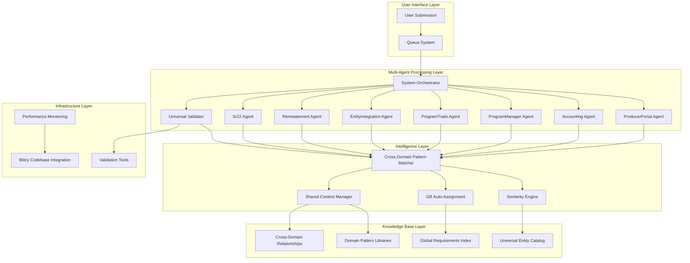
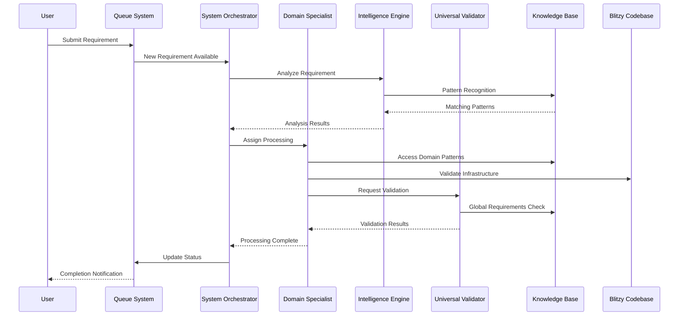
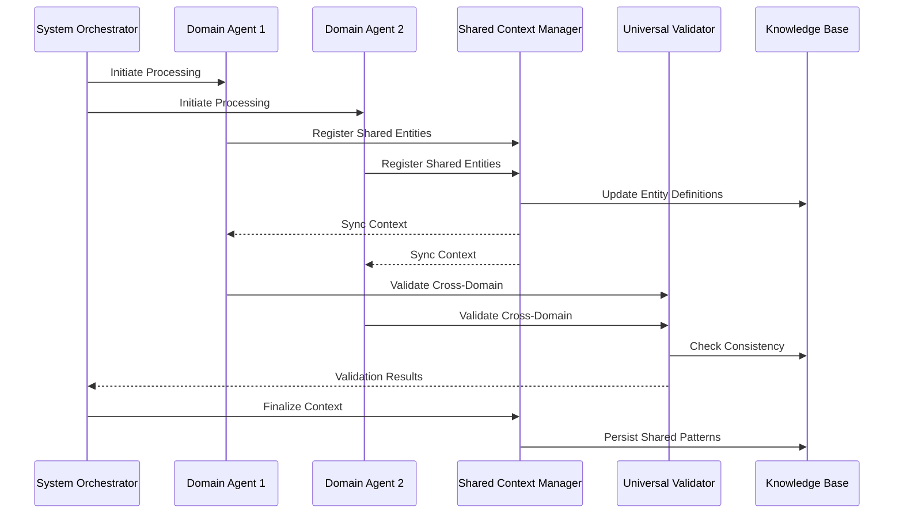
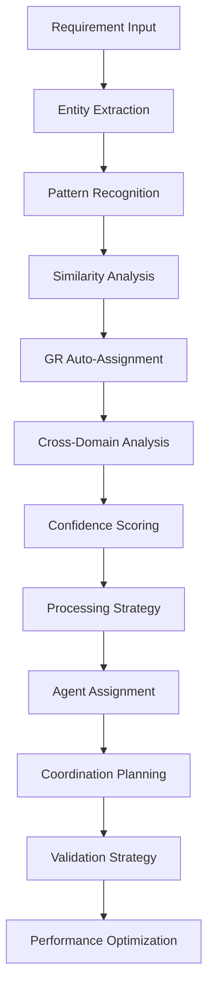

# Requirements Generation System Architecture

## Overview

This document provides comprehensive technical details of the multi-agent requirements generation system architecture. The system transforms traditional manual requirement creation into an intelligent, coordinated, and automated process leveraging cross-domain patterns and shared infrastructure.

## Table of Contents

- [System Architecture](#system-architecture)
- [Directory Structure](#directory-structure)
- [Agent Configuration](#agent-configuration)
- [Knowledge Base Organization](#knowledge-base-organization)
- [Integration Patterns](#integration-patterns)
- [Data Flow Architecture](#data-flow-architecture)
- [Performance and Scalability](#performance-and-scalability)
- [Security and Compliance](#security-and-compliance)
- [Technical Implementation Details](#technical-implementation-details)

## System Architecture

### High-Level Architecture



### Core Components

#### Processing Layer Components

**System Orchestrator (SO)**
- **Purpose**: Central coordination hub for multi-domain processing
- **Capabilities**: Cross-domain analysis, dependency resolution, batch optimization
- **Configuration**: `/shared-infrastructure/agent-configurations/system-orchestrator.yaml`
- **Memory**: Shared context with all agents, persistent across sessions

**Domain Specialist Agents (D1-D7)**
- **Purpose**: Domain-specific expertise and processing
- **Capabilities**: Specialized business logic, domain pattern application, entity management
- **Configuration**: Individual YAML files per domain in `/agent-configurations/`
- **Memory**: Domain-specific context plus shared cross-domain context

**Universal Validator (UV)**
- **Purpose**: Quality assurance and compliance validation
- **Capabilities**: Progressive validation, Global Requirements compliance, infrastructure alignment
- **Configuration**: `/shared-infrastructure/agent-configurations/universal-validator.yaml`
- **Memory**: Validation history, pattern compliance metrics, failure analysis

#### Intelligence Layer Components

**Cross-Domain Pattern Matcher (CPM)**
- **Purpose**: Identify reusable patterns across business domains
- **Algorithm**: Semantic similarity analysis with confidence scoring
- **Integration**: Real-time pattern library updates and cross-domain relationship mapping

**Similarity Engine (SE)**
- **Purpose**: Advanced requirement similarity analysis and pattern recognition
- **Algorithm**: Multi-dimensional similarity scoring including entity, workflow, and integration patterns
- **Performance**: >80% accuracy target with continuous learning improvement

**GR Auto-Assignment Engine (GRA)**
- **Purpose**: Automatic Global Requirements assignment and compliance tracking
- **Coverage**: All 64+ Global Requirements with applicability rules
- **Accuracy**: >95% assignment accuracy with human validation fallback

**Shared Context Manager (SCM)**
- **Purpose**: Real-time synchronization of context across all agents
- **Technology**: Event-driven synchronization with conflict resolution
- **Performance**: <5% coordination overhead target

## Directory Structure

### Complete System Organization

```
/app/workspace/requirements/
├── shared-infrastructure/                    # System-wide shared components
│   ├── knowledge-base/                      # Cross-domain intelligence
│   │   ├── universal-entity-catalog.json   # GR-52 compliant entity definitions
│   │   ├── global-requirements-index.json  # Complete GR mapping and rules
│   │   ├── global-patterns/                # Cross-domain reusable patterns
│   │   │   ├── universal-entities/         # Entity patterns (driver, vehicle, quote, etc.)
│   │   │   ├── communication-templates/    # GR-44 messaging patterns
│   │   │   ├── database-schemas/           # GR-41 standardized schemas
│   │   │   └── service-integrations/       # GR-38 microservice patterns
│   │   ├── domain-patterns/                # Domain-specific pattern libraries
│   │   │   ├── producer-portal/            # Quote, producer, entity patterns
│   │   │   ├── accounting/                 # Billing, payment, commission patterns
│   │   │   ├── program-manager/            # Rate factor, underwriting patterns
│   │   │   ├── program-traits/             # Program-specific rule patterns
│   │   │   ├── entity-integration/         # External API integration patterns
│   │   │   ├── reinstatement/              # Policy lifecycle patterns
│   │   │   └── sr22/                       # Compliance filing patterns
│   │   ├── cross-domain-relationships/     # Inter-domain entity relationships
│   │   │   └── relationship-map.json       # Complete relationship mapping
│   │   ├── architectural-decisions/        # Global ADR repository
│   │   │   └── decision-index.json         # Searchable decision catalog
│   │   └── performance-metrics/            # System-wide performance tracking
│   │       └── performance-baselines.json  # Target and actual metrics
│   ├── validation-tools/                   # Shared validation components
│   │   ├── gr-compliance-checker.py        # Global Requirements validation
│   │   ├── cross-domain-validator.py       # Cross-domain consistency checking
│   │   └── infrastructure-validator.py     # Codebase alignment validation
│   ├── intelligence-engines/               # Pattern recognition and analysis
│   │   ├── system-orchestrator-engine.py   # Central coordination logic
│   │   ├── cross-domain-pattern-matcher.py # Pattern recognition engine
│   │   ├── similarity-engine.py            # Advanced similarity analysis
│   │   ├── entity-extractor.py             # Automatic entity identification
│   │   ├── confidence-scorer.py            # Pattern confidence scoring
│   │   ├── requirement-similarity.py       # Requirement similarity calculator
│   │   ├── relationship-analyzer.py        # Cross-domain relationship analysis
│   │   ├── batch-optimizer.py              # Batch processing optimization
│   │   ├── gr-auto-assignment.py           # GR automatic assignment
│   │   ├── gr-compliance-predictor.py      # Compliance prediction
│   │   ├── gr-impact-analyzer.py           # GR impact analysis
│   │   ├── shared-context-manager.py       # Real-time context synchronization
│   │   └── agent-memory-interface.py       # Agent memory management
│   ├── agent-configurations/               # Multi-agent system configurations
│   │   ├── system-orchestrator.yaml        # Central coordinator configuration
│   │   ├── domain-specialist-template.yaml # Template for domain agents
│   │   ├── producer-portal-specialist.yaml # ProducerPortal agent configuration
│   │   ├── accounting-specialist.yaml      # Accounting agent configuration
│   │   ├── program-manager-specialist.yaml # ProgramManager agent configuration
│   │   ├── program-traits-specialist.yaml  # ProgramTraits agent configuration
│   │   ├── entity-integration-specialist.yaml # EntityIntegration agent configuration
│   │   ├── reinstatement-specialist.yaml   # Reinstatement agent configuration
│   │   ├── sr22-specialist.yaml            # Sr22 agent configuration
│   │   ├── universal-validator.yaml        # Universal validator configuration
│   │   └── sync-configuration.yaml         # Real-time synchronization settings
│   ├── monitoring-dashboard/               # System-wide performance monitoring
│   │   ├── performance-dashboard.py        # Real-time performance dashboard
│   │   ├── metrics-collector.py            # Performance metrics collection
│   │   ├── improvement-engine.py           # Continuous improvement recommendations
│   │   └── real-time-monitor.py            # Real-time monitoring interface
│   └── integration-patterns/               # Cross-domain integration templates
│       ├── quote-to-billing-integration.yaml
│       ├── rate-factor-program-traits-integration.yaml
│       └── dcs-entity-integration.yaml
├── processing-queues/                       # Centralized queue system
│   ├── multi-domain/                       # Cross-domain requirement coordination
│   │   ├── pending/                        # Multi-domain requirements awaiting processing
│   │   ├── in-progress/                    # Active multi-domain processing
│   │   │   └── batch-{id}/                 # Coordinated batch processing
│   │   │       ├── batch-config.json       # Batch configuration and dependencies
│   │   │       ├── shared-entities.json    # Shared entity definitions
│   │   │       └── processing-status.json  # Real-time processing status
│   │   ├── completed/                      # Finished multi-domain requirements
│   │   ├── intelligence/                   # Pre-processing analysis results
│   │   └── cross-domain-batches/           # Multi-domain requirement sets
│   ├── producer-portal/                    # ProducerPortal specific processing
│   │   ├── pending/, in-progress/, completed/, intelligence/, cross-domain-batches/
│   ├── accounting/                         # Accounting specific processing
│   │   ├── pending/, in-progress/, completed/, intelligence/, cross-domain-batches/
│   ├── program-manager/                    # ProgramManager specific processing
│   │   ├── pending/, in-progress/, completed/, intelligence/, cross-domain-batches/
│   ├── program-traits/                     # ProgramTraits specific processing
│   │   ├── pending/, in-progress/, completed/, intelligence/, cross-domain-batches/
│   ├── entity-integration/                 # EntityIntegration specific processing
│   │   ├── pending/, in-progress/, completed/, intelligence/, cross-domain-batches/
│   ├── reinstatement/                      # Reinstatement specific processing
│   │   ├── pending/, in-progress/, completed/, intelligence/, cross-domain-batches/
│   └── sr22/                              # Sr22 specific processing
│       ├── pending/, in-progress/, completed/, intelligence/, cross-domain-batches/
├── GlobalRequirements/                      # System-wide standards (existing)
│   └── IndividualRequirements/             # 64+ Global Requirements definitions
├── ProducerPortal/                          # Enhanced with shared patterns (existing)
│   ├── CLAUDE.md                           # Domain-specific standards
│   ├── approved-requirements/              # Existing approved patterns
│   ├── templates/                          # Requirement templates
│   └── queue/                              # Legacy queue system (maintained for compatibility)
├── Accounting/                              # Enhanced with shared patterns (existing)
├── ProgramManager/                          # Enhanced with shared patterns (existing)
├── ProgramTraits/                           # Enhanced with shared patterns (existing)
├── EntityIntegration/                       # Enhanced with shared patterns (existing)
├── Reinstatement/                           # Enhanced with shared patterns (existing)
├── Sr22/                                    # Enhanced with shared patterns (existing)
├── CLAUDE.md                               # System-wide standards reference
├── README.md                               # System overview and navigation
├── PROCESS_GUIDE.md                        # Workflow and process documentation
├── USER_GUIDE.md                           # Practical usage instructions
└── ARCHITECTURE.md                         # Technical architecture documentation (this file)
```

### Queue System Architecture

Each domain queue follows a standardized structure designed for efficient processing and monitoring:

```
{domain}/
├── pending/                    # Requirements awaiting agent availability
│   └── {requirement-id}.md     # Individual requirement files
├── in-progress/               # Active processing
│   ├── individual/            # Single requirement processing
│   │   ├── {req-id}.md        # Requirement being processed
│   │   ├── {req-id}-approach.md # Processing approach and strategy
│   │   └── {req-id}-status.json # Real-time processing status
│   └── batch-{timestamp}/     # Coordinated batch processing
│       ├── batch-config.json  # Batch configuration and coordination
│       ├── shared-entities.json # Shared entity definitions within batch
│       ├── dependency-map.json # Requirement dependencies
│       ├── {req1}.md          # Individual requirements in batch
│       ├── {req1}-approach.md # Processing approaches
│       └── processing-metrics.json # Real-time performance metrics
├── completed/                # Finished requirements
│   └── {requirement-id}/      # Complete requirement package
│       ├── {requirement-id}.md # Final requirement specification
│       ├── {requirement-id}-approach.md # Final processing approach
│       ├── cross-domain-links.json # Links to related requirements
│       ├── pattern-contributions.json # New patterns contributed
│       └── processing-metrics.json # Performance and quality metrics
├── intelligence/             # Pre-processing analysis
│   └── {requirement-id}-intelligence.json # AI analysis results
└── cross-domain-batches/     # Multi-domain coordination
    └── {workflow-name}/       # Named workflow coordination
        ├── batch-config.json  # Multi-domain batch configuration
        ├── dependency-map.json # Cross-domain dependencies
        ├── shared-context.json # Shared processing context
        └── coordination-log.json # Real-time coordination status
```

## Agent Configuration

### System Orchestrator Configuration

```yaml
# shared-infrastructure/agent-configurations/system-orchestrator.yaml
agent:
  name: "System Orchestrator"
  version: "3.0"
  scope: "system_wide"
  role: "coordination_and_strategy"

capabilities:
  multi_domain_intelligence:
    enabled: true
    coordination_scope: "all_domains"
    dependency_analysis: true
    batch_optimization: true
    
  global_requirements_mastery:
    enabled: true
    gr_coverage: 64
    auto_assignment: true
    compliance_prediction: true
    impact_analysis: true
    
  cross_domain_coordination:
    enabled: true
    shared_entity_management: true
    workflow_orchestration: true
    resource_optimization: true

domain_coverage:
  - producer_portal
  - accounting
  - program_manager
  - program_traits
  - entity_integration
  - reinstatement
  - sr22

global_requirements_expertise:
  core_standards:
    universal_entity_management: "GR-52"
    communication_architecture: "GR-44"
    database_standards: "GR-41"
    microservice_architecture: "GR-38"
    dcs_integration: "GR-53"
  domain_specific:
    policy_reinstatement: "GR-64"
    sr22_filing: "GR-10"
    performance_requirements: "GR-08, GR-27"
    security_standards: "GR-01, GR-12, GR-24, GR-36"

intelligence_engines:
  pattern_recognition: "cross-domain-pattern-matcher"
  similarity_analysis: "similarity-engine"
  gr_automation: "gr-auto-assignment"
  context_management: "shared-context-manager"
  batch_optimization: "batch-optimizer"

memory_management:
  shared_context: true
  cross_domain_sync: true
  persistence: true
  sync_interval_seconds: 15
  conflict_resolution: "orchestrator_priority"

performance_targets:
  coordination_overhead: "<5%"
  pattern_recognition_accuracy: ">80%"
  gr_assignment_accuracy: ">95%"
  batch_optimization_improvement: ">30%"
```

### Domain Specialist Configuration Template

```yaml
# shared-infrastructure/agent-configurations/domain-specialist-template.yaml
agent:
  name: "Domain Specialist - {DOMAIN}"
  version: "3.0"
  domain: "{DOMAIN}"
  role: "domain_expertise_and_processing"

capabilities:
  domain_expertise:
    enabled: true
    specialized_patterns: true
    business_rule_application: true
    entity_specialization: true
    
  shared_intelligence:
    enabled: true
    cross_domain_awareness: true
    global_pattern_access: true
    universal_entity_usage: true
    
  collaborative_processing:
    enabled: true
    shared_context_participation: true
    cross_domain_coordination: true
    batch_processing: true

# Domain-specific configurations (instantiated per domain)
domain_specializations:
  producer_portal:
    entities:
      primary: [quote, driver, vehicle, producer]
      supporting: [entity_relationships, producer_hierarchy]
    workflows:
      quote_management: "creation_to_binding"
      producer_workflows: "onboarding_to_management"
      entity_relationships: "hierarchical_management"
    integrations:
      dcs_api: "household_data_verification"
      communication_hub: "producer_notifications"
    patterns:
      approved_requirements: "/ProducerPortal/approved-requirements/"
      entity_catalog: "producer_portal_entities.json"
      
  accounting:
    entities:
      primary: [billing, payment, commission, ach_transaction]
      supporting: [billing_cycle, payment_schedule, commission_structure]
    workflows:
      billing_cycle: "generation_to_collection"
      payment_processing: "initiation_to_settlement"
      commission_calculation: "quote_to_payout"
    integrations:
      payment_gateways: "multi_processor_support"
      banking_apis: "ach_and_wire_processing"
    patterns:
      approved_requirements: "/Accounting/approved-requirements/"
      entity_catalog: "accounting_entities.json"

shared_patterns:
  universal_entities: "GR-52"
  communication_templates: "GR-44"
  database_schemas: "GR-41"
  service_integrations: "GR-38"

intelligence_access:
  pattern_library: "shared-infrastructure/knowledge-base/domain-patterns/{domain}/"
  universal_entities: "shared-infrastructure/knowledge-base/universal-entity-catalog.json"
  cross_domain_relationships: "shared-infrastructure/knowledge-base/cross-domain-relationships/"
  global_requirements: "GlobalRequirements/IndividualRequirements/"

memory_management:
  domain_context: true
  shared_context_access: true
  pattern_learning: true
  performance_tracking: true

validation_integration:
  progressive_stages: true
  domain_specific_validation: true
  cross_domain_consistency: true
  infrastructure_alignment: true
```

### Universal Validator Configuration

```yaml
# shared-infrastructure/agent-configurations/universal-validator.yaml
agent:
  name: "Universal Validator"
  version: "3.0"
  scope: "system_wide"
  role: "quality_assurance_and_compliance"

capabilities:
  progressive_validation:
    enabled: true
    fail_fast: true
    performance_optimization: true
    
  global_standards_enforcement:
    enabled: true
    comprehensive_gr_coverage: true
    automatic_compliance_checking: true
    
  cross_domain_validation:
    enabled: true
    shared_entity_consistency: true
    integration_validation: true
    workflow_coordination_validation: true
    
  infrastructure_alignment:
    enabled: true
    codebase_pattern_validation: true
    database_schema_consistency: true
    api_pattern_compliance: true

validation_stages:
  structure:
    duration_minutes: 3
    scope: "format_and_template_compliance"
    checks:
      - template_structure_compliance
      - required_sections_present
      - format_standardization
    failure_handling: "immediate_rejection"
    
  domain_patterns:
    duration_minutes: 7
    scope: "domain_specific_validation"
    checks:
      - business_rule_compliance
      - entity_pattern_adherence
      - workflow_consistency
      - domain_standard_alignment
    failure_handling: "detailed_feedback"
    
  cross_domain:
    duration_minutes: 10
    scope: "cross_domain_consistency"
    checks:
      - shared_entity_definition_consistency
      - cross_domain_relationship_integrity
      - integration_pattern_validation
      - workflow_coordination_validation
    failure_handling: "coordination_required"
    
  global_requirements:
    duration_minutes: 15
    scope: "comprehensive_gr_compliance"
    checks:
      - all_applicable_grs_assigned
      - gr_52_universal_entity_compliance
      - gr_44_communication_architecture_compliance
      - gr_41_database_standards_compliance
      - gr_38_microservice_architecture_compliance
      - gr_53_dcs_integration_compliance
      - domain_specific_gr_compliance
    failure_handling: "iterative_improvement"
    
  infrastructure:
    duration_minutes: 10
    scope: "codebase_and_infrastructure_alignment"
    checks:
      - existing_pattern_alignment
      - database_schema_compatibility
      - api_endpoint_consistency
      - service_layer_integration
      - performance_impact_assessment
    failure_handling: "infrastructure_coordination"

quality_gates:
  minimum_thresholds:
    global_requirements_compliance: 0.95
    cross_domain_consistency: 0.90
    infrastructure_alignment: 0.85
    pattern_reuse_rate: 0.80
    
  performance_targets:
    total_validation_time: "<45_minutes"
    fail_fast_detection: "<5_minutes"
    feedback_quality: ">90%_actionable"

validation_tools:
  gr_compliance_checker: "validation-tools/gr-compliance-checker.py"
  cross_domain_validator: "validation-tools/cross-domain-validator.py"
  infrastructure_validator: "validation-tools/infrastructure-validator.py"
  pattern_consistency_checker: "intelligence-engines/pattern-consistency.py"

integration_points:
  blitzy_codebase: "/app/workspace/blitzy-requirements/"
  global_requirements: "/app/workspace/requirements/GlobalRequirements/"
  approved_patterns: "/app/workspace/requirements/{domain}/approved-requirements/"
  universal_entities: "shared-infrastructure/knowledge-base/universal-entity-catalog.json"
```

## Knowledge Base Organization

### Universal Entity Catalog Structure

```json
{
  "metadata": {
    "version": "1.0",
    "last_updated": "2025-01-07T00:00:00Z",
    "compliance_standard": "GR-52",
    "total_entities": 15,
    "cross_domain_entities": 12
  },
  "core_business_entities": {
    "quote": {
      "entity_id": "quote_001",
      "universal_pattern": "GR-52",
      "domains": ["producer-portal", "accounting", "program-manager"],
      "primary_domain": "producer-portal",
      "shared_attributes": {
        "id": "uuid",
        "status": "enum",
        "created_at": "timestamp",
        "updated_at": "timestamp"
      },
      "domain_specializations": {
        "producer-portal": {
          "quote_number": "string",
          "producer_id": "foreign_key",
          "named_insured": "json"
        },
        "accounting": {
          "billing_schedule": "json",
          "payment_terms": "enum"
        },
        "program-manager": {
          "rate_factors": "json",
          "underwriting_results": "json"
        }
      },
      "relationships": {
        "driver": "one_to_many",
        "vehicle": "one_to_many",
        "coverage": "one_to_many",
        "billing": "one_to_one"
      },
      "integration_points": [
        "DCS_verification",
        "payment_processing",
        "rate_calculation"
      ],
      "performance_metrics": {
        "average_processing_time": "15_minutes",
        "reuse_rate": "92%",
        "cross_domain_usage": "85%"
      }
    },
    "driver": {
      "entity_id": "driver_001",
      "universal_pattern": "GR-52",
      "domains": ["producer-portal", "entity-integration", "sr22"],
      "primary_domain": "producer-portal",
      "shared_attributes": {
        "id": "uuid",
        "license_number": "string",
        "date_of_birth": "date",
        "license_state": "string"
      },
      "domain_specializations": {
        "producer-portal": {
          "quote_id": "foreign_key",
          "driver_type": "enum",
          "relationship_to_named_insured": "enum"
        },
        "entity-integration": {
          "dcs_household_id": "string",
          "verification_status": "enum",
          "last_verified": "timestamp"
        },
        "sr22": {
          "filing_required": "boolean",
          "filing_status": "enum",
          "filing_expiration": "date"
        }
      },
      "relationships": {
        "quote": "many_to_one",
        "vehicle": "many_to_many",
        "violation": "one_to_many",
        "sr22_filing": "one_to_many"
      },
      "integration_points": [
        "DCS_household_lookup",
        "criminal_background_check",
        "violation_history",
        "sr22_filing_management"
      ]
    }
  },
  "integration_entities": {
    "dcs_api": {
      "entity_id": "dcs_001",
      "pattern": "GR-53",
      "used_by": ["producer-portal", "entity-integration"],
      "endpoints": {
        "household_drivers": "/api/v2.7/household/drivers",
        "household_vehicles": "/api/v2.3/household/vehicles",
        "criminal_history": "/api/v1.0/criminal/background"
      },
      "authentication": "oauth2_client_credentials",
      "rate_limits": "1000_requests_per_hour",
      "integration_patterns": "async_with_webhook_confirmation"
    },
    "communication_hub": {
      "entity_id": "comm_001",
      "pattern": "GR-44",
      "used_by": ["all_domains"],
      "channels": {
        "email": "transactional_and_marketing",
        "sms": "urgent_notifications_tcpa_compliant",
        "voice": "automated_calls_compliance_tracking",
        "document_generation": "policy_documents_billing_statements"
      },
      "templates": "shared-infrastructure/knowledge-base/global-patterns/communication-templates/",
      "compliance_requirements": ["TCPA", "CAN_SPAM", "state_regulations"]
    }
  },
  "cross_domain_relationships": {
    "quote_to_billing": {
      "relationship_id": "cdr_001",
      "domains": ["producer-portal", "accounting"],
      "trigger": "quote_binding_completed",
      "entities": ["quote", "policy", "billing_schedule", "payment"],
      "workflow": "automatic_billing_creation_on_binding",
      "integration_requirements": ["shared_entity_consistency", "workflow_coordination"]
    },
    "driver_to_sr22": {
      "relationship_id": "cdr_002",
      "domains": ["producer-portal", "entity-integration", "sr22"],
      "trigger": "driver_violation_detected",
      "entities": ["driver", "violation", "sr22_filing"],
      "workflow": "automatic_sr22_requirement_evaluation",
      "integration_requirements": ["violation_monitoring", "filing_automation"]
    }
  }
}
```

### Global Requirements Index Structure

```json
{
  "metadata": {
    "version": "1.0",
    "last_updated": "2025-01-07T00:00:00Z",
    "total_requirements": 64,
    "auto_assignment_rules": 45
  },
  "requirements": {
    "GR-52": {
      "id": "GR-52",
      "title": "Universal Entity Management",
      "description": "Standardized approach for managing entities across domains",
      "file_path": "GlobalRequirements/IndividualRequirements/52-universal-entity-management.md",
      "domains": ["all"],
      "auto_assignment_rules": {
        "triggers": ["entity_creation", "cross_domain_entity", "external_entity"],
        "keywords": ["entity", "external", "universal", "shared"],
        "confidence_threshold": 0.85
      },
      "compliance_checks": [
        "universal_entity_pattern_usage",
        "json_metadata_schema",
        "three_level_configuration_hierarchy",
        "performance_targets_met"
      ],
      "integration_requirements": ["entity_catalog_update", "cross_domain_validation"],
      "performance_targets": {
        "entity_queries": "<500ms",
        "development_speedup": "90%"
      }
    },
    "GR-44": {
      "id": "GR-44",
      "title": "Comprehensive Communication Architecture",
      "description": "Unified communication system across all domains",
      "file_path": "GlobalRequirements/IndividualRequirements/44-comprehensive-communication-architecture-updated.md",
      "domains": ["all"],
      "auto_assignment_rules": {
        "triggers": ["communication", "notification", "email", "sms"],
        "keywords": ["email", "sms", "notification", "communication", "template"],
        "confidence_threshold": 0.90
      },
      "compliance_checks": [
        "communication_template_usage",
        "correlation_id_tracking",
        "compliance_requirements_met",
        "performance_targets_achieved"
      ],
      "integration_requirements": ["template_library_access", "compliance_validation"],
      "performance_targets": {
        "communication_queries": "<200ms",
        "template_reuse": "95%"
      }
    },
    "GR-41": {
      "id": "GR-41",
      "title": "Table Schema Requirements",
      "description": "Standardized database design and naming conventions",
      "file_path": "GlobalRequirements/IndividualRequirements/41-table-schema-requirements.md",
      "domains": ["all"],
      "auto_assignment_rules": {
        "triggers": ["database", "table", "schema", "migration"],
        "keywords": ["table", "schema", "database", "migration", "index"],
        "confidence_threshold": 0.95
      },
      "compliance_checks": [
        "naming_convention_adherence",
        "audit_field_presence",
        "index_optimization",
        "relationship_integrity"
      ],
      "integration_requirements": ["schema_validation", "migration_compatibility"]
    }
  },
  "domain_mappings": {
    "producer-portal": {
      "primary_grs": ["GR-52", "GR-44", "GR-41", "GR-38", "GR-53"],
      "secondary_grs": ["GR-01", "GR-12", "GR-19", "GR-20"],
      "conditional_grs": {
        "quote_workflows": ["GR-18", "GR-37"],
        "entity_management": ["GR-52"],
        "dcs_integration": ["GR-53"]
      }
    },
    "accounting": {
      "primary_grs": ["GR-52", "GR-44", "GR-41", "GR-38"],
      "secondary_grs": ["GR-24", "GR-51", "GR-20"],
      "conditional_grs": {
        "payment_processing": ["GR-12", "GR-24"],
        "billing_cycles": ["GR-18", "GR-37"]
      }
    }
  },
  "auto_assignment_engine": {
    "confidence_scoring": {
      "keyword_matching": 0.3,
      "context_analysis": 0.4,
      "domain_mapping": 0.2,
      "pattern_recognition": 0.1
    },
    "validation_rules": {
      "minimum_confidence": 0.80,
      "human_review_threshold": 0.85,
      "automatic_assignment_threshold": 0.95
    }
  }
}
```

## Integration Patterns

### Cross-Domain Integration Templates

#### Quote-to-Billing Integration Pattern

```yaml
# shared-infrastructure/integration-patterns/quote-to-billing-integration.yaml
integration_pattern:
  name: "Quote to Billing Workflow"
  type: "cross_domain"
  version: "1.0"
  
domains:
  primary: "producer-portal"
  secondary: "accounting"
  
trigger:
  event: "quote_binding_completed"
  source: "producer-portal"
  conditions:
    - quote_status: "bound"
    - payment_schedule_required: true
    - billing_setup_needed: true

shared_entities:
  quote:
    source_domain: "producer-portal"
    shared_attributes: ["id", "named_insured", "policy_effective_date", "premium_amount"]
    synchronization: "real_time"
    
  policy_holder:
    derived_from: "quote.named_insured"
    target_entity: "accounting.customer"
    mapping_rules: "customer_creation_from_quote.json"
    
  billing_schedule:
    target_domain: "accounting"
    dependencies: ["quote.payment_terms", "quote.premium_amount"]
    generation_rules: "billing_schedule_generation.json"

workflow_steps:
  1:
    agent: "producer_portal_specialist"
    action: "finalize_quote_binding"
    outputs: ["complete_quote_data", "entity_relationships"]
    validation: ["GR-52_compliance", "data_completeness"]
    
  2:
    agent: "system_orchestrator"
    action: "coordinate_cross_domain_transition"
    inputs: ["complete_quote_data", "cross_domain_requirements"]
    validation: ["shared_entity_consistency", "integration_readiness"]
    
  3:
    agent: "accounting_specialist"
    action: "create_billing_infrastructure"
    inputs: ["quote_data", "customer_profile", "billing_requirements"]
    outputs: ["billing_schedule", "payment_setup", "account_structure"]
    validation: ["GR-44_communication_setup", "GR-41_schema_compliance"]

coordination_requirements:
  shared_context_updates:
    - entity_definitions_synchronized
    - workflow_status_shared
    - validation_results_propagated
    
  error_handling:
    rollback_strategy: "compensating_transactions"
    notification_channels: ["system_orchestrator", "domain_specialists"]
    recovery_procedures: "automatic_retry_with_human_escalation"

performance_targets:
  total_processing_time: "<30_minutes"
  shared_entity_sync_time: "<2_minutes"
  coordination_overhead: "<5%"
  
quality_gates:
  data_consistency: ">99%"
  integration_success_rate: ">98%"
  performance_compliance: ">95%"
```

#### DCS Entity Integration Pattern

```yaml
# shared-infrastructure/integration-patterns/dcs-entity-integration.yaml
integration_pattern:
  name: "DCS External Entity Integration"
  type: "external_integration"
  version: "1.0"
  
domains:
  primary: "entity-integration"
  consuming_domains: ["producer-portal", "sr22"]
  
trigger:
  events: ["driver_verification_required", "vehicle_verification_required"]
  conditions:
    - external_verification_needed: true
    - dcs_api_available: true

external_systems:
  dcs_api:
    base_url: "https://api.dcs.example.com"
    authentication: "oauth2_client_credentials"
    rate_limits: "1000_requests_per_hour"
    endpoints:
      household_drivers: "/api/v2.7/household/drivers"
      household_vehicles: "/api/v2.3/household/vehicles"
      criminal_history: "/api/v1.0/criminal/background"

integration_workflow:
  1:
    agent: "entity_integration_specialist"
    action: "prepare_verification_request"
    inputs: ["entity_data", "verification_requirements"]
    validation: ["GR-53_compliance", "data_format_validation"]
    
  2:
    agent: "entity_integration_specialist"
    action: "execute_dcs_api_calls"
    external_calls: ["household_lookup", "verification_checks"]
    error_handling: "retry_with_exponential_backoff"
    
  3:
    agent: "system_orchestrator"
    action: "distribute_verification_results"
    targets: ["consuming_domains"]
    coordination: "shared_context_updates"

universal_entity_compliance:
  pattern: "GR-52"
  entity_catalog_integration: true
  metadata_schema_usage: true
  performance_monitoring: true

shared_context_management:
  verification_cache: "24_hour_ttl"
  cross_domain_availability: "real_time"
  conflict_resolution: "last_verified_wins"
```

## Data Flow Architecture

### Request Processing Flow



### Cross-Domain Coordination Flow



### Intelligence Engine Processing Flow



## Performance and Scalability

### Performance Targets

#### Processing Time Targets
- **Single Domain Requirements**: 20-40 minutes (70-80% reduction from baseline)
- **Cross-Domain Requirements**: 45-60 minutes (3x speedup through parallelization)
- **System-Wide Requirements**: 60-90 minutes (50-60% reduction through coordination)

#### Pattern Recognition Performance
- **Similarity Analysis Accuracy**: >80%
- **Cross-Domain Pattern Matching**: >85% reuse rate
- **Global Requirements Auto-Assignment**: >95% accuracy

#### Coordination Efficiency
- **Shared Context Synchronization**: <15 seconds
- **Cross-Domain Coordination Overhead**: <5% of total processing time
- **Agent Communication Latency**: <500ms

### Scalability Architecture

#### Horizontal Scaling
- **Agent Instances**: Each domain specialist can run multiple instances
- **Queue Processing**: Parallel processing within domain queues
- **Intelligence Engines**: Distributed pattern recognition and analysis

#### Vertical Scaling
- **Knowledge Base Optimization**: Indexed pattern libraries and cached frequent queries
- **Memory Management**: Shared context with intelligent caching and conflict resolution
- **Processing Optimization**: Batch processing and dependency optimization

#### Resource Management

```python
# Example: Dynamic Resource Allocation
class ResourceManager:
    def __init__(self):
        self.agent_pool = AgentPool()
        self.queue_monitor = QueueMonitor()
        self.performance_tracker = PerformanceTracker()
    
    def optimize_resource_allocation(self):
        queue_loads = self.queue_monitor.get_current_loads()
        performance_metrics = self.performance_tracker.get_real_time_metrics()
        
        # Dynamic agent allocation based on queue load
        for domain, load in queue_loads.items():
            if load > HIGH_LOAD_THRESHOLD:
                self.agent_pool.scale_up_domain(domain)
            elif load < LOW_LOAD_THRESHOLD:
                self.agent_pool.scale_down_domain(domain)
        
        # Batch processing optimization
        related_requirements = self.identify_related_requirements()
        self.schedule_batch_processing(related_requirements)
        
        # Cross-domain coordination optimization
        self.optimize_shared_context_sync()
```

### Monitoring and Alerting

#### Real-Time Performance Dashboard
- **System-Wide Metrics**: Processing time, pattern reuse, compliance rates
- **Domain-Specific Metrics**: Individual domain performance and bottlenecks
- **Quality Metrics**: Validation success rates, pattern accuracy, compliance scores
- **Resource Metrics**: Agent utilization, queue depths, memory usage

#### Automated Alerting
- **Performance Degradation**: Automatic alerts when processing times exceed targets
- **Quality Issues**: Notifications for validation failures or compliance issues
- **Resource Constraints**: Alerts for queue overflow or agent availability issues
- **Integration Failures**: Immediate notification of external service issues

## Security and Compliance

### Data Security Architecture

#### Sensitive Data Handling
- **PII Protection**: Automatic identification and masking of personally identifiable information
- **Access Control**: Role-based access to requirement processing and pattern libraries
- **Audit Logging**: Comprehensive logging of all requirement processing activities
- **Data Retention**: 7-year retention with automated archival and secure deletion

#### Secure Communication
- **Agent Communication**: Encrypted communication between all agents and intelligence engines
- **External Integrations**: OAuth2 and TLS for all external API communications
- **Context Synchronization**: Secure shared context management with integrity checking

### Compliance Framework

#### Global Requirements Compliance
- **Automated Checking**: All 64+ Global Requirements automatically validated
- **Compliance Scoring**: Continuous tracking of compliance rates across domains
- **Non-Compliance Handling**: Automatic remediation suggestions and human escalation

#### Industry Compliance
- **Insurance Regulations**: Compliance with state and federal insurance regulations
- **Data Protection**: GDPR, CCPA, and other data protection regulation compliance
- **Communication Compliance**: TCPA, CAN-SPAM, and telemarketing regulation compliance

## Technical Implementation Details

### Agent Communication Protocol

```python
# Agent Communication Interface
class AgentCommunicationProtocol:
    def __init__(self):
        self.message_bus = SecureMessageBus()
        self.context_manager = SharedContextManager()
        self.encryption = E2EEncryption()
    
    def send_message(self, sender_agent, recipient_agent, message):
        encrypted_message = self.encryption.encrypt(message)
        routing_info = self.get_routing_info(recipient_agent)
        
        return self.message_bus.send(
            sender=sender_agent,
            recipient=recipient_agent,
            message=encrypted_message,
            routing=routing_info,
            correlation_id=self.generate_correlation_id()
        )
    
    def broadcast_context_update(self, updating_agent, context_update):
        affected_agents = self.context_manager.get_affected_agents(context_update)
        
        for agent in affected_agents:
            self.send_message(
                sender_agent=updating_agent,
                recipient_agent=agent,
                message={
                    'type': 'context_update',
                    'data': context_update,
                    'timestamp': datetime.utcnow(),
                    'sync_required': True
                }
            )
```

### Pattern Recognition Algorithm

```python
# Cross-Domain Pattern Recognition
class CrossDomainPatternMatcher:
    def __init__(self):
        self.similarity_engine = AdvancedSimilarityEngine()
        self.entity_extractor = EntityExtractor()
        self.confidence_scorer = ConfidenceScorer()
        self.pattern_library = UnifiedPatternLibrary()
    
    def analyze_requirement(self, requirement_text, source_domain):
        # Multi-dimensional similarity analysis
        entities = self.entity_extractor.extract_entities(requirement_text)
        workflows = self.extract_workflows(requirement_text)
        integrations = self.identify_integrations(requirement_text)
        
        # Cross-domain pattern matching
        similar_patterns = []
        for domain in self.get_all_domains():
            if domain != source_domain:
                domain_patterns = self.pattern_library.get_domain_patterns(domain)
                similarities = self.similarity_engine.calculate_similarities(
                    requirement_text, domain_patterns
                )
                similar_patterns.extend(similarities)
        
        # Confidence scoring
        pattern_scores = []
        for pattern in similar_patterns:
            score = self.confidence_scorer.calculate_confidence(
                requirement_text, pattern, entities, workflows
            )
            pattern_scores.append((pattern, score))
        
        # Return top patterns with confidence scores
        return sorted(pattern_scores, key=lambda x: x[1], reverse=True)[:10]
```

### Validation Pipeline Implementation

```python
# Progressive Validation Pipeline
class ProgressiveValidationPipeline:
    def __init__(self):
        self.validators = {
            'structure': StructureValidator(),
            'domain_patterns': DomainPatternValidator(),
            'cross_domain': CrossDomainValidator(),
            'global_requirements': GlobalRequirementsValidator(),
            'infrastructure': InfrastructureValidator()
        }
        self.performance_tracker = ValidationPerformanceTracker()
    
    def validate_requirement(self, requirement, processing_context):
        validation_results = {
            'overall_success': True,
            'stage_results': {},
            'performance_metrics': {},
            'recommendations': []
        }
        
        # Progressive validation with fail-fast capability
        for stage_name, validator in self.validators.items():
            start_time = time.time()
            
            try:
                stage_result = validator.validate(requirement, processing_context)
                validation_results['stage_results'][stage_name] = stage_result
                
                # Fail-fast for critical failures
                if stage_result.critical_failure:
                    validation_results['overall_success'] = False
                    validation_results['early_termination'] = stage_name
                    break
                    
            except ValidationException as e:
                validation_results['overall_success'] = False
                validation_results['stage_results'][stage_name] = {
                    'success': False,
                    'error': str(e),
                    'recommendations': e.recommendations
                }
                break
            
            finally:
                end_time = time.time()
                validation_results['performance_metrics'][stage_name] = {
                    'duration_seconds': end_time - start_time,
                    'timestamp': datetime.utcnow()
                }
        
        # Performance tracking and optimization
        self.performance_tracker.record_validation_performance(validation_results)
        
        return validation_results
```

---

**Last Updated**: 2025-01-07  
**Architecture Version**: Phase 1 Implementation  
**Status**: Foundation Complete, Multi-Agent System In Development  
**Next Update**: Upon completion of Phase 1 Week 2 (Agent System Development)