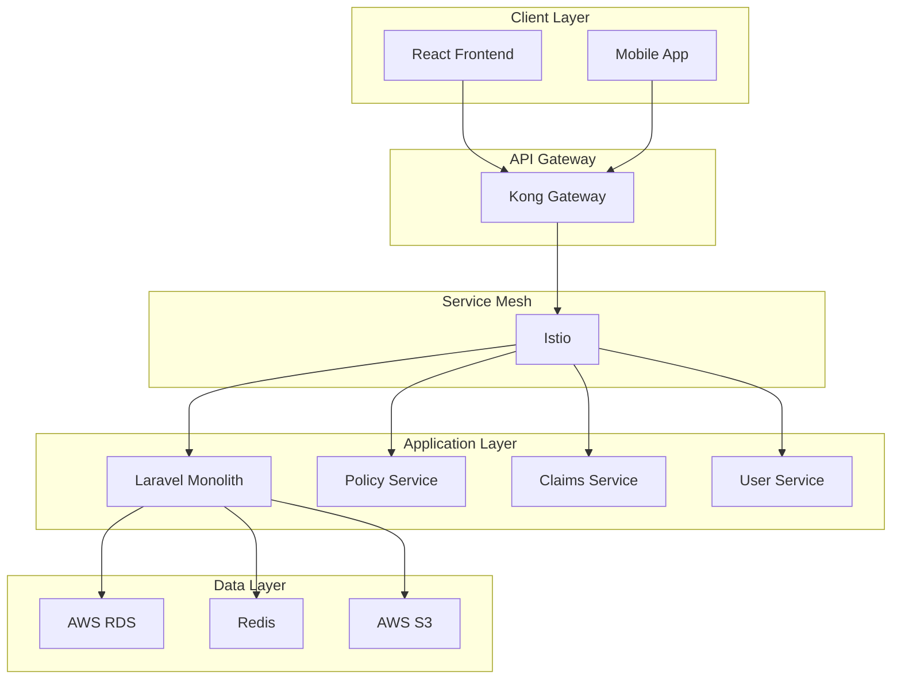
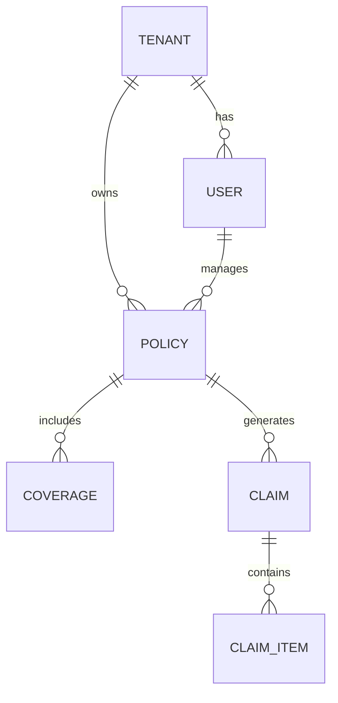

# 14.0 Documentation - Updated

## Documentation Framework Overview

### Documentation Philosophy
- **Documentation as Code**: Version-controlled, automated, and integrated with development workflow
- **Living Documentation**: Self-updating documentation that stays synchronized with code
- **Multi-Audience Approach**: Technical, business, and end-user documentation
- **Compliance Documentation**: Regulatory and audit trail documentation
- **API-First Documentation**: Comprehensive API documentation driving development

## API Documentation Standards

### OpenAPI 3.0 Specification
```yaml
# openapi.yaml - Insurance API Specification
openapi: 3.0.3
info:
  title: Insurance Management API
  description: |
    Comprehensive API for managing insurance policies, claims, and customer data.
    
    ## Authentication
    This API uses OAuth2 with JWT tokens. Include the token in the Authorization header:
    `Authorization: Bearer <your-token>`
    
    ## Rate Limiting
    - 1000 requests per minute for authenticated users
    - 100 requests per minute for unauthenticated requests
    
    ## Versioning
    API versioning is handled via the Accept header:
    `Accept: application/vnd.insurance-api.v1+json`
  version: "1.0.0"
  contact:
    name: API Support
    email: api-support@insurance.com
    url: https://docs.insurance.com
  license:
    name: Proprietary
    url: https://insurance.com/license

servers:
  - url: https://api.insurance.com/v1
    description: Production server
  - url: https://staging-api.insurance.com/v1
    description: Staging server

security:
  - OAuth2: [read:policies, write:policies]

components:
  securitySchemes:
    OAuth2:
      type: oauth2
      flows:
        clientCredentials:
          tokenUrl: https://auth.insurance.com/oauth2/token
          scopes:
            read:policies: Read policy information
            write:policies: Create and update policies
            admin:users: Manage user accounts

  schemas:
    Policy:
      type: object
      required:
        - policyNumber
        - insuredName
        - effectiveDate
        - status
      properties:
        id:
          type: integer
          format: int64
          description: Unique policy identifier
          example: 12345
        policyNumber:
          type: string
          pattern: '^POL-[0-9]{6}$'
          description: Policy number in format POL-XXXXXX
          example: "POL-123456"
        insuredName:
          type: string
          maxLength: 255
          description: Full name of the insured party
          example: "John Doe"
        effectiveDate:
          type: string
          format: date
          description: Policy effective date (ISO 8601)
          example: "2024-01-01"
        expirationDate:
          type: string
          format: date
          description: Policy expiration date (ISO 8601)
          example: "2024-12-31"
        status:
          type: string
          enum: [quoted, bound, active, cancelled, expired]
          description: Current policy status
          example: "active"
        premium:
          type: number
          format: decimal
          minimum: 0
          description: Annual premium amount
          example: 1250.00
        coverages:
          type: array
          items:
            $ref: '#/components/schemas/Coverage'

paths:
  /policies:
    get:
      summary: List policies
      description: Retrieve a paginated list of policies for the authenticated user's tenant
      tags:
        - Policies
      parameters:
        - name: page
          in: query
          schema:
            type: integer
            minimum: 1
            default: 1
        - name: limit
          in: query
          schema:
            type: integer
            minimum: 1
            maximum: 100
            default: 25
        - name: status
          in: query
          schema:
            type: string
            enum: [quoted, bound, active, cancelled, expired]
      responses:
        '200':
          description: Policies retrieved successfully
          content:
            application/json:
              schema:
                type: object
                properties:
                  data:
                    type: array
                    items:
                      $ref: '#/components/schemas/Policy'
                  meta:
                    type: object
                    properties:
                      currentPage:
                        type: integer
                      totalPages:
                        type: integer
                      totalItems:
                        type: integer
```

### Laravel API Documentation Generation
```php
// API documentation generation using Laravel Scribe
// config/scribe.php
return [
    'type' => 'laravel',
    'theme' => 'default',
    'title' => 'Insurance Management API',
    'description' => 'Comprehensive API for insurance operations',
    'base_url' => null,
    'routes' => [
        [
            'match' => [
                'domains' => ['*'],
                'prefixes' => ['api/v1/*'],
                'versions' => ['v1'],
            ],
            'include' => ['*'],
            'exclude' => ['telescope*', 'horizon*'],
        ],
    ],
    'strategies' => [
        'metadata' => [
            \Knuckles\Scribe\Extracting\Strategies\Metadata\GetFromDocBlocks::class,
        ],
        'urlParameters' => [
            \Knuckles\Scribe\Extracting\Strategies\UrlParameters\GetFromLaravelAPI::class,
        ],
        'queryParameters' => [
            \Knuckles\Scribe\Extracting\Strategies\QueryParameters\GetFromFormRequest::class,
        ],
        'headers' => [
            \Knuckles\Scribe\Extracting\Strategies\Headers\GetFromRouteRules::class,
        ],
        'bodyParameters' => [
            \Knuckles\Scribe\Extracting\Strategies\BodyParameters\GetFromFormRequest::class,
        ],
        'responses' => [
            \Knuckles\Scribe\Extracting\Strategies\Responses\UseResponseAttributes::class,
            \Knuckles\Scribe\Extracting\Strategies\Responses\UseApiResourceTags::class,
        ],
    ],
];

// Controller documentation example
/**
 * @group Policy Management
 * 
 * APIs for managing insurance policies including creation, updates, and retrieval.
 * All endpoints require authentication and enforce tenant isolation.
 */
class PolicyController extends Controller
{
    /**
     * Create a new policy
     * 
     * Creates a new insurance policy for the authenticated user's tenant.
     * The policy will be created in 'quoted' status and can be bound later.
     * 
     * @authenticated
     * 
     * @bodyParam policyNumber string required Policy number in format POL-XXXXXX. Example: POL-123456
     * @bodyParam insuredName string required Full name of insured party. Example: John Doe
     * @bodyParam effectiveDate date required Policy effective date. Example: 2024-01-01
     * @bodyParam premium number required Annual premium amount. Example: 1250.00
     * @bodyParam coverages array required Array of coverage objects
     * @bodyParam coverages.*.type string required Coverage type (liability, collision, comprehensive)
     * @bodyParam coverages.*.limit number required Coverage limit amount
     * 
     * @response 201 scenario="Policy created successfully" {
     *   "data": {
     *     "id": 12345,
     *     "policyNumber": "POL-123456",
     *     "insuredName": "John Doe",
     *     "effectiveDate": "2024-01-01",
     *     "status": "quoted",
     *     "premium": 1250.00,
     *     "createdAt": "2024-01-01T10:00:00Z"
     *   }
     * }
     * 
     * @response 422 scenario="Validation error" {
     *   "error": {
     *     "code": "VALIDATION_ERROR",
     *     "message": "The given data was invalid",
     *     "validation_errors": {
     *       "policyNumber": ["The policy number format is invalid"]
     *     }
     *   }
     * }
     */
    public function store(StorePolicyRequest $request): JsonResponse
    {
        // Implementation...
    }
}
```

## Code Documentation Standards

### PHP/Laravel Documentation
```php
/**
 * Service class for handling insurance policy operations
 * 
 * This service provides comprehensive policy management including creation,
 * updates, binding, and cancellation. All operations are tenant-aware and
 * include comprehensive audit logging.
 * 
 * @package App\Services
 * @author Development Team <dev@insurance.com>
 * @version 1.0.0
 * @since 2024-01-01
 */
class PolicyService
{
    /**
     * Create a new insurance policy
     * 
     * Creates a new policy in the system with the provided data. The policy
     * will be created in 'quoted' status and can later be bound to become active.
     * 
     * @param PolicyData $policyData Validated policy data object
     * @param User $user The user creating the policy
     * @param array $options Additional options for policy creation
     * 
     * @return Policy The created policy instance
     * 
     * @throws PolicyValidationException When policy data is invalid
     * @throws InsufficientPermissionsException When user lacks permissions
     * @throws TenantIsolationException When tenant access is violated
     * 
     * @example
     * ```php
     * $policyData = new PolicyData([
     *     'policyNumber' => 'POL-123456',
     *     'insuredName' => 'John Doe',
     *     'effectiveDate' => '2024-01-01',
     *     'premium' => 1250.00
     * ]);
     * 
     * $policy = $policyService->createPolicy($policyData, $user);
     * ```
     * 
     * @see Policy For the policy model documentation
     * @see PolicyData For the policy data structure
     * @link https://docs.insurance.com/policies/creation Policy Creation Guide
     */
    public function createPolicy(
        PolicyData $policyData, 
        User $user, 
        array $options = []
    ): Policy {
        // Validate user permissions
        if (!$user->can('create-policy')) {
            throw new InsufficientPermissionsException(
                'User does not have permission to create policies'
            );
        }

        // Validate tenant access
        if ($policyData->tenantId !== $user->tenant_id) {
            throw new TenantIsolationException(
                'Cannot create policy for different tenant'
            );
        }

        try {
            DB::beginTransaction();

            // Create the policy
            $policy = Policy::create([
                'tenant_id' => $user->tenant_id,
                'policy_number' => $policyData->policyNumber,
                'insured_name' => $policyData->insuredName,
                'effective_date' => $policyData->effectiveDate,
                'premium' => $policyData->premium,
                'status' => PolicyStatus::QUOTED,
                'created_by' => $user->id
            ]);

            // Add coverages
            foreach ($policyData->coverages as $coverageData) {
                $policy->coverages()->create($coverageData);
            }

            // Create audit trail
            $this->auditLogger->logPolicyCreation($policy, $user);

            // Dispatch events
            PolicyCreated::dispatch($policy);

            DB::commit();

            return $policy;

        } catch (Exception $e) {
            DB::rollBack();
            
            // Log the error with context
            Log::error('Policy creation failed', [
                'user_id' => $user->id,
                'tenant_id' => $user->tenant_id,
                'policy_data' => $policyData->toArray(),
                'error' => $e->getMessage()
            ]);

            throw new PolicyCreationException(
                'Failed to create policy: ' . $e->getMessage(),
                0,
                $e
            );
        }
    }
}
```

### React/TypeScript Documentation
```typescript
/**
 * PolicyForm component for creating and editing insurance policies
 * 
 * This component provides a comprehensive form interface for policy management.
 * It includes validation, error handling, and integration with the policy API.
 * 
 * @component
 * @example
 * ```tsx
 * // Create new policy
 * <PolicyForm
 *   mode="create"
 *   onSubmit={handlePolicyCreate}
 *   onCancel={() => navigate('/policies')}
 * />
 * 
 * // Edit existing policy
 * <PolicyForm
 *   mode="edit"
 *   initialData={existingPolicy}
 *   onSubmit={handlePolicyUpdate}
 *   onCancel={() => navigate('/policies')}
 * />
 * ```
 */

interface PolicyFormProps {
  /** Form mode - determines behavior and validation */
  mode: 'create' | 'edit';
  
  /** Initial form data for edit mode */
  initialData?: Partial<PolicyFormData>;
  
  /** Callback fired when form is submitted with valid data */
  onSubmit: (data: PolicyFormData) => Promise<void>;
  
  /** Callback fired when user cancels the form */
  onCancel: () => void;
  
  /** Whether the form is in loading state */
  isLoading?: boolean;
  
  /** Additional CSS classes to apply */
  className?: string;
}

/**
 * Policy form data structure
 * 
 * @interface PolicyFormData
 */
interface PolicyFormData {
  /** Policy number in format POL-XXXXXX */
  policyNumber: string;
  
  /** Full name of the insured party */
  insuredName: string;
  
  /** Policy effective date (ISO 8601 format) */
  effectiveDate: string;
  
  /** Policy expiration date (ISO 8601 format) */
  expirationDate: string;
  
  /** Annual premium amount */
  premium: number;
  
  /** Array of coverage objects */
  coverages: Coverage[];
}

/**
 * Custom hook for managing policy form state and validation
 * 
 * @param initialData - Initial form data
 * @param mode - Form mode (create/edit)
 * @returns Form state and handlers
 * 
 * @example
 * ```tsx
 * const {
 *   formData,
 *   errors,
 *   isValid,
 *   handleChange,
 *   handleSubmit,
 *   resetForm
 * } = usePolicyForm(initialData, 'create');
 * ```
 */
const usePolicyForm = (
  initialData: Partial<PolicyFormData> = {},
  mode: 'create' | 'edit'
) => {
  const [formData, setFormData] = useState<PolicyFormData>({
    policyNumber: '',
    insuredName: '',
    effectiveDate: '',
    expirationDate: '',
    premium: 0,
    coverages: [],
    ...initialData
  });

  const [errors, setErrors] = useState<Record<string, string>>({});

  /**
   * Validates the form data against business rules
   * 
   * @param data - Form data to validate
   * @returns Validation errors object
   */
  const validateForm = (data: PolicyFormData): Record<string, string> => {
    const errors: Record<string, string> = {};

    // Policy number validation
    if (!data.policyNumber) {
      errors.policyNumber = 'Policy number is required';
    } else if (!/^POL-\d{6}$/.test(data.policyNumber)) {
      errors.policyNumber = 'Policy number must be in format POL-XXXXXX';
    }

    // Insured name validation
    if (!data.insuredName.trim()) {
      errors.insuredName = 'Insured name is required';
    } else if (data.insuredName.length > 255) {
      errors.insuredName = 'Insured name must be less than 255 characters';
    }

    // Date validations
    const effectiveDate = new Date(data.effectiveDate);
    const expirationDate = new Date(data.expirationDate);
    
    if (!data.effectiveDate) {
      errors.effectiveDate = 'Effective date is required';
    } else if (effectiveDate < new Date()) {
      errors.effectiveDate = 'Effective date cannot be in the past';
    }

    if (!data.expirationDate) {
      errors.expirationDate = 'Expiration date is required';
    } else if (expirationDate <= effectiveDate) {
      errors.expirationDate = 'Expiration date must be after effective date';
    }

    // Premium validation
    if (data.premium <= 0) {
      errors.premium = 'Premium must be greater than zero';
    } else if (data.premium > 999999.99) {
      errors.premium = 'Premium cannot exceed $999,999.99';
    }

    return errors;
  };

  // Rest of implementation...
};

const PolicyForm: React.FC<PolicyFormProps> = ({
  mode,
  initialData,
  onSubmit,
  onCancel,
  isLoading = false,
  className = ''
}) => {
  const {
    formData,
    errors,
    isValid,
    handleChange,
    handleSubmit
  } = usePolicyForm(initialData, mode);

  /**
   * Handles form submission with validation and error handling
   */
  const handleFormSubmit = async (event: React.FormEvent) => {
    event.preventDefault();
    
    if (!isValid) {
      return;
    }

    try {
      await onSubmit(formData);
    } catch (error) {
      console.error('Form submission failed:', error);
      // Error handling is managed by parent component
    }
  };

  return (
    <form 
      onSubmit={handleFormSubmit} 
      className={`policy-form ${className}`}
      aria-labelledby="policy-form-title"
    >
      <h2 id="policy-form-title">
        {mode === 'create' ? 'Create New Policy' : 'Edit Policy'}
      </h2>
      
      {/* Form fields implementation */}
    </form>
  );
};

export default PolicyForm;
```

## Architecture Documentation

### System Architecture Documentation
```markdown
# Insurance System Architecture

## Overview

The Insurance Management System is built using a cloud-first, microservices-ready architecture that starts as a Laravel monolith and evolves into microservices as needed.

## High-Level Architecture



## Technology Stack

### Backend Technologies
- **Framework**: Laravel 11.x
- **Language**: PHP 8.3
- **Database**: MariaDB 11.x (AWS RDS)
- **Cache**: Redis 7.x (AWS ElastiCache)
- **Storage**: AWS S3
- **Queue**: Laravel Queues → Apache Kafka

### Frontend Technologies
- **Framework**: React 18+
- **Language**: TypeScript 5.x
- **UI Library**: Minimal UI Kit
- **Styling**: Tailwind CSS 3.x
- **State Management**: React Query + Context API
- **Form Handling**: React Hook Form

### Infrastructure
- **Container Platform**: AWS EKS (Kubernetes 1.28+)
- **API Gateway**: Kong 3.x
- **Service Mesh**: Istio 1.20+
- **Monitoring**: LGTM Stack (Loki, Grafana, Tempo, Mimir)
- **CI/CD**: GitLab CI/CD

## Security Architecture

### Authentication & Authorization
- **OAuth2**: Laravel Passport for API authentication
- **JWT**: Stateless token-based authentication
- **RBAC**: Role-based access control with permissions
- **MFA**: Multi-factor authentication for admin users

### Data Protection
- **Encryption at Rest**: AWS KMS for data encryption
- **Encryption in Transit**: TLS 1.3 for all communications
- **Field-Level Encryption**: Sensitive PII data encryption
- **Multi-Tenant Isolation**: Database-level tenant separation

## Deployment Architecture

### AWS Infrastructure
```yaml
# EKS Cluster Configuration
Cluster:
  Name: insurance-production
  Version: 1.28
  NodeGroups:
    - Name: general-purpose
      InstanceType: t3.medium
      MinSize: 3
      MaxSize: 10
      VolumeSize: 100GB
      VolumeEncrypted: true

Database:
  Engine: MariaDB 11.x
  InstanceClass: db.r6g.large
  MultiAZ: true
  BackupRetention: 30 days
  Encryption: true

Cache:
  Engine: Redis 7.x
  NodeType: cache.r6g.large
  NumCacheNodes: 2
  Encryption: true
```

## Data Architecture

### Database Design Principles
- **Multi-Tenancy**: Tenant isolation at row level
- **Audit Trail**: Comprehensive change tracking
- **Performance**: Optimized indexes and query patterns
- **Compliance**: GDPR/CCPA data protection

### Entity Relationships


## API Design

### RESTful API Standards
- **Resource-Based URLs**: `/api/v1/policies/{id}`
- **HTTP Verbs**: GET, POST, PUT, DELETE
- **Status Codes**: Standard HTTP status codes
- **Pagination**: Cursor-based pagination
- **Versioning**: Header-based API versioning

### GraphQL Integration
- **Query Language**: GraphQL for complex data fetching
- **Schema**: Type-safe schema definition
- **Resolvers**: Efficient data resolution
- **Caching**: Query result caching

## Performance Considerations

### Caching Strategy
- **Application Cache**: Redis for session and application data
- **Database Cache**: Query result caching
- **CDN**: CloudFront for static asset delivery
- **API Cache**: Kong response caching

### Optimization Techniques
- **Database Indexes**: Strategic index placement
- **Query Optimization**: N+1 query prevention
- **Asset Optimization**: Bundle splitting and lazy loading
- **Image Optimization**: WebP format and responsive images
```

## Database Documentation

### Database Schema Documentation
```sql
-- Database schema documentation with comprehensive comments

/**
 * Tenants table - Multi-tenant isolation
 * 
 * This table manages tenant organizations in the system. Each tenant
 * represents a separate insurance company or organization with complete
 * data isolation.
 */
CREATE TABLE tenants (
    id BIGINT UNSIGNED AUTO_INCREMENT PRIMARY KEY,
    name VARCHAR(255) NOT NULL COMMENT 'Tenant organization name',
    slug VARCHAR(100) UNIQUE NOT NULL COMMENT 'URL-safe tenant identifier',
    domain VARCHAR(255) UNIQUE COMMENT 'Custom domain for tenant',
    settings JSON COMMENT 'Tenant-specific configuration settings',
    subscription_tier ENUM('basic', 'professional', 'enterprise') DEFAULT 'basic',
    status ENUM('active', 'suspended', 'cancelled') DEFAULT 'active',
    created_at TIMESTAMP DEFAULT CURRENT_TIMESTAMP,
    updated_at TIMESTAMP DEFAULT CURRENT_TIMESTAMP ON UPDATE CURRENT_TIMESTAMP,
    
    INDEX idx_tenants_slug (slug),
    INDEX idx_tenants_status (status),
    INDEX idx_tenants_subscription (subscription_tier)
) ENGINE=InnoDB COMMENT='Multi-tenant organizations';

/**
 * Policies table - Insurance policy management
 * 
 * Core table for managing insurance policies. Includes comprehensive
 * audit fields and tenant isolation. Supports multiple policy types
 * and statuses throughout the policy lifecycle.
 */
CREATE TABLE policies (
    id BIGINT UNSIGNED AUTO_INCREMENT PRIMARY KEY,
    tenant_id BIGINT UNSIGNED NOT NULL COMMENT 'Tenant ownership',
    policy_number VARCHAR(20) UNIQUE NOT NULL COMMENT 'Human-readable policy identifier',
    insured_name VARCHAR(255) NOT NULL COMMENT 'Primary insured party name',
    insured_email VARCHAR(255) COMMENT 'Primary contact email',
    insured_phone VARCHAR(20) COMMENT 'Primary contact phone',
    
    -- Policy dates and lifecycle
    effective_date DATE NOT NULL COMMENT 'Policy coverage start date',
    expiration_date DATE NOT NULL COMMENT 'Policy coverage end date',
    bind_date DATETIME COMMENT 'Date policy was bound/activated',
    
    -- Financial information
    premium DECIMAL(10,2) NOT NULL COMMENT 'Annual premium amount',
    fees DECIMAL(10,2) DEFAULT 0.00 COMMENT 'Additional fees',
    taxes DECIMAL(10,2) DEFAULT 0.00 COMMENT 'Tax amount',
    total_premium DECIMAL(10,2) GENERATED ALWAYS AS (premium + fees + taxes) STORED,
    
    -- Policy status and type
    status ENUM('quoted', 'bound', 'active', 'cancelled', 'expired', 'renewed') DEFAULT 'quoted',
    policy_type ENUM('auto', 'home', 'commercial', 'life', 'health') NOT NULL,
    
    -- Audit fields
    created_by BIGINT UNSIGNED COMMENT 'User who created the policy',
    updated_by BIGINT UNSIGNED COMMENT 'User who last updated the policy',
    created_at TIMESTAMP DEFAULT CURRENT_TIMESTAMP,
    updated_at TIMESTAMP DEFAULT CURRENT_TIMESTAMP ON UPDATE CURRENT_TIMESTAMP,
    
    -- Foreign key constraints
    FOREIGN KEY (tenant_id) REFERENCES tenants(id) ON DELETE RESTRICT,
    FOREIGN KEY (created_by) REFERENCES users(id) ON DELETE SET NULL,
    FOREIGN KEY (updated_by) REFERENCES users(id) ON DELETE SET NULL,
    
    -- Indexes for performance
    INDEX idx_policies_tenant (tenant_id),
    INDEX idx_policies_status (status),
    INDEX idx_policies_type (policy_type),
    INDEX idx_policies_effective (effective_date),
    INDEX idx_policies_expiration (expiration_date),
    INDEX idx_policies_premium (premium),
    UNIQUE INDEX idx_policies_number_tenant (policy_number, tenant_id)
) ENGINE=InnoDB COMMENT='Insurance policies';

/**
 * Policy audit trail - Immutable change tracking
 * 
 * Tracks all changes to policies for compliance and audit purposes.
 * This table is append-only and records cannot be modified or deleted.
 */
CREATE TABLE policy_audit_trail (
    id BIGINT UNSIGNED AUTO_INCREMENT PRIMARY KEY,
    policy_id BIGINT UNSIGNED NOT NULL,
    tenant_id BIGINT UNSIGNED NOT NULL,
    action ENUM('created', 'updated', 'status_changed', 'deleted') NOT NULL,
    
    -- Change tracking
    old_values JSON COMMENT 'Previous values before change',
    new_values JSON COMMENT 'New values after change',
    changed_fields JSON COMMENT 'List of fields that changed',
    
    -- Audit metadata
    user_id BIGINT UNSIGNED COMMENT 'User who made the change',
    ip_address INET COMMENT 'IP address of the user',
    user_agent TEXT COMMENT 'Browser/client information',
    request_id VARCHAR(36) COMMENT 'Request tracking ID',
    
    -- Compliance fields
    reason TEXT COMMENT 'Business reason for the change',
    compliance_notes TEXT COMMENT 'Additional compliance documentation',
    
    created_at TIMESTAMP DEFAULT CURRENT_TIMESTAMP,
    
    FOREIGN KEY (policy_id) REFERENCES policies(id) ON DELETE RESTRICT,
    FOREIGN KEY (tenant_id) REFERENCES tenants(id) ON DELETE RESTRICT,
    FOREIGN KEY (user_id) REFERENCES users(id) ON DELETE SET NULL,
    
    INDEX idx_audit_policy (policy_id),
    INDEX idx_audit_tenant (tenant_id),
    INDEX idx_audit_user (user_id),
    INDEX idx_audit_created (created_at),
    INDEX idx_audit_action (action)
) ENGINE=InnoDB COMMENT='Immutable policy change audit trail';
```

## Development Workflow Documentation

### Git Workflow and Branching Strategy

#### Branch Structure

**Main Branches:**
- **main**: Production-ready code
- **develop**: Integration branch for features
- **staging**: Pre-production testing

**Feature Branches:**
- **feature/**: New features (`feature/policy-management`)
- **bugfix/**: Bug fixes (`bugfix/premium-calculation`)
- **hotfix/**: Critical production fixes (`hotfix/security-patch`)

#### Commit Message Standards

**Format:**
```
<type>(<scope>): <subject>

<body>

<footer>
```

**Types:**
- **feat**: New feature
- **fix**: Bug fix
- **docs**: Documentation changes
- **style**: Code style changes
- **refactor**: Code refactoring
- **test**: Adding or modifying tests
- **chore**: Maintenance tasks

**Examples:**
```
feat(policies): add premium calculation API

Implement comprehensive premium calculation with support for
multiple rating factors and state-specific regulations.

- Add PremiumCalculator service class
- Implement rating factor validation
- Add comprehensive test coverage
- Update API documentation

Closes #123
```

#### Code Review Guidelines

**Review Checklist:**
- [ ] Code follows PSR-12 standards (PHP) / ESLint rules (TypeScript)
- [ ] All new code has appropriate test coverage
- [ ] API changes include documentation updates
- [ ] Security considerations have been addressed
- [ ] Performance impact has been evaluated
- [ ] Database migrations are reversible
- [ ] Error handling is comprehensive
- [ ] Logging is appropriate for debugging

**Security Review:**
- [ ] Input validation is present and comprehensive
- [ ] SQL injection prevention (parameterized queries)
- [ ] XSS prevention (output encoding)
- [ ] CSRF protection is enabled
- [ ] Authentication and authorization are properly implemented
- [ ] Sensitive data is properly encrypted
- [ ] Audit logging captures security-relevant events
```

## Testing Documentation

### Testing Strategy and Guidelines

#### Test Pyramid Structure

**Unit Tests (70%):**
- **Purpose**: Test individual functions and methods in isolation
- **Tools**: PHPUnit (Laravel), Jest (React)
- **Coverage Target**: 80% minimum
- **Scope**: Business logic, utility functions, model methods

**Integration Tests (20%):**
- **Purpose**: Test component interactions and API endpoints
- **Tools**: PHPUnit Feature Tests, React Testing Library
- **Coverage**: API endpoints, database interactions, service integrations
- **Scope**: Controller actions, service classes, component interactions

**End-to-End Tests (10%):**
- **Purpose**: Test complete user workflows
- **Tools**: Playwright
- **Coverage**: Critical user journeys, cross-browser compatibility
- **Scope**: Policy creation, claims processing, user authentication

#### Test Organization

**Backend Tests (Laravel):**
```
tests/
├── Unit/
│   ├── Services/
│   │   ├── PolicyServiceTest.php
│   │   └── PremiumCalculatorTest.php
│   ├── Models/
│   │   ├── PolicyTest.php
│   │   └── UserTest.php
│   └── Helpers/
│       └── ValidationHelperTest.php
├── Feature/
│   ├── Api/
│   │   ├── PolicyApiTest.php
│   │   └── AuthenticationTest.php
│   ├── Auth/
│   │   └── LoginTest.php
│   └── Database/
│       └── MigrationTest.php
└── Browser/
    ├── PolicyManagementTest.php
    └── UserAuthenticationTest.php
```

**Frontend Tests (React):**
```
src/
├── components/
│   ├── PolicyForm/
│   │   ├── PolicyForm.tsx
│   │   ├── PolicyForm.test.tsx
│   │   └── PolicyForm.stories.tsx
│   └── UserProfile/
│       ├── UserProfile.tsx
│       └── UserProfile.test.tsx
├── hooks/
│   ├── usePolicyForm.ts
│   └── usePolicyForm.test.ts
├── services/
│   ├── apiClient.ts
│   └── apiClient.test.ts
└── __tests__/
    ├── integration/
    │   └── PolicyFlow.test.tsx
    └── e2e/
        └── policy-management.spec.ts
```

#### Test Data Management

**Database Factories:**
```php
// PolicyFactory.php
class PolicyFactory extends Factory
{
    public function definition(): array
    {
        return [
            'tenant_id' => Tenant::factory(),
            'policy_number' => 'POL-' . $this->faker->unique()->numberBetween(100000, 999999),
            'insured_name' => $this->faker->name(),
            'effective_date' => $this->faker->dateTimeBetween('now', '+30 days'),
            'expiration_date' => $this->faker->dateTimeBetween('+1 year', '+2 years'),
            'premium' => $this->faker->randomFloat(2, 500, 5000),
            'status' => PolicyStatus::QUOTED,
        ];
    }
    
    public function bound(): self
    {
        return $this->state(['status' => PolicyStatus::BOUND]);
    }
    
    public function auto(): self
    {
        return $this->state(['policy_type' => 'auto']);
    }
}
```

**Test Utilities:**
```typescript
// testUtils.tsx
export const renderWithProviders = (
  ui: React.ReactElement,
  options?: {
    initialState?: Partial<AppState>;
    theme?: Theme;
  }
) => {
  const { initialState, theme = lightTheme, ...renderOptions } = options || {};

  const Wrapper: React.FC<{ children: React.ReactNode }> = ({ children }) => (
    <ThemeProvider theme={theme}>
      <QueryClient>
        <AuthProvider initialState={initialState?.auth}>
          <Router>
            {children}
          </Router>
        </AuthProvider>
      </QueryClient>
    </ThemeProvider>
  );

  return {
    ...render(ui, { wrapper: Wrapper, ...renderOptions }),
    // Custom utilities
    getByTestId: (testId: string) => screen.getByTestId(testId),
    queryByTestId: (testId: string) => screen.queryByTestId(testId),
  };
};

export const createMockUser = (overrides?: Partial<User>): User => ({
  id: 1,
  email: 'test@example.com',
  name: 'Test User',
  tenantId: 1,
  roles: ['user'],
  ...overrides,
});

export const createMockPolicy = (overrides?: Partial<Policy>): Policy => ({
  id: 1,
  policyNumber: 'POL-123456',
  insuredName: 'John Doe',
  effectiveDate: '2024-01-01',
  expirationDate: '2024-12-31',
  premium: 1250.00,
  status: 'active',
  ...overrides,
});
```

## Compliance Documentation

### Regulatory Compliance Framework

#### Data Protection Compliance

**GDPR (General Data Protection Regulation):**
- **Scope**: EU residents and data processing
- **Implementation**: Consent management, data portability, right to erasure
- **Documentation**: Privacy notices, data processing records, impact assessments

**CCPA (California Consumer Privacy Act):**
- **Scope**: California residents
- **Implementation**: Consumer rights management, opt-out mechanisms
- **Documentation**: Privacy policy updates, consumer request handling

**HIPAA (Health Insurance Portability and Accountability Act):**
- **Scope**: Health insurance products
- **Implementation**: PHI encryption, access controls, audit logging
- **Documentation**: Business associate agreements, security assessments

#### Financial Compliance

**SOX (Sarbanes-Oxley Act):**
- **Scope**: Financial reporting and controls
- **Implementation**: Internal controls, audit trails, financial data integrity
- **Documentation**: Control documentation, testing procedures, remediation plans

**PCI DSS (Payment Card Industry Data Security Standard):**
- **Scope**: Payment card data handling
- **Implementation**: Data encryption, network security, access controls
- **Documentation**: Security policies, vulnerability assessments, penetration testing

#### Insurance Regulation Compliance

**State Insurance Regulations:**
- **Scope**: State-specific insurance requirements
- **Implementation**: Rate filing compliance, form approvals, market conduct
- **Documentation**: Regulatory filings, compliance monitoring, audit responses

**NAIC (National Association of Insurance Commissioners):**
- **Scope**: Model laws and regulations
- **Implementation**: Uniform standards, best practices, regulatory coordination
- **Documentation**: Model law compliance, reporting standards

## Summary

This comprehensive documentation framework ensures that all aspects of the insurance system are properly documented, from API specifications to compliance requirements, supporting both development teams and business stakeholders.