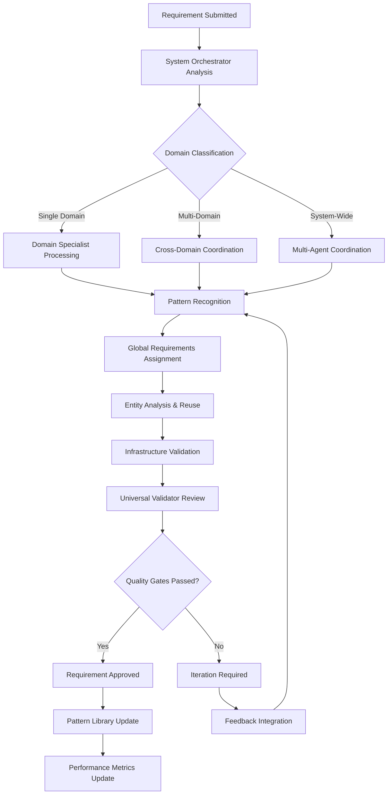

# Requirements Generation Process Guide

## Overview

This guide explains the complete requirements generation process using our multi-agent architecture. The system transforms manual, domain-specific requirement creation into an intelligent, unified workflow that leverages cross-domain patterns and automated validation.

## Table of Contents

- [Process Flow](#process-flow)
- [Multi-Agent Architecture](#multi-agent-architecture)
- [Workflow Types](#workflow-types)
- [Cross-Domain Coordination](#cross-domain-coordination)
- [Quality Assurance Process](#quality-assurance-process)
- [Performance Optimization](#performance-optimization)
- [Monitoring and Tracking](#monitoring-and-tracking)

## Process Flow

### High-Level Workflow



### Detailed Process Steps

#### 1. Requirement Submission
- **Input Location**: `processing-queues/{domain}/pending/`
- **Automatic Triggers**: System detects new requirement files
- **Initial Classification**: System Orchestrator analyzes content for domain relevance

#### 2. Domain Analysis and Routing
- **Single Domain**: Routed to appropriate Domain Specialist
- **Multi-Domain**: Coordinated processing across multiple domains
- **System-Wide**: Full multi-agent coordination with infrastructure impact

#### 3. Intelligent Pre-Processing
- **Pattern Recognition**: Cross-domain pattern matching using similarity engines
- **Entity Identification**: Universal entity catalog consultation for reuse opportunities
- **Global Requirements Mapping**: Automatic assignment of applicable GRs
- **Dependency Analysis**: Cross-domain relationship evaluation

#### 4. Collaborative Processing
- **Domain Expertise**: Specialized agents apply domain-specific knowledge
- **Shared Context**: Real-time synchronization of entity definitions and decisions
- **Infrastructure Alignment**: Validation against existing codebase patterns
- **Quality Coordination**: Continuous validation throughout processing

#### 5. Progressive Validation
- **Structure Validation** (3 minutes): Format compliance and basic structure
- **Domain Patterns** (7 minutes): Domain-specific validation
- **Cross-Domain** (10 minutes): Shared entity consistency
- **Global Requirements** (15 minutes): Comprehensive GR compliance
- **Infrastructure** (10 minutes): Codebase alignment validation

#### 6. Results Consolidation
- **Pattern Learning**: Successful patterns added to knowledge base
- **Performance Tracking**: Metrics collection for continuous improvement
- **Cross-Reference Updates**: Links established with related requirements

## Multi-Agent Architecture

### System Orchestrator (Agent SO)

**Primary Responsibilities:**
- Cross-domain workflow coordination and strategic planning
- Multi-domain intelligence and dependency analysis
- Global Requirements mastery and automatic assignment
- Infrastructure orchestration and pattern reuse coordination

**Enhanced Capabilities:**
- Analyze requirements across all business domains simultaneously
- Detect cross-domain dependencies (e.g., quote → billing → payment workflows)
- Identify shared entity opportunities across domains
- Coordinate batch processing of related requirements

**Tools and Resources:**
- Complete knowledge of all 64+ Global Requirements
- Cross-domain pattern matcher
- Universal entity catalog access
- Infrastructure coordination capabilities

### Domain Specialists (Agents D1-D7)

**Agent Configurations:**

**Agent D1 (ProducerPortal)**
- **Entities**: Quote, driver, vehicle, producer, entity relationships
- **Workflows**: Quote creation, producer management, entity relationships
- **Integrations**: DCS API, communication hub
- **Specializations**: Quote lifecycle, producer workflows, entity management

**Agent D2 (Accounting)**
- **Entities**: Billing, payment, commission, ACH transaction
- **Workflows**: Billing cycle, payment processing, commission calculation
- **Integrations**: Payment gateways, banking APIs
- **Specializations**: Financial workflows, payment processing, commission reconciliation

**Agent D3 (ProgramManager)**
- **Entities**: Rate factor, underwriting rule, program configuration
- **Workflows**: Rate calculation, rule evaluation, program setup
- **Integrations**: Rating engines, compliance systems
- **Specializations**: Rate management, underwriting rules, program configuration

**Agent D4 (ProgramTraits)**
- **Entities**: Program-specific rules, Aguila Dorada configurations
- **Workflows**: Program-specific validation, trait application
- **Integrations**: Program management systems
- **Specializations**: Aguila Dorada program rules, program-specific customizations

**Agent D5 (EntityIntegration)**
- **Entities**: External API mappings, DCS integrations
- **Workflows**: External system integration, data verification
- **Integrations**: DCS household APIs, criminal background, verification services
- **Specializations**: External API integration, data verification workflows

**Agent D6 (Reinstatement)**
- **Entities**: Policy lifecycle, lapse processing, reinstatement workflows
- **Workflows**: Policy reinstatement, lapse management, lifecycle tracking
- **Integrations**: Policy management systems, payment processing
- **Specializations**: Policy lifecycle management, reinstatement processes

**Agent D7 (Sr22)**
- **Entities**: Financial responsibility filing, compliance tracking
- **Workflows**: SR22/SR26 filing, compliance monitoring
- **Integrations**: State filing systems, compliance tracking
- **Specializations**: Financial responsibility filing, compliance requirements

### Universal Validator (Agent UV)

**Primary Responsibilities:**
- Cross-domain validation with Global Requirements expertise
- Global standards enforcement across all domains
- Cross-domain consistency validation
- Infrastructure alignment verification

**Validation Stages:**

1. **Structure Validation** (3 minutes)
   - Format compliance checking
   - Basic requirement structure validation
   - Template adherence verification

2. **Domain Patterns** (7 minutes)
   - Domain-specific pattern validation
   - Business rule compliance checking
   - Entity relationship validation

3. **Cross-Domain** (10 minutes)
   - Shared entity consistency checking
   - Cross-domain relationship validation
   - Integration point verification

4. **Global Requirements** (15 minutes)
   - Comprehensive GR compliance validation
   - Universal entity management compliance (GR-52)
   - Communication architecture integration (GR-44)
   - Database standards adherence (GR-41)

5. **Infrastructure** (10 minutes)
   - Codebase alignment validation
   - Existing pattern compatibility
   - Service layer integration compliance

## Workflow Types

### Single Domain Processing

**When Used:**
- Requirement affects only one business domain
- No cross-domain entities or workflows involved
- Minimal integration requirements

**Process:**
1. Domain Specialist takes primary responsibility
2. System Orchestrator provides pattern library access
3. Universal Validator ensures Global Requirements compliance
4. Results integrated into domain-specific patterns

**Example:** ProducerPortal quote form field addition

### Cross-Domain Processing

**When Used:**
- Requirement affects 2-3 business domains
- Shared entities or workflows involved
- Integration between domains required

**Process:**
1. System Orchestrator coordinates domain assignment
2. Multiple Domain Specialists work in parallel
3. Shared context management ensures consistency
4. Universal Validator checks cross-domain integrity

**Example:** Quote-to-billing workflow enhancement

### System-Wide Processing

**When Used:**
- Requirement affects 4+ business domains
- Fundamental system changes required
- New global patterns or standards involved

**Process:**
1. Full multi-agent coordination
2. System Orchestrator manages complex dependencies
3. All Domain Specialists contribute expertise
4. Enhanced validation with infrastructure impact assessment

**Example:** New universal entity type introduction

## Cross-Domain Coordination

### Shared Entity Management

**Universal Entity Catalog (GR-52 Compliant)**
- Central repository of all business entities across domains
- Consistent entity definitions with 90% faster development
- Cross-domain relationship mapping
- Integration point identification

**Key Shared Entities:**
- **Quote**: Used by ProducerPortal, Accounting, ProgramManager
- **Driver**: Used by ProducerPortal, EntityIntegration, Sr22
- **Payment**: Used by Accounting, ProducerPortal, Reinstatement
- **Policy**: Used by ProducerPortal, Accounting, Reinstatement, Sr22

### Cross-Domain Workflows

**Quote-to-Payment Integration**
```yaml
domains: [producer-portal, accounting]
trigger: quote_binding_completed

shared_entities:
  - quote (primary)
  - policy_holder (from quote.named_insured)
  - payment_schedule (generated)
  - billing_cycle (created)

processing_steps:
  1. producer_portal_agent: generates complete quote with all entities
  2. system_orchestrator: validates cross-domain entity consistency
  3. accounting_agent: creates billing entities using shared quote data

validation_points:
  - shared entity integrity
  - GR-41 database consistency
  - GR-38 service boundary compliance
```

**Rate Factor to Program Traits Integration**
```yaml
domains: [program-manager, program-traits]
trigger: rate_factor_update

shared_entities:
  - program_configuration
  - rate_factor_matrix
  - underwriting_rules
  - program_specific_adjustments

processing_steps:
  1. program_manager_agent: updates base rate factors
  2. program_traits_agent: applies Aguila Dorada specific adjustments

integration_requirements:
  - GR-52 universal entity management for program configs
  - GR-38 microservice boundaries for rate calculation
  - shared validation rules across programs
```

### Dependency Resolution

**Automatic Dependency Detection:**
- Entity relationship analysis across domains
- Workflow sequence identification
- Integration point mapping
- Resource requirement calculation

**Processing Order Optimization:**
- Critical path analysis for multi-domain requirements
- Parallel processing opportunities identification
- Resource allocation optimization
- Bottleneck prevention

## Quality Assurance Process

### Progressive Validation Framework

**Stage 1: Structure (3 minutes)**
- Template compliance verification
- Required section presence checking
- Format standardization validation

**Stage 2: Domain Patterns (7 minutes)**
- Domain-specific business rule validation
- Entity pattern compliance checking
- Workflow consistency verification

**Stage 3: Cross-Domain (10 minutes)**
- Shared entity definition consistency
- Cross-domain relationship integrity
- Integration pattern validation

**Stage 4: Global Requirements (15 minutes)**
- Comprehensive GR compliance checking
- Universal entity management validation (GR-52)
- Communication architecture compliance (GR-44)
- Database standards verification (GR-41)
- Microservice architecture alignment (GR-38)

**Stage 5: Infrastructure (10 minutes)**
- Existing codebase pattern alignment
- Database schema compatibility
- API endpoint consistency
- Service layer integration verification

### Quality Gates

**Minimum Compliance Thresholds:**
- Global Requirements compliance: 95%
- Cross-domain consistency: 90%
- Infrastructure alignment: 85%
- Pattern reuse rate: 80%

**Fail-Fast Capabilities:**
- Early termination for critical failures
- Immediate feedback for structural issues
- Progressive complexity validation
- Resource optimization through early detection

### Automated Compliance Checking

**Global Requirements Validation:**
- Automatic assignment of applicable GRs
- Compliance verification against all 64+ standards
- Integration requirement identification
- Performance impact assessment

**Cross-Domain Consistency:**
- Shared entity definition synchronization
- Relationship integrity verification
- Integration point validation
- Workflow consistency checking

## Performance Optimization

### Batch Processing

**Multi-Domain Batch Coordination:**
- Related requirement identification
- Shared entity optimization
- Parallel processing orchestration
- Resource utilization optimization

**Processing Strategies:**
- **Single Requirements**: Standard individual processing
- **Related Batches**: Coordinated processing with shared context
- **System Updates**: Full multi-agent coordination

### Pattern Reuse Optimization

**Pattern Recognition Engine:**
- Cross-domain similarity analysis
- Entity reuse identification
- Workflow pattern matching
- Integration template application

**Performance Targets:**
- 85%+ pattern reuse across domains
- 70-80% reduction in processing time
- 90%+ first-pass approval rate
- <5% coordination overhead

### Resource Management

**Agent Coordination:**
- Real-time context synchronization
- Shared memory management
- Processing queue optimization
- Load balancing across agents

**Infrastructure Optimization:**
- Codebase pattern caching
- Global Requirements indexing
- Entity relationship precomputation
- Validation rule optimization

## Monitoring and Tracking

### Real-Time Performance Dashboard

**System-Wide Metrics:**
- Processing time across all domains
- Pattern reuse effectiveness
- Cross-domain coordination efficiency
- Global Requirements compliance rates

**Domain-Specific Tracking:**
- Individual domain performance
- Bottleneck identification
- Resource utilization analysis
- Quality trend monitoring

### Continuous Improvement

**Pattern Learning:**
- Successful pattern identification
- Automatic pattern library updates
- Confidence score improvements
- Cross-domain pattern promotion

**Performance Optimization:**
- Automated threshold adjustments
- Processing workflow optimization
- Resource allocation improvements
- Quality gate refinements

### Metrics and KPIs

**Primary Performance Indicators:**
- **Processing Time Reduction**: Target 70-80% improvement
- **Pattern Reuse Rate**: Target 85%+ across domains
- **First-Pass Approval Rate**: Target 90%+ success
- **Cross-Domain Efficiency**: Target 3x speedup for multi-domain batches

**Quality Indicators:**
- **Global Requirements Compliance**: Target 98%+ automatic validation
- **Infrastructure Alignment**: Target 95%+ pattern reuse
- **Cross-Domain Consistency**: Target 90%+ entity definition alignment
- **System Scalability**: Target <1 week integration for new domains

## Future Enhancements

### AI-Enhanced Capabilities (Planned)
- Natural language processing for requirement analysis
- Predictive pattern matching based on business trends
- Automated business rule extraction from documentation
- Intelligent quality assurance with AI-powered assessment

### Advanced Integration (Planned)
- Real-time infrastructure monitoring and pattern analysis
- Automated testing integration with requirement generation
- Documentation generation from requirements
- Compliance monitoring with regulatory change detection

---

**Last Updated**: 2025-01-07  
**Process Version**: Phase 1 Implementation  
**Status**: Multi-Agent System Operational, Intelligence Engines Pending