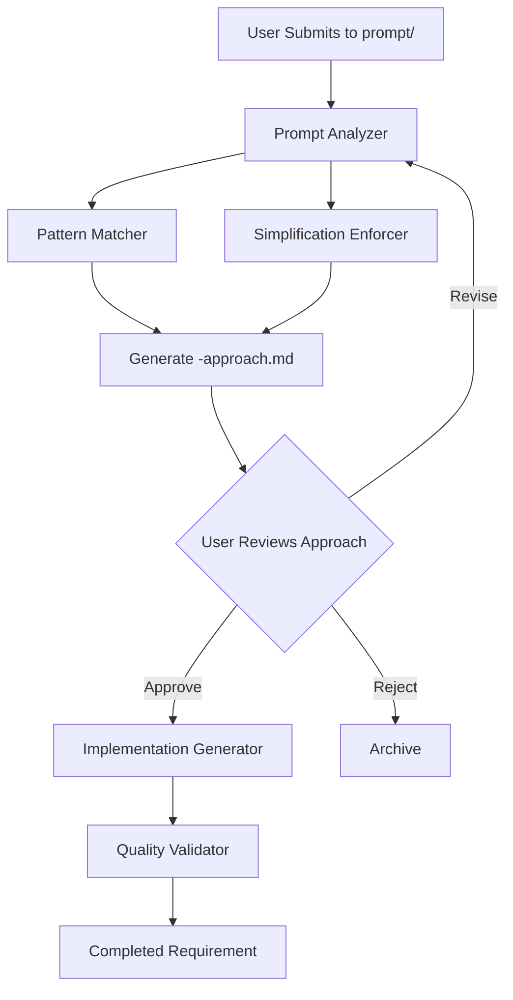
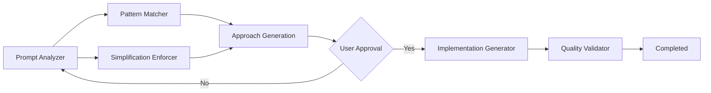

# Requirements Generation Process Guide

## Overview

This guide explains the simplified 5-agent requirements generation process with mandatory approval workflow. The system emphasizes simplification, pattern reuse, and human approval before any implementation begins.

## Table of Contents

- [Process Flow](#process-flow)
- [5-Agent Architecture](#5-agent-architecture)
- [Approval Workflow](#approval-workflow)
- [Simplification Process](#simplification-process)
- [Context Preservation](#context-preservation)
- [Quality Checkpoints](#quality-checkpoints)

## Process Flow

### High-Level Workflow



### Key Process Points
1. **Submission**: User places requirement in `/prompt/` directory
2. **Analysis**: Parallel processing by Pattern Matcher and Simplification Enforcer
3. **Approach Generation**: Creates `-approach.md` file for review
4. **MANDATORY STOP**: System waits for user approval
5. **Implementation**: Only begins after explicit approval
6. **Validation**: Final quality checks before completion

### Detailed Process Steps

#### 1. Requirement Submission
- **Input Location**: `processing-queues/{domain}/prompt/`
- **File Naming**: `prompt-{feature-name}.md`
- **Content Requirements**: Clear description, acceptance criteria, context

#### 2. Initial Analysis (Prompt Analyzer)
- **Deep Understanding**: Comprehends the full requirement
- **Domain Classification**: Single, multi, or system-wide
- **Context Creation**: Builds initial context for other agents
- **Complexity Assessment**: Initial complexity evaluation

#### 3. Pattern Discovery (Pattern Matcher)
- **GlobalRequirements Search**: Finds applicable GRs
- **Codebase Reference**: Searches blitzy-requirements for examples
- **Reuse Identification**: Maximizes pattern reuse
- **Implementation Examples**: Provides concrete references

#### 4. Simplification Review (Simplification Enforcer)
- **Complexity Analysis**: Identifies unnecessary complexity
- **Alternative Suggestions**: Proposes simpler approaches
- **Trade-off Documentation**: Documents what is gained/lost
- **Approval Readiness**: Ensures approach is review-ready

#### 5. Approach Generation
- **Unified Output**: Combines all agent inputs
- **Template Usage**: Uses standard approach template
- **Clear Proposal**: Makes implementation plan explicit
- **Decision Points**: Highlights key choices made

#### 6. User Approval (MANDATORY STOP)
- **Review Period**: User reviews -approach.md file
- **Feedback Options**: Approve, Revise, Reject, Defer
- **Revision Support**: Can iterate on approach
- **No Auto-Proceed**: System waits for explicit approval

## 5-Agent Architecture

### Agent 1: Prompt Analyzer (PA)

**Purpose**: Maximize first-approach accuracy through deep analysis

**Responsibilities:**
- Comprehensive requirement understanding
- Domain classification and routing
- Initial complexity assessment
- Context initialization for other agents

**Key Outputs:**
- Requirement summary
- Domain classification
- Initial context structure
- Complexity level assessment

**Configuration:**
```yaml
name: prompt-analyzer
type: analysis
capabilities:
  - Requirement deep understanding
  - Domain classification
  - Complexity assessment
  - Context initialization
knowledge_base:
  - All 64+ Global Requirements
  - Domain-specific patterns
  - Entity catalog
  - Infrastructure patterns
```

### Agent 2: Pattern Matcher (PM)

**Purpose**: Find and apply reusable patterns from GlobalRequirements and codebase

**Responsibilities:**
- Search GlobalRequirements for applicable patterns
- Find similar implementations in blitzy-requirements
- Identify reusable components
- Map patterns to new requirement

**Key Outputs:**
- Applicable Global Requirements list
- Reference implementations
- Reusable pattern recommendations
- Pattern adaptation strategies

**Configuration:**
```yaml
name: pattern-matcher
type: discovery
capabilities:
  - GlobalRequirements search
  - Codebase pattern analysis
  - Similarity scoring
  - Pattern adaptation
search_locations:
  - /GlobalRequirements/
  - /blitzy-requirements/ (read-only)
  - /approved-requirements/
```

### Agent 3: Simplification Enforcer (SE)

**Purpose**: Ensure solutions remain simple and maintainable

**Responsibilities:**
- Identify unnecessary complexity
- Propose simpler alternatives
- Document trade-offs
- Enforce "simple as possible" principle

**Key Outputs:**
- Complexity analysis
- Simplification suggestions
- Trade-off documentation
- Approval readiness assessment

**Configuration:**
```yaml
name: simplification-enforcer
type: optimization
principles:
  - Prefer existing patterns
  - Direct over abstract
  - Clear over clever
  - Documented decisions
metrics:
  - Complexity score
  - Pattern reuse percentage
  - Implementation clarity
```

### Agent 4: Implementation Generator (IG)

**Purpose**: Create detailed requirements after approval

**Responsibilities:**
- Generate comprehensive requirement document
- Apply approved approach
- Include all technical details
- Ensure completeness

**Key Outputs:**
- Complete requirement document
- Implementation specifications
- API definitions
- Database schemas

**Configuration:**
```yaml
name: implementation-generator
type: generation
triggers:
  - User approval of -approach.md
templates:
  - /shared-infrastructure/templates/requirement-template.md
validation:
  - All sections complete
  - Cross-references accurate
  - Standards compliance
```

### Agent 5: Quality Validator (QV)

**Purpose**: Final validation against all standards

**Responsibilities:**
- Validate Global Requirements compliance
- Check pattern consistency
- Verify infrastructure alignment
- Ensure quality standards

**Key Outputs:**
- Validation report
- Compliance checklist
- Quality score
- Completion confirmation

**Configuration:**
```yaml
name: quality-validator
type: validation
checks:
  - Global Requirements compliance
  - Pattern consistency
  - Infrastructure alignment
  - Documentation completeness
thresholds:
  - GR compliance: 95%
  - Pattern reuse: 80%
  - Quality score: 90%
```

## Agent Coordination

### Sequential Flow


### Context Sharing
- Unified context store maintains state
- Each agent builds on previous outputs
- No information loss between agents
- Continuous refinement process

## Approval Workflow

### Overview
The approval workflow ensures quality by requiring human review before implementation begins. This mandatory checkpoint prevents wasted effort and ensures alignment with business needs.

### Workflow States
1. **Pending**: Initial submission in prompt directory
2. **In Analysis**: Being processed by 5-agent system
3. **Awaiting Approval**: -approach.md generated and ready for review
4. **Approved**: User has approved the approach
5. **In Implementation**: Requirement being generated
6. **Completed**: Final requirement delivered

### Approval Process

#### Step 1: Approach Generation
After analysis by Prompt Analyzer, Pattern Matcher, and Simplification Enforcer:
- System generates `-approach.md` file
- File placed in `/in-progress/approaches/`
- User notified of ready approach

#### Step 2: User Review
User reviews the approach file containing:
- Requirement understanding
- Pattern analysis
- Simplification approach
- Proposed implementation plan
- Risk assessment
- Context preservation

#### Step 3: Decision Options
- **APPROVE**: Proceed to implementation
- **REVISE**: Request changes to approach
- **REJECT**: Stop processing this requirement
- **DEFER**: Postpone for later consideration

#### Step 4: Implementation (if approved)
- Implementation Generator creates full requirement
- Quality Validator ensures compliance
- Final requirement moved to completed/

### Revision Workflow
When user requests revisions:
1. Feedback incorporated into context
2. Agents re-process with new constraints
3. Updated -approach.md generated
4. Review cycle repeats

## Simplification Process

### Core Principle
"Make everything as simple as possible, but not simpler." - This guides every decision in the system.

### Simplification Strategies

#### 1. Pattern Reuse First
- Always check GlobalRequirements for existing patterns
- Search blitzy-requirements for implementations
- Adapt existing solutions before creating new ones
- Document why new patterns are needed (if they are)

#### 2. Direct Over Abstract
- Use straightforward implementations
- Avoid unnecessary abstraction layers
- Prefer explicit over implicit behavior
- Make code intent obvious

#### 3. Reduce Complexity
- Break large requirements into smaller pieces
- Remove unnecessary features
- Consolidate duplicate functionality
- Simplify data structures

#### 4. Clear Documentation
- Document the "why" not just the "what"
- Explain trade-offs made
- Note simplification decisions
- Preserve context for future developers

### Simplification Metrics
- **Pattern Reuse Rate**: Target 85%+
- **Complexity Score**: Lower is better
- **Lines of Code**: Minimize while maintaining clarity
- **Dependency Count**: Reduce external dependencies

### Trade-off Documentation
Every simplification involves trade-offs. Document:
- What was simplified
- What functionality was preserved
- What was intentionally omitted
- Why the trade-off is acceptable

## Context Preservation

### Purpose
Maintain complete context throughout the requirements process to ensure nothing is lost between agents or approval cycles.

### Context Store Structure
```
/shared-infrastructure/context-store/
├── domain-contexts/
│   ├── producer-portal.json
│   ├── accounting.json
│   └── [domain].json
├── pattern-applications.json
├── simplification-decisions.json
└── approval-history.json
```

### Context Components

#### 1. Requirement Context
- Original requirement text
- User feedback and revisions
- Business justification
- Acceptance criteria

#### 2. Analysis Context
- Domain classification results
- Complexity assessment
- Entity identification
- Relationship mapping

#### 3. Pattern Context
- Applied Global Requirements
- Referenced implementations
- Reuse decisions
- Adaptation notes

#### 4. Simplification Context
- Complexity reduction decisions
- Trade-offs documented
- Alternative approaches considered
- Final simplification rationale

#### 5. Approval Context
- Review feedback
- Revision history
- Decision rationale
- Implementation constraints

### Context Flow
1. **Initial Capture**: Prompt Analyzer creates base context
2. **Enrichment**: Each agent adds their findings
3. **Preservation**: Context saved at each stage
4. **Retrieval**: Agents access full context
5. **Archive**: Final context stored with requirement

## Quality Checkpoints

### Pre-Analysis Checkpoint
Before processing begins:
- [ ] Requirement is complete and clear
- [ ] Domain can be identified
- [ ] Acceptance criteria are present
- [ ] No obvious duplicates exist

### Pattern Discovery Checkpoint
After pattern matching:
- [ ] Relevant GRs identified
- [ ] Similar implementations found
- [ ] Reuse opportunities documented
- [ ] Gaps clearly noted

### Simplification Checkpoint
After simplification review:
- [ ] Complexity reduced where possible
- [ ] Trade-offs documented
- [ ] Solution remains functional
- [ ] Approach is clear

### Pre-Approval Checkpoint
Before user review:
- [ ] Approach document complete
- [ ] All sections filled
- [ ] Risks identified
- [ ] Context preserved

### Implementation Checkpoint
After approval:
- [ ] Approach faithfully followed
- [ ] All details included
- [ ] Standards met
- [ ] Quality validated

### Final Quality Checkpoint
Before completion:
- [ ] GR compliance verified
- [ ] Pattern consistency checked
- [ ] Documentation complete
- [ ] All tests pass

## Performance Optimization

### Processing Strategies

#### Single Requirement Processing
- Standard sequential flow
- Full context for single item
- Typical time: 10-15 minutes

#### Batch Processing
- Related requirements grouped
- Shared context reused
- Parallel pattern matching
- Time savings: 30-40%

#### Domain-Specific Optimization
- Domain expertise cached
- Common patterns pre-loaded
- Validation rules optimized
- Performance gain: 20-30%

### Resource Management

#### Context Store Optimization
- Indexed for fast retrieval
- Compressed for storage
- Versioned for history
- Cached for performance

#### Pattern Matching Optimization
- Pre-indexed Global Requirements
- Cached codebase patterns
- Similarity scoring optimized
- Search time < 30 seconds

#### Validation Optimization
- Parallel validation checks
- Early termination on failure
- Cached validation rules
- Result caching for reuse

## Monitoring and Metrics

### Key Performance Indicators

#### Quality Metrics
- **First-Approach Accuracy**: Target 90%+
- **Pattern Reuse Rate**: Target 85%+
- **Approval Rate**: Target 90%+
- **Revision Cycles**: Target < 2

#### Performance Metrics
- **Processing Time**: Target < 15 minutes
- **Approval Turnaround**: Target < 1 day
- **Implementation Time**: Target < 30 minutes
- **End-to-End**: Target < 2 days

#### System Health Metrics
- **Agent Availability**: 99.9%
- **Context Store Uptime**: 99.9%
- **Pattern Match Success**: 95%+
- **Validation Pass Rate**: 98%+

### Continuous Improvement

#### Pattern Library Growth
- New patterns discovered
- Existing patterns refined
- Cross-domain patterns promoted
- Obsolete patterns archived

#### Process Refinement
- Bottleneck identification
- Workflow optimization
- Tool enhancement
- Documentation updates

#### Feedback Integration
- User feedback analyzed
- Common issues addressed
- Process adjustments made
- Success patterns reinforced

## Troubleshooting Guide

### Common Issues

#### Requirement Not Processing
- Check prompt directory placement
- Verify file naming convention
- Ensure markdown format
- Check for domain directory

#### Approach Not Generated
- Verify requirement completeness
- Check for processing errors
- Review context store
- Confirm agent availability

#### Pattern Matching Failures
- Verify GlobalRequirements access
- Check blitzy-requirements connection
- Review search parameters
- Confirm pattern index current

#### Approval Workflow Issues
- Check approach file location
- Verify approval format
- Review revision feedback
- Confirm status updates

### Resolution Steps

1. **Check Logs**: Review agent processing logs
2. **Verify Context**: Ensure context store accessible
3. **Test Patterns**: Confirm pattern matching works
4. **Review Status**: Check requirement status
5. **Escalate**: Contact system administrator if needed

## Summary

The simplified 5-agent system provides:
- **Clear workflow** with mandatory approval
- **High accuracy** through deep analysis
- **Pattern reuse** for consistency
- **Simplification** for maintainability
- **Quality assurance** at every step

This process ensures requirements are well-understood, properly analyzed, simplified appropriately, and implemented correctly - all with human oversight at the critical approval checkpoint.

---

**Last Updated**: 2025-01-14  
**Process Version**: 5-Agent Architecture with Approval Workflow  
**Status**: Simplified system ready for implementation