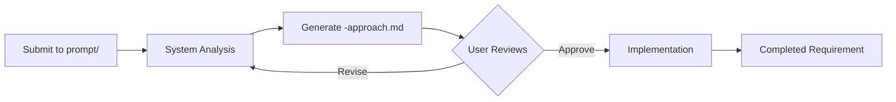

# Complete Requirements Generation System

## Executive Summary

This is a simplified, approval-based requirements generation system that ensures high-quality requirements through a streamlined 5-agent architecture. The system emphasizes simplification, pattern reuse, and human approval before implementation.

### System Coverage
- **ProducerPortal** - Quote management, producer workflows, entity management
- **Accounting** - Billing, payments, ACH processing, commission reconciliation  
- **ProgramManager** - Rate factors, underwriting rules, program configuration
- **ProgramTraits** - Program-specific business rules (Aguila Dorada specialization)
- **PolicyManager** - Policy lifecycle management, renewals, cancellations, endorsements
- **LossManager** - Claims processing, loss adjusting, settlement workflows
- **EntityIntegration** - External API integrations (DCS for verification)
- **Reinstatement** - Policy reinstatement with lapse processing
- **Sr22** - SR22/SR26 financial responsibility filing

### Key Benefits
- **90%+ first-approach accuracy** through deep analysis and pattern matching
- **85%+ pattern reuse** leveraging existing Global Requirements and codebase
- **Mandatory approval workflow** ensures quality before implementation
- **Simplified 5-agent system** streamlines the generation process

## Quick Start

### How to Submit a Requirement

1. **Choose your domain**: ProducerPortal, Accounting, etc.
2. **Create your requirement file**: Name it `prompt-{feature}.md`
3. **Place in prompt directory**: `/processing-queues/{domain}/prompt/`
4. **Wait for approach file**: System generates `-approach.md` for review
5. **Approve or revise**: Review the approach and provide feedback
6. **Implementation begins**: Only after your approval

### Essential Reading
- **[PROCESS_GUIDE.md](PROCESS_GUIDE.md)** - Understand the 5-agent workflow
- **[USER_GUIDE.md](USER_GUIDE.md)** - Detailed submission instructions
- **[CLAUDE.md](CLAUDE.md)** - Quality standards and compliance

## Approval Workflow

### Step-by-Step Process



### What Happens at Each Step

1. **Submit**: Place your requirement in `/processing-queues/{domain}/prompt/`
2. **Analysis**: 5-agent system analyzes and creates approach
3. **Review**: Find `-approach.md` in `/in-progress/approaches/`
4. **Decision**: Approve, Revise, Reject, or Defer
5. **Implementation**: Only proceeds after approval
6. **Completion**: Final requirement in `/completed/`

## Core Components

### Simplified 5-Agent Architecture
- **Prompt Analyzer**: Deep requirement analysis and initial approach generation
- **Pattern Matcher**: Finds reusable patterns from GlobalRequirements and blitzy-requirements for greenfield implementation
- **Simplification Enforcer**: Ensures solutions remain simple and maintainable
- **Implementation Generator**: Creates detailed requirements after approval
- **Quality Validator**: Final validation against all standards

### Key Infrastructure (Active Components)
- **Templates**: Two distinct templates in `/shared-infrastructure/templates/`
  - `approach-template.md`: For technical analysis in `/in-progress/approaches/`
  - `completed-requirement-template.md`: For final requirements in `/completed/`
- **Context Store**: Maintains processing context in `/shared-infrastructure/context-store/`
- **Knowledge Base**: Entity catalogs and patterns in `/shared-infrastructure/knowledge-base/`
- **Agent Configurations**: 5-agent system configs in `/shared-infrastructure/agent-configurations/`
- **Processing Queues**: Domain-specific and multi-domain queues
- **Blitzy-Requirements**: Reference-only codebase (NEVER modify)

### Global Requirements Integration
Leverages 64+ existing Global Requirements including:
- **⚠️ GR-68**: Pattern Reuse Guidelines (PRIORITY - 85%+ reuse target)
- **GR-69**: Producer Portal Architecture (23 core features)
- **GR-52**: Universal Entity Management (90% faster development)
- **GR-44**: Communication Architecture (unified messaging)
- **GR-41**: Database Standards (consistent naming and relationships)
- **GR-38**: Microservice Architecture (21 defined service boundaries)
- **GR-53**: DCS Integration Architecture (standardized external APIs)
- **GR-64**: Policy Reinstatement Process
- **GR-10**: SR22/SR26 Financial Responsibility Filing

## Directory Structure

```
requirements/
├── processing-queues/             # WHERE TO SUBMIT REQUIREMENTS
│   ├── [domain]/                 # Domain-specific queues
│   │   ├── prompt/              # 📁 SUBMIT NEW REQUIREMENTS HERE
│   │   ├── pending/             # Waiting for processing
│   │   ├── in-progress/         
│   │   │   ├── approaches/      # 📋 REVIEW -approach.md FILES HERE
│   │   │   │   └── {requirement-id}/  # Subdirectory for each requirement
│   │   │   │       ├── *-approach.md  # Original approach file
│   │   │   │       ├── *-approach-v2.md # Revised versions
│   │   │   │       └── *-approach-v3.md # Further iterations
│   │   │   └── implementations/ # Active implementation work
│   │   └── completed/           # Finished requirements
│   └── multi-domain/            # For cross-domain requirements
├── shared-infrastructure/        
│   ├── templates/               # Approach and requirement templates
│   ├── context-store/           # Context preservation
│   └── agent-configurations/    # 5-agent system configs
├── GlobalRequirements/          # Reusable patterns (64+ GRs)
├── [Domain]/                    # Domain-specific documentation
└── blitzy-requirements/         # ⚠️ REFERENCE ONLY - DO NOT MODIFY
```

## Key Features

### Approval-Based Workflow
- **Mandatory Approval**: No implementation without explicit approval
- **-approach.md Files**: Clear proposals before any work begins
- **Revision Support**: Iterate on approaches based on feedback
- **Full Transparency**: See exactly what will be implemented

### Enhanced Validation Process
Approach files now include comprehensive validation sections:
- **Business Summaries**: Non-technical explanations for stakeholder validation
- **Technical Summaries**: Implementation guidance for developer validation
- **Database Schemas**: Data model suggestions for architecture validation
- **Success Criteria**: Measurable outcomes for quality validation

### Simplification Focus
- **Pattern Reuse**: Leverages existing patterns from GlobalRequirements
- **Codebase Reference**: Checks blitzy-requirements for implementations
- **Complexity Reduction**: Simplification Enforcer prevents over-engineering
- **Clear Documentation**: Every decision is documented and traceable

### Context Preservation
- **Continuous Context**: Information flows between all agents
- **Decision History**: All choices and rationale preserved
- **Domain Knowledge**: Specialized templates for each domain
- **Cross-References**: Links between related requirements

### Database Standards (GR-41)
All tables in the system must follow these standards:
- **Status Management**: Use `status_id` (FK to status table) instead of boolean `is_active` fields
- **Status Tables**: Implement `status_type` and `status` tables for lifecycle management
- **Audit Fields**: Every table must include:
  - `created_by` (BIGINT UNSIGNED NOT NULL, FK to user)
  - `created_at` (TIMESTAMP DEFAULT CURRENT_TIMESTAMP)
  - `updated_by` (BIGINT UNSIGNED, FK to user)
  - `updated_at` (TIMESTAMP DEFAULT CURRENT_TIMESTAMP ON UPDATE CURRENT_TIMESTAMP)
- **Naming Convention**: Use singular nouns for tables, `map_` prefix for junction tables
- **Foreign Keys**: Always define proper foreign key constraints
- **Indexes**: Add indexes for foreign keys and commonly queried fields

## Documentation

### Core Documentation
- **[PROCESS_GUIDE.md](PROCESS_GUIDE.md)** - Complete workflow explanation and multi-agent coordination
- **[USER_GUIDE.md](USER_GUIDE.md)** - Practical instructions for using the system
- **[ARCHITECTURE.md](ARCHITECTURE.md)** - Technical system design and implementation details
- **[CLAUDE.md](CLAUDE.md)** - Quality standards and compliance requirements

### Implementation Documentation
- **[complete-requirements-generation-system.md](prompt/complete-requirements-generation-system.md)** - Comprehensive system specification
- **[phase1-execution-checklist.md](prompt/phase1-execution-checklist.md)** - Detailed implementation tracking
- **[phase1-changes-summary.md](prompt/phase1-changes-summary.md)** - Summary of all system changes

### Domain-Specific Documentation
- **[ProducerPortal/CLAUDE.md](ProducerPortal/CLAUDE.md)** - ProducerPortal-specific standards
- **[GlobalRequirements/](GlobalRequirements/)** - Complete library of Global Requirements

## Getting Started

### 1. Choose Your Domain
Available domains:
- `producer-portal` - Quote and policy management
- `accounting` - Billing and payments
- `program-manager` - Rate and rule configuration
- `program-traits` - Program-specific features
- `policy-manager` - Policy lifecycle management
- `loss-manager` - Claims processing and loss adjusting
- `entity-integration` - External API integrations
- `reinstatement` - Policy reinstatement
- `sr22` - Financial responsibility filing
- `multi-domain` - Cross-domain requirements

### 2. Create Your Requirement
Write a clear markdown file describing:
- What you need built
- Why it's needed
- Acceptance criteria
- Any special considerations

### 3. Submit for Processing
Place your file in: `/processing-queues/{domain}/prompt/`

### 4. Review and Approve
- Check `/in-progress/approaches/` for your `-approach.md` file
- Review the proposed implementation
- Provide feedback or approval

### 5. Track Progress
- Approved requirements move to `/in-progress/implementations/`
- Completed requirements end up in `/completed/`

## Important Notes

### Blitzy-Requirements Repository
- **GitHub**: https://github.com/blitzy-public-samples/insure-pilot-new/tree/staging
- **Purpose**: Reference existing implementations
- **Access**: Read-only - NEVER modify
- **Usage**: Find patterns and examples

### Pattern Selection for Greenfield Implementation
- **Pre-Production System**: Building new system without existing data
- **BR as Reference**: Proven patterns inform but don't constrain our choices
- **PE as Requirements**: Global Requirements define what must be built
- **Pattern Reconciliation**: Aligning approaches, not migrating data
- **Future Standards**: Our pattern choices establish templates for ongoing requirements

### Simplification Philosophy
"Make everything as simple as possible, but not simpler."
- Prefer existing patterns over new solutions
- Use direct approaches over abstractions
- Prioritize clarity over cleverness
- Document decisions clearly

### Success Tips
1. **Be Specific**: Clear requirements get better approaches
2. **Reference Examples**: Point to similar features in blitzy-requirements
3. **Think Simple**: Complex solutions often hide simple ones
4. **Iterate**: Use the revision process to refine approaches

---

**Last Updated**: 2025-01-14  
**System Version**: 5-Agent Architecture with Approval Workflow  
**Focus**: Simplification, Pattern Reuse, First-Approach Accuracy