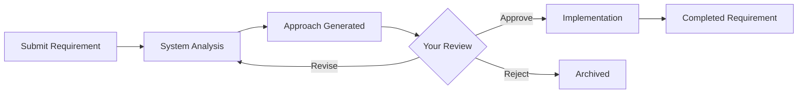

# Requirements Generation User Guide

## Overview

This guide provides practical instructions for using the simplified 5-agent requirements generation system with mandatory approval workflow. The system emphasizes simplification, pattern reuse, and human oversight to ensure high-quality requirements.

## Table of Contents

- [Getting Started](#getting-started)
- [Submitting Requirements](#submitting-requirements)
- [Approval Workflow](#approval-workflow)
- [Understanding the Queue System](#understanding-the-queue-system)
- [Working with Different Domains](#working-with-different-domains)
- [Quality Checklist and Validation](#quality-checklist-and-validation)
- [Monitoring Progress](#monitoring-progress)
- [Troubleshooting Common Issues](#troubleshooting-common-issues)
- [Best Practices](#best-practices)

## Getting Started

### What's New in the Simplified System

- **5-Agent Architecture**: Reduced from 11 agents for simplicity
- **Mandatory Approval**: Every requirement needs approval before implementation
- **Pattern-First Approach**: 85%+ pattern reuse target
- **Simple File-Based Queue**: No complex message brokers
- **Clear Workflow**: Submit → Analyze → Approve → Implement

### Prerequisites

Before using the system, ensure you have:
- Access to the `/app/workspace/requirements/` directory
- Understanding of your business domain (ProducerPortal, Accounting, etc.)
- Familiarity with the approval process
- Basic knowledge of markdown format

### Key Locations

```
/requirements/
├── processing-queues/{domain}/prompt/    # WHERE YOU SUBMIT
├── processing-queues/{domain}/in-progress/approaches/    # WHERE YOU REVIEW
├── GlobalRequirements/    # Pattern library
├── blitzy-requirements/    # Reference implementations (READ-ONLY)
└── shared-infrastructure/templates/    # Templates for consistency
```

### Quick Start Checklist

- [ ] **Choose Your Domain**: Identify which domain your requirement belongs to
- [ ] **Create Requirement File**: Use markdown format with clear description
- [ ] **Submit to Prompt Directory**: Place in `/processing-queues/{domain}/prompt/`
- [ ] **Review Approach File**: Check `/in-progress/approaches/` for `-approach.md`
- [ ] **Provide Approval Decision**: Mark your decision in the approach file

## Submitting Requirements

### Step 1: Choose Your Submission Method

**Single Domain Requirements**
```bash
# Submit to specific domain
/processing-queues/{domain}/prompt/prompt-{feature}.md
```

**Cross-Domain Requirements**
```bash
# Submit to multi-domain queue
/processing-queues/multi-domain/prompt/prompt-{feature}.md
```

### Step 2: Create Your Requirement File

**Simple Requirement Format**
```markdown
# [Feature Name] Requirement

## What We Need
[Clear description of the feature or change needed]

## Why It's Needed
[Business justification]

## Acceptance Criteria
- [ ] [Specific criterion 1]
- [ ] [Specific criterion 2]
- [ ] [Specific criterion 3]

## Additional Context
[Any relevant information, similar features, constraints]
```

### Step 3: Submit and Wait

1. **Save your file** in the appropriate `prompt/` directory
2. **System picks it up** automatically (no manual trigger needed)
3. **Approach file created** in 5-10 minutes
4. **Review notification** when approach is ready

## Approval Workflow

### Understanding the Approval Process

The system uses a mandatory approval checkpoint to ensure quality and prevent wasted effort:



### Step 1: Finding Your Approach File

After submitting a requirement, the system generates an approach file:

```bash
# Location of approach files
/processing-queues/{domain}/in-progress/approaches/{requirement-id}-approach.md
```

**Approach File Contents:**
- Requirement understanding
- Pattern analysis (which GRs apply)
- Reference implementations found
- Simplification suggestions
- Proposed implementation plan
- Risk assessment

### Step 2: Reviewing the Approach

**What to Look For:**
1. **Correct Understanding**: Does the system understand your requirement?
2. **Pattern Reuse**: Are existing patterns being leveraged (85%+ target)?
3. **Simplification**: Is the solution as simple as possible?
4. **Completeness**: Does the approach cover all your needs?
5. **Trade-offs**: Are the trade-offs acceptable?
6. **Business Summary**: Is this what stakeholders expect?
7. **Technical Summary**: Do the technical decisions make sense?
8. **Database Schema**: Does the data model follow our standards?
9. **Validation Criteria**: Are the success metrics clear and measurable?

**Example Approach File:**
```markdown
# IP269-UW-Questions - Implementation Approach

## Status: AWAITING APPROVAL

## Requirement Understanding
System will add underwriting questions to the quote flow with:
- Dynamic question rendering based on rules
- Answer validation and storage
- Integration with quote API

## Pattern Analysis
- Applicable GRs: [GR-52, GR-44, GR-41]
- Reference implementations: 
  - quote-questions.tsx (similar UI pattern)
  - uw-api.php (existing API structure)
- Reuse score: 87%

## Simplification Approach
- Original complexity: Real-time question updates
- Simplified solution: Batch question loading
- Trade-offs: 
  - Lose: Real-time rule changes
  - Gain: 50% simpler implementation
  
## Proposed Implementation
1. Extend existing quote API endpoints
2. Reuse question component from approved-requirements
3. Add validation using existing patterns
4. Store answers in quote_uw_answers table

## Risk Assessment
- Low risk: Using proven patterns
- Medium risk: New table needs migration
- Mitigation: Follow GR-41 standards

## Suggested Tables and Schemas
[Expected database structure with tables and relationships]

## Business Summary for Stakeholders
[Plain English explanation of what's being built and why]

## Technical Summary for Developers
[Key technical decisions and implementation guidance]

## Validation Criteria
[Pre-implementation checkpoints and success metrics]

## Approval Section
**Decision**: [ ] APPROVED [ ] REVISE [ ] REJECT [ ] DEFER
**Feedback**: [Your comments here]
```

### Step 3: Making Your Decision

**APPROVED**
```markdown
**Decision**: [X] APPROVED [ ] REVISE [ ] REJECT [ ] DEFER
**Feedback**: Looks good. Proceed with implementation.
```
- Implementation begins immediately
- Full requirement generated using approved approach
- Moved to completed when done

**REVISE**
```markdown
**Decision**: [ ] APPROVED [X] REVISE [ ] REJECT [ ] DEFER
**Feedback**: Need to include driver-specific questions. Also consider using the existing validation framework from GR-39.
```
- System incorporates feedback
- Generates new approach
- Returns for your review

**REJECT**
```markdown
**Decision**: [ ] APPROVED [ ] REVISE [X] REJECT [ ] DEFER
**Feedback**: This duplicates functionality in the risk assessment module.
```
- Requirement archived
- No further processing
- Can be resubmitted later if needed

**DEFER**
```markdown
**Decision**: [ ] APPROVED [ ] REVISE [ ] REJECT [X] DEFER
**Feedback**: Good idea but wait for Q2 when quote v2 launches.
```
- Requirement paused
- Can be reactivated later
- Preserves context and analysis

### Step 4: After Approval

Once approved, the system:
1. **Moves to implementations/**: Active work begins
2. **Generates full requirement**: Using the requirement template
3. **Validates quality**: Final checks against standards
4. **Delivers to completed/**: Ready for development team

You can monitor progress:
```bash
# Check implementation status
ls /processing-queues/{domain}/in-progress/implementations/

# View completed requirement
cat /processing-queues/{domain}/completed/{requirement-id}.md
```

## Understanding the Queue System

### Simplified Queue Structure

Each domain follows the same simple structure:

```
processing-queues/{domain}/
├── prompt/                    # WHERE YOU SUBMIT NEW REQUIREMENTS
├── pending/                   # Waiting to be processed
├── in-progress/               
│   ├── approaches/           # APPROACH FILES FOR YOUR REVIEW
│   └── implementations/      # Being implemented (after approval)
└── completed/                # Finished requirements
```

### How Files Move Through the System

```
1. prompt/ → You place file here
2. pending/ → System picks it up
3. in-progress/approaches/ → System creates -approach.md
4. [WAITING FOR YOUR APPROVAL]
5. in-progress/implementations/ → After you approve
6. completed/ → Final requirement delivered
```

### File Naming Convention

**Your submission:**
```
prompt-{feature-name}.md
```

**System generates:**
```
{ID}-{feature-name}-approach.md    # For your review
{ID}-{feature-name}.md              # Final requirement
```

### Queue Status

**Check what's happening:**
```bash
# See pending requirements
ls /processing-queues/{domain}/pending/

# Find approach files to review
ls /processing-queues/{domain}/in-progress/approaches/

# Check implementations in progress
ls /processing-queues/{domain}/in-progress/implementations/

# View completed requirements
ls /processing-queues/{domain}/completed/
```

## Working with Different Domains

### ProducerPortal Domain

**Typical Requirements:**
- Quote management workflows
- Producer portal features
- Entity relationship management
- DCS integration enhancements

**Key Considerations:**
- Check existing quote patterns in approved requirements
- Verify DCS integration requirements (GR-53)
- Ensure Universal Entity Management compliance (GR-52)
- Consider communication workflow integration (GR-44)

**Domain-Specific Queue:**
```bash
/app/workspace/requirements/processing-queues/producer-portal/
```

### Accounting Domain

**Typical Requirements:**
- Billing cycle enhancements
- Payment processing workflows
- Commission calculation updates
- ACH integration modifications

**Key Considerations:**
- Review payment entity patterns for reuse
- Check integration with ProducerPortal for quote-to-billing workflows
- Ensure financial compliance requirements
- Validate against existing commission structures

**Domain-Specific Queue:**
```bash
/app/workspace/requirements/processing-queues/accounting/
```

### ProgramManager Domain

**Typical Requirements:**
- Rate factor updates
- Underwriting rule modifications
- Program configuration changes
- Rate calculation enhancements

**Key Considerations:**
- Check integration with ProgramTraits for program-specific rules
- Ensure rate calculation consistency across programs
- Validate against existing underwriting patterns
- Consider impact on quote generation workflows

**Domain-Specific Queue:**
```bash
/app/workspace/requirements/processing-queues/program-manager/
```

### ProgramTraits Domain

**Typical Requirements:**
- Aguila Dorada program rules
- Program-specific customizations
- Specialized workflow modifications
- Program compliance updates

**Key Considerations:**
- Coordinate with ProgramManager for base rate factors
- Ensure program-specific rule consistency
- Validate against Aguila Dorada guidelines
- Consider cross-program impact

**Domain-Specific Queue:**
```bash
/app/workspace/requirements/processing-queues/program-traits/
```

### EntityIntegration Domain

**Typical Requirements:**
- External API integration updates
- DCS integration enhancements
- Third-party service connections
- Data verification workflows

**Key Considerations:**
- Review existing API integration patterns
- Ensure DCS architecture compliance (GR-53)
- Validate external service security requirements
- Consider impact on other domains using external data

**Domain-Specific Queue:**
```bash
/app/workspace/requirements/processing-queues/entity-integration/
```

### Reinstatement Domain

**Typical Requirements:**
- Policy reinstatement workflow updates
- Lapse processing enhancements
- Policy lifecycle modifications
- Reinstatement compliance updates

**Key Considerations:**
- Follow Policy Reinstatement Process guidelines (GR-64)
- Coordinate with Accounting for payment processing
- Ensure policy lifecycle consistency
- Validate against existing reinstatement patterns

**Domain-Specific Queue:**
```bash
/app/workspace/requirements/processing-queues/reinstatement/
```

### Sr22 Domain

**Typical Requirements:**
- SR22/SR26 filing enhancements
- Financial responsibility updates
- Compliance tracking modifications
- State filing system integration

**Key Considerations:**
- Follow SR22/SR26 Filing guidelines (GR-10)
- Coordinate with driver data from ProducerPortal
- Ensure compliance tracking accuracy
- Validate against state filing requirements

**Domain-Specific Queue:**
```bash
/app/workspace/requirements/processing-queues/sr22/
```

## Quality Checklist and Validation

### Pre-Submission Checklist

**Global Requirements Review:**
- [ ] **GR-52 (Universal Entity Management)**: Check if entities can be reused
- [ ] **GR-44 (Communication Architecture)**: Verify communication patterns
- [ ] **GR-41 (Database Standards)**: Ensure naming convention compliance
- [ ] **GR-38 (Microservice Architecture)**: Validate service boundaries
- [ ] **GR-53 (DCS Integration)**: Check external API patterns if applicable
- [ ] **GR-64 (Policy Reinstatement)**: Verify reinstatement process if applicable
- [ ] **GR-10 (SR22/SR26 Filing)**: Check financial responsibility requirements if applicable

**Domain-Specific Review:**
- [ ] **Check Approved Requirements**: Review domain's approved patterns
- [ ] **Entity Catalog Verification**: Ensure entity reuse where possible
- [ ] **Infrastructure Compatibility**: Validate against existing codebase
- [ ] **Cross-Domain Impact**: Identify shared entities and workflows

**Documentation Standards:**
- [ ] **Clear Requirement Description**: Unambiguous statement of needs
- [ ] **Complete Entity Analysis**: All entities identified and analyzed
- [ ] **Implementation Specifications**: Detailed technical requirements
- [ ] **Quality Validation Criteria**: Clear acceptance criteria

### Automatic Validation Process

The system performs progressive validation in these stages:

**Stage 1: Structure Validation (3 minutes)**
- Template compliance checking
- Required section verification
- Format standardization

**Stage 2: Domain Patterns (7 minutes)**
- Domain-specific business rule validation
- Entity pattern compliance
- Workflow consistency verification

**Stage 3: Cross-Domain (10 minutes)**
- Shared entity definition consistency
- Cross-domain relationship integrity
- Integration pattern validation

**Stage 4: Global Requirements (15 minutes)**
- Comprehensive GR compliance checking
- Universal entity management validation
- Communication architecture compliance
- Database standards verification

**Stage 5: Infrastructure (10 minutes)**
- Existing codebase pattern alignment
- Database schema compatibility
- API endpoint consistency
- Service layer integration verification

### Quality Gates

**Minimum Thresholds:**
- Global Requirements compliance: 95%
- Cross-domain consistency: 90%
- Infrastructure alignment: 85%
- Pattern reuse rate: 80%

**Common Validation Failures:**
- Missing Global Requirements references
- Entity duplication instead of reuse
- Inconsistent naming conventions
- Missing cross-domain coordination
- Infrastructure pattern misalignment

## Monitoring Progress

### Queue Status Monitoring

**Check Processing Status:**
```bash
# View current status of your requirements
ls -la /app/workspace/requirements/processing-queues/{domain}/in-progress/
ls -la /app/workspace/requirements/processing-queues/{domain}/completed/
```

**Monitor Cross-Domain Requirements:**
```bash
# Check multi-domain processing status
ls -la /app/workspace/requirements/processing-queues/multi-domain/in-progress/
```

### Progress Indicators

**File Locations Indicate Status:**
- `pending/`: Waiting for processing
- `in-progress/individual/`: Single requirement processing
- `in-progress/batch-{id}/`: Part of coordinated batch processing
- `completed/`: Processing finished
- `intelligence/`: Pre-processing analysis available

**Processing Artifacts:**
- `{requirement}-approach.md`: Processing approach and strategy
- `shared-entities.json`: Shared entity definitions within batch
- `cross-domain-links.json`: Links to related domain requirements
- `processing-metrics.json`: Performance and quality metrics

### Performance Tracking

**Individual Requirement Metrics:**
- Processing time from submission to completion
- Pattern reuse rate achieved
- Global Requirements compliance score
- Cross-domain coordination efficiency

**System-Wide Performance:**
- Average processing time across domains
- Pattern library growth rate
- First-pass approval rates
- Infrastructure alignment scores

## Troubleshooting Common Issues

### Approval Workflow Issues

**Can't Find Approach File**
- **Issue**: Approach file not in expected location
- **Solution**: Check `/in-progress/approaches/` directory
- **Tip**: Files are named `{ID}-{feature}-approach.md`

**Approach Not Generated**
- **Issue**: No approach file after 15 minutes
- **Solution**: Check if file is still in `prompt/` or `pending/`
- **Prevention**: Ensure proper markdown format in submission

**Revision Loop**
- **Issue**: Multiple revisions without progress
- **Solution**: Be specific in feedback about what needs changing
- **Example**: "Add validation for negative numbers" vs "needs better validation"

### Simplification Challenges

**Over-Complicated Approach**
- **Issue**: System proposes complex solution
- **Solution**: Request revision focusing on simplification
- **Feedback**: "Please simplify by removing real-time updates and using batch processing instead"

**Missing Pattern Reuse**
- **Issue**: Not leveraging existing patterns
- **Solution**: Point to specific patterns in feedback
- **Feedback**: "Use the quote validation pattern from IP-123 instead of creating new"

### File Management

**Wrong Directory**
- **Issue**: File placed in wrong location
- **Solution**: Move to correct `prompt/` directory
- **Prevention**: Double-check domain before submitting

**File Naming**
- **Issue**: System can't process incorrectly named files
- **Solution**: Use `prompt-{feature}.md` format
- **Example**: `prompt-uw-questions.md` ✓

## Best Practices

### Writing Clear Requirements

**DO:**
- Use simple, clear language
- Include specific examples
- List concrete acceptance criteria
- Reference similar existing features

**DON'T:**
- Write vague descriptions
- Skip the business justification
- Assume context
- Over-specify implementation details

**Good Example:**
```markdown
# Add Export Button to Quote List

## What We Need
Add a button to export the quote list to CSV format

## Why It's Needed
Producers need to analyze quotes in Excel for monthly reporting

## Acceptance Criteria
- [ ] Export button visible on quote list page
- [ ] CSV includes: quote number, customer name, premium, status, date
- [ ] File downloads to user's computer
- [ ] Works with filtered results

## Additional Context
Similar to the export feature in the commission report
```

### Effective Approval Reviews

**Enhanced Approval Checklist:**
1. ✓ Requirement understood correctly?
2. ✓ Existing patterns being reused (85%+ target)?
3. ✓ Solution simplified appropriately?
4. ✓ Trade-offs acceptable?
5. ✓ All needs covered?
6. ✓ **NEW: Business summary accurate for stakeholders?**
7. ✓ **NEW: Technical approach clear for developers?**
8. ✓ **NEW: Database schema follows standards?**
9. ✓ **NEW: Validation criteria measurable?**

**Good Feedback Examples:**

✓ **Specific**: "Add error handling for network timeouts"
✗ **Vague**: "Needs better error handling"

✓ **Actionable**: "Use the validation pattern from GR-41"
✗ **Unclear**: "Follow best practices"

✓ **Focused**: "Simplify by removing the caching layer"
✗ **Broad**: "Make it simpler"

### Maximizing Pattern Reuse

**Before Submitting:**
1. Search GlobalRequirements for similar patterns
2. Check blitzy-requirements for implementations
3. Review domain's approved-requirements
4. Reference patterns in your requirement

**In Your Requirement:**
```markdown
## Additional Context
Similar to the quote validation in approved-requirements/IP-145
Could reuse the export component from blitzy-requirements/commission-export.tsx
Should follow GR-52 for entity management
```

### Working with the Simplified System

**Embrace Simplicity:**
- Trust the 5-agent system
- Don't over-specify requirements
- Let the system find patterns
- Focus on what, not how

**Use the Approval Checkpoint:**
- Review approaches thoroughly
- Provide clear feedback
- Iterate when needed
- Approve when satisfied

**Learn from the System:**
- Study generated approaches
- Understand pattern selections
- Learn simplification strategies
- Apply lessons to future requirements

---

**Last Updated**: 2025-01-14  
**User Guide Version**: 5-Agent System with Approval Workflow  
**Support**: Review documentation or submit questions through appropriate domain queue