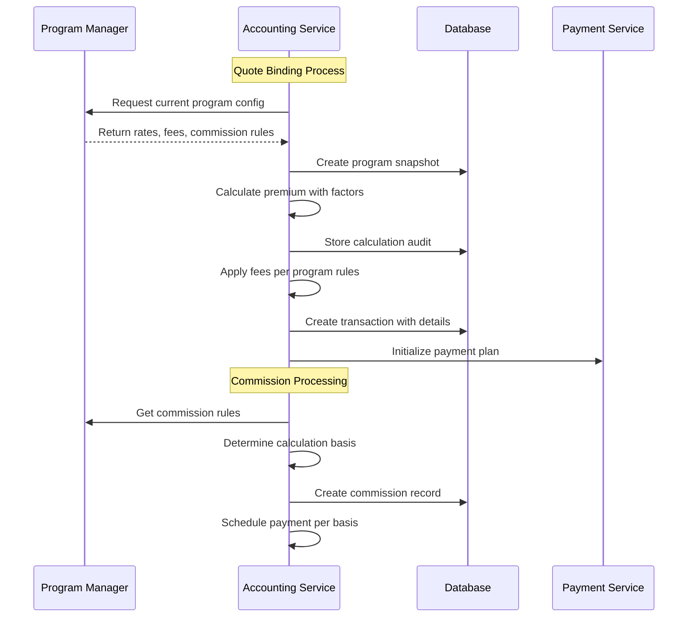

# Accounting Global Requirements Generation - Version 4 (Program Manager Integration)

## Executive Summary

This version 4 document represents a significant evolution of the accounting requirements, incorporating deep integration with the Program Manager module. The analysis reveals that Program Manager is not just a configuration system but the **financial control center** that drives virtually all accounting calculations, fee structures, commission rules, and payment configurations. This integration requires fundamental changes to our accounting approach to ensure all financial operations respect program-specific configurations.

## Pre-Analysis Summary

### Key Program Manager Components Affecting Accounting

1. **Financial Configuration Elements**
   - **Payment Plans**: Full Pay, Installment with configurable down payment percentages (20-50%)
   - **Fee Structure**: MGA fees, MVCPA fees, convenience fees, installment fees (complex formula), NSF fees, endorsement fees, SR-22 fees
   - **Commission Structure**: New business rates, renewal rates, calculation basis (Collected/Earned/Written), term-specific rates, producer overrides
   - **Sales Tax Configuration**: State-specific tax rates and application rules
   - **Cancellation Methods**: Pro Rata vs Short Rate with configurable lead times

2. **Rate Calculation Components**
   - Base rates per coverage line with term applicability
   - Individual rating factors (payment options, EFT, driver points, etc.)
   - Factor groupings (lienholder + vehicle count, policy core matrix, etc.)
   - Territory factors at ZIP code level
   - Payment method acceptance factors
   - **Critical**: Rating order affects final premium - fees ALWAYS applied last

3. **Integration Requirements**
   - **Payment Processor**: Paysafe/Tranzpay integration
   - **Positive Pay**: Sunflower Bank integration
   - **Agency Management System**: APIs for commission tracking and producer management

## Major Changes from Version 2

### 1. Program-Centric Architecture
All accounting operations must now reference Program Manager configurations:
- Premium calculations use program-specific rate factors and base rates
- Fee applications follow program-defined formulas and stacking rules
- Commission calculations vary by program, product line, and producer tier
- Payment plans are dynamically generated from program configurations

### 2. Enhanced Commission Management
Program Manager reveals commission complexity not addressed in v2:
- **Calculation Basis Options**: Collected (when payment received), Earned (over policy term), Written (at bind)
- **Tiered Commission Structures**: Agency tier affects commission rates
- **Commission Caps**: Maximum commission amounts per policy
- **Producer Overrides**: Program defaults can be overridden at producer level

### 3. Complex Fee Calculation Engine
The installment fee formula from Program Manager requires sophisticated calculation:
```
Installment Fee = Base Fee + ceil((Term Premium - Base Threshold) / Increment Amount) × Increment Fee
```

### 4. Payment Plan Flexibility
Program Manager defines payment plans with:
- Variable down payment percentages (not fixed at 20%)
- Different installment counts (not just monthly/quarterly)
- Plan-specific factors affecting premium
- EFT enhancement discounts

### 5. Territory-Based Financial Calculations
ZIP code level territory factors affect:
- Base premium calculations
- Coverage-specific adjustments
- Term-specific variations

## Enhanced Entity Analysis

### Modified Primary Accounting Entities

1. **Transaction** (Enhanced)
   - Add `program_version_id` to track which program version was used
   - Add `rate_calculation_log` (JSON) to store step-by-step premium derivation
   - Add `factor_application_order` to document rating sequence
   - Add `territory_factor_snapshot` to preserve territory factors at transaction time

2. **TransactionLine** (Enhanced)
   - Add `coverage_line_code` to link to specific coverage types
   - Add `base_rate_snapshot` to preserve base rate at calculation time
   - Add `applied_factors` (JSON) to track all factors affecting this line
   - Add `factor_contribution` to show impact of each factor

3. **Commission** (Significantly Enhanced)
   ```
   Commission {
     id: UUID
     policy_id: UUID
     producer_id: UUID
     program_id: UUID
     calculation_basis: ENUM [COLLECTED, EARNED, WRITTEN]
     commission_tier: String (agency tier from program)
     base_commission_rate: Decimal (program default)
     override_commission_rate: Decimal (producer-specific)
     applied_commission_rate: Decimal (actual rate used)
     premium_base: Decimal (amount commission calculated on)
     commission_amount: Decimal
     cap_applied: Boolean
     cap_amount: Decimal
     earned_date: Date (for EARNED basis)
     written_date: Date (for WRITTEN basis)
     collected_date: Date (for COLLECTED basis)
     payment_status: ENUM [PENDING, SCHEDULED, PAID, CANCELLED]
     chargeback_eligible_until: Date
     created_at: Timestamp
     updated_at: Timestamp
   }
   ```

4. **PaymentPlan** (Program-Driven)
   ```
   PaymentPlan {
     id: UUID
     policy_id: UUID
     program_plan_id: UUID (reference to program's payment plan)
     plan_type: ENUM [FULL_PAY, MONTHLY, QUARTERLY, SEMI_ANNUAL, CUSTOM]
     total_installments: Integer
     down_payment_percentage: Decimal
     down_payment_amount: Decimal
     installment_fee_formula: JSON (from program configuration)
     eft_discount_applied: Boolean
     eft_discount_amount: Decimal
     payment_factor: Decimal (from program)
     total_plan_premium: Decimal
     status: ENUM [ACTIVE, MODIFIED, CANCELLED, COMPLETED]
     created_at: Timestamp
     updated_at: Timestamp
   }
   ```

5. **FeeCalculation** (New)
   ```
   FeeCalculation {
     id: UUID
     transaction_id: UUID
     fee_type: ENUM [MGA, MVCPA, CONVENIENCE, INSTALLMENT, NSF, LATE, ENDORSEMENT, SR22]
     calculation_method: ENUM [FLAT, PERCENTAGE, FORMULA, PER_ENTITY]
     base_amount: Decimal
     calculated_amount: Decimal
     formula_details: JSON (for complex calculations)
     entity_count: Integer (for per-entity fees)
     waived: Boolean
     waived_reason: String
     applied_at: Timestamp
   }
   ```

### New Program Integration Entities

1. **ProgramSnapshot** (New)
   ```
   ProgramSnapshot {
     id: UUID
     policy_id: UUID
     program_id: UUID
     program_version: String
     snapshot_data: JSON (complete program configuration at bind time)
     rate_tables: JSON
     fee_structures: JSON
     commission_rules: JSON
     territory_factors: JSON
     created_at: Timestamp
   }
   ```

2. **RateCalculationAudit** (New)
   ```
   RateCalculationAudit {
     id: UUID
     quote_id: UUID
     policy_id: UUID
     calculation_timestamp: Timestamp
     base_premium: Decimal
     factors_applied: JSON (ordered list of factors with values)
     running_premium: JSON (premium after each factor)
     final_premium: Decimal
     fees_applied: JSON
     total_amount: Decimal
     calculation_time_ms: Integer
   }
   ```

## Implementation Requirements Update

### Modified Architecture Foundation

1. **Enhanced Database Schema**
   ```sql
   -- Program integration tables
   CREATE TABLE program_snapshot (
     id BIGINT UNSIGNED AUTO_INCREMENT PRIMARY KEY,
     policy_id BIGINT UNSIGNED NOT NULL,
     program_id BIGINT UNSIGNED NOT NULL,
     program_version VARCHAR(20) NOT NULL,
     snapshot_data JSON NOT NULL,
     rate_tables JSON NOT NULL,
     fee_structures JSON NOT NULL,
     commission_rules JSON NOT NULL,
     territory_factors JSON NOT NULL,
     created_at TIMESTAMP DEFAULT CURRENT_TIMESTAMP,
     FOREIGN KEY (policy_id) REFERENCES policies(id),
     INDEX idx_program_snapshot_policy (policy_id)
   );

   -- Enhanced commission tracking
   CREATE TABLE commission_calculation_log (
     id BIGINT UNSIGNED AUTO_INCREMENT PRIMARY KEY,
     commission_id BIGINT UNSIGNED NOT NULL,
     calculation_step VARCHAR(100),
     step_value DECIMAL(10,2),
     step_description TEXT,
     created_at TIMESTAMP DEFAULT CURRENT_TIMESTAMP,
     FOREIGN KEY (commission_id) REFERENCES commissions(id)
   );

   -- Territory factor tracking
   CREATE TABLE applied_territory_factors (
     id BIGINT UNSIGNED AUTO_INCREMENT PRIMARY KEY,
     transaction_id BIGINT UNSIGNED NOT NULL,
     zip_code VARCHAR(10) NOT NULL,
     territory_code VARCHAR(50),
     coverage_factors JSON NOT NULL,
     applied_at TIMESTAMP DEFAULT CURRENT_TIMESTAMP,
     FOREIGN KEY (transaction_id) REFERENCES transactions(id),
     INDEX idx_territory_transaction (transaction_id)
   );
   ```

2. **Enhanced Service Layer**

   **RateCalculationService** (New)
   - Interfaces with Program Manager for rate factors
   - Implements complex rating algorithms
   - Maintains calculation audit trail
   - Handles factor ordering and application

   **ProgramIntegrationService** (New)
   - Fetches current program configurations
   - Creates program snapshots at bind time
   - Validates program version compatibility
   - Manages program version transitions

   **EnhancedCommissionService**
   - Implements three calculation bases (Collected/Earned/Written)
   - Handles producer-specific overrides
   - Manages commission caps and tiers
   - Tracks commission eligibility by calculation basis

   **FeeCalculationEngine** (New)
   - Implements complex fee formulas from Program Manager
   - Handles entity-based fee calculations (MGA per policy, MVCPA per vehicle)
   - Manages fee stacking and application order
   - Supports fee waivers with audit trail

   **TerritoryRatingService** (New)
   - Integrates with Program Manager territory definitions
   - Applies ZIP-level rating factors
   - Handles territory changes and effective dates
   - Maintains historical territory factor data

### Modified Business Rules

1. **Rating Calculation Rules**
   - Base premium MUST come from Program Manager configuration
   - Rating factors MUST be applied in program-defined order
   - Fees MUST be applied last in calculation sequence
   - Territory factors vary by coverage type and must be applied correctly
   - All calculations must be reproducible from stored snapshots

2. **Commission Calculation Rules**
   ```
   IF calculation_basis = 'WRITTEN' THEN
     Calculate commission at policy bind
     Pay according to producer payment schedule
   ELSIF calculation_basis = 'EARNED' THEN
     Calculate commission at bind
     Recognize commission revenue over policy term
     Pay as earned (monthly/quarterly)
   ELSIF calculation_basis = 'COLLECTED' THEN
     Calculate commission as payments received
     Pay only on collected premium
   END IF
   ```

3. **Fee Application Rules**
   - Installment fees use program-specific formula
   - Entity-based fees multiply by entity count
   - Convenience fees vary by transaction type
   - SR-22 fees integrate with existing GR-10 requirements
   - All fees respect program configuration

4. **Payment Plan Rules**
   - Down payment percentage from program (not hardcoded 20%)
   - Installment count from program configuration
   - EFT discount applies as payment method factor
   - Plan modifications require recalculation
   - Factors affect individual installment amounts

## Enhanced Cross-Domain Dependencies

### Critical Program Manager Dependencies

1. **Rate Factor Management**
   - Real-time access to current rate factors
   - Historical factor preservation for audit
   - Factor validation before application
   - Version control for rate changes

2. **Fee Configuration Access**
   - Dynamic fee formula retrieval
   - Fee stacking rule enforcement
   - Entity-based fee calculations
   - Fee waiver authorization

3. **Commission Rule Integration**
   - Producer tier determination
   - Commission cap validation
   - Override rule application
   - Calculation basis selection

4. **Territory Integration**
   - ZIP to territory mapping
   - Territory factor lookup
   - Multi-coverage factor application
   - Effective date management

### Data Flow Requirements



## Critical Questions Requiring Clarification

### Program Manager Integration

1. **Rate Change Handling**
   - How do mid-term program rate changes affect in-force policies?
     - Rate changes only go into affect on new business and renewals.
   - Should we recalculate or grandfather existing policies?
     - Existing polcies will renew into the newer rate chart.
   - What triggers a re-rating event?
     - An endorsement, renewal, changes during rate quote bind,

2. **Commission Timing**
   - For EARNED basis, what's the exact earning schedule (daily, monthly)?
     - monthly.
   - How do cancellations affect earned but unpaid commissions?
     - Suggestion?
   - Do short-rate cancellations affect commission differently than pro-rata?
     - Explain?

3. **Fee Stacking**
   - What's the complete order for multiple fee types?
     - scour through all the information in this directory for the answer.
     - Aime/workspace/requirements/ProgramManager/Documentation
   - Can certain fees be combined (e.g., convenience + installment)?
     - See the program rating requirements
   - How do fee waivers affect stacking order?
     - Explain?

4. **Territory Changes**
   - How do territory factor changes affect existing policies?
     - Existing policies are not changed by a rate change, but endorsements.
     - Remeber, upon binding a policy, that is a legal contract for a period of time.
   - Is re-rating automatic or manual for territory changes?
     - automatic upon renewal.
   - How do we handle policies that span territory changes?
     - it should be evaluated upon renewal.

### Payment Plan Modifications

1. **Plan Change Rules**
   - Can payment plans be changed mid-term?
     - Technically, yes. However, not necessarily by a payment plan selection.
       - Given that the system is equity based, if a payment is made over the invoiced amount, the remaining premium should be automatically redistributed accross the remaining payment fo the term.
         - In some cases, this could remove a payment at the end of the term, which would in essence be chnaging the payment plan.
     - They can also change the due date.
   - How do plan changes affect installment fees?
     - Goven my response above, is this still a question?
   - What validates a plan modification request?
     - See my answer above.

2. **EFT Discount Application**
   - When is EFT discount locked in?
     - Whenever they choose to add it.
   - Can EFT discount be removed mid-term?
     - Yes, via endorsement.
   - How does EFT failure affect the discount?
     - Failures should be logged and possible a suspense added for the underwrtiting team to review.

### Audit and Compliance

1. **Calculation Transparency**
   - What level of detail needed for rate calculation logs?
     - Everything from steps in the process, premium, fees, rate order of caluclation, actual calculations, etcc.
       - An auditor should be able to look at this and know exactly how a policy was rated to a specfifc program.
   - How long must calculation audit trails be retained?
     - Forever on bound policies and endorsements.
   - What format for regulatory reporting?
     - Suggestions?

2. **Program Version Control**
   - How do we handle policies spanning multiple program versions?
     - An offer to renew is sent out to the insured to renew. The reweal will be based on the rates of the newer version of the existing chart.
   - What constitutes a major vs minor program change?
     - Program changes are all major as they affect all policies written under them.
   - How do we audit program version usage?
      - scour through all the information in this directory for the answer.
      - Aime/workspace/requirements/ProgramManager/Documentation

## Migration Considerations

### From Version 2 to Version 4

1. **Database Migration Requirements**
   - Add program references to all financial tables
   - Migrate fixed commission rates to program-based structures
   - Create program snapshots for existing policies
   - Populate calculation audit trails retrospectively

2. **Service Layer Updates**
   - Refactor commission service for multiple calculation bases
   - Implement fee calculation engine
   - Add program integration layer
   - Create rate calculation service

3. **API Changes**
   - Enhance transaction endpoints with program context
   - Add rate calculation preview endpoints
   - Expand commission APIs for basis selection
   - Include program version in all responses

## Success Criteria Additions

### Program Integration Success
- [ ] All financial calculations traceable to program configurations
- [ ] Rate calculations reproducible from stored snapshots
- [ ] Commission basis properly implemented for all three types
- [ ] Fee formulas correctly implemented including complex installment fees
- [ ] Territory factors properly applied at ZIP code level

### Audit Trail Success
- [ ] Complete calculation transparency for all premiums
- [ ] Factor application order documented
- [ ] Fee stacking sequence preserved
- [ ] Commission calculation steps logged
- [ ] Program versions tracked for all transactions

### Performance Targets
- [ ] Rate calculations complete in < 500ms
- [ ] Batch commission processing handles 10,000 policies/hour
- [ ] Fee calculations add < 100ms to transaction time
- [ ] Territory lookups cached with < 50ms access time

## Implementation Priority Recommendations

### Phase 1: Foundation (Weeks 1-2)
1. Create program snapshot infrastructure
2. Implement rate calculation service
3. Add calculation audit trail
4. Enhance transaction tables

### Phase 2: Fee Engine (Weeks 3-4)
1. Build fee calculation engine
2. Implement complex formulas
3. Add fee stacking logic
4. Create fee audit trail

### Phase 3: Commission Enhancement (Weeks 5-6)
1. Implement three calculation bases
2. Add producer override logic
3. Create commission caps
4. Build earning schedules

### Phase 4: Integration & Testing (Weeks 7-8)
1. Complete Program Manager integration
2. End-to-end testing
3. Performance optimization
4. Migration scripts

## Conclusion

This Version 4 document represents a fundamental shift in how accounting integrates with the insurance platform. The Program Manager is revealed as the financial brain of the system, requiring tight integration and careful attention to configuration-driven calculations. The enhanced requirements ensure that accounting respects all program rules while maintaining the audit trail and flexibility needed for insurance operations.

The key insight is that accounting cannot be treated as a standalone domain - it must be deeply integrated with Program Manager configurations to ensure accurate financial calculations and compliance with business rules.

---

**Document Version**: 4.0  
**Date**: 2025-01-07  
**Status**: DRAFT - Pending Review and Clarification  
**Next Steps**: Address critical questions before proceeding with implementation