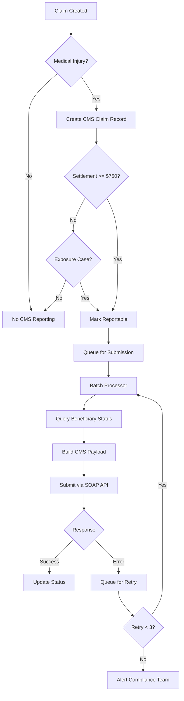

# CMS Section 111 Medicare Reporting Requirements for Texas Personal Auto Insurance

## Pre-Analysis Checklist

- [x] Pattern Reuse Target: 85% - Leveraging GR-52 (Universal Entity Management), GR-44 (Communication), GR-10 (SR22 patterns)
- [x] Entity Reuse: Using existing claim, policy, user, status, and communication entities
- [x] Schema Normalization: Fully normalized design following GR-41 standards
- [x] API Integration: Following GR-48 patterns with Apache Camel routing
- [x] Communication Tracking: Universal patterns from GR-44 for audit trail
- [x] Performance Targets: Sub-second queries on 2M+ records
- [x] Compliance Requirements: 7-year retention, PII protection, audit logging

## A. Requirement Overview

### Overview
The Centers for Medicare & Medicaid Services (CMS) mandates electronic reporting under Section 111 of the Medicare, Medicaid, and SCHIP Extension Act (MMSEA) for all entities paying medical claims where Medicare beneficiaries may be involved. For Texas personal auto insurance, this requires reporting liability insurance claims to determine Medicare's payment responsibility.

### Business Context
- **Legal Mandate**: Federal requirement with penalties of $1,325 per day per claim for non-compliance
- **Scope**: All auto liability claims in Texas involving potential Medicare beneficiaries  
- **Purpose**: Coordinate benefits when Medicare and auto insurance both cover medical expenses
- **Impact**: Affects claims processing, compliance tracking, and financial reporting

### Key Requirements
1. **Data Collection**: Capture 70+ fields per claim including injured party details, policy information, and settlement data
2. **Beneficiary Query**: Identify Medicare beneficiaries and enrollment status before settlement
3. **Submission Timeline**: Report within 365 days of payment responsibility or face penalties
4. **Ongoing Updates**: Track claim lifecycle changes and report amendments
5. **Audit Trail**: Maintain complete records for compliance verification

### Success Metrics
- 100% of eligible claims reported within required timeframe
- Zero compliance penalties for late/missing reports
- < 1% error rate on submissions
- < 5 minute processing time per 1000 claims
- Complete audit trail for regulatory reviews

## B. Entity Analysis and Reuse Strategy

### Entities to Reuse from Entity Catalog

#### From Core Business Entities
- **claim**: Primary source of claim data
- **policy**: Policy details and coverage information
- **driver**: Injured party information
- **user**: System users creating/updating reports
- **status**: Universal status tracking

#### From Universal Entity Management (GR-52)
- **entity**: Store CMS API configuration
- **entity_type**: Define CMS_REPORTING_API type
- **communication**: Track all API interactions
- **configuration**: Store reporting thresholds and rules

#### From Infrastructure Entities
- **payment**: Settlement and payment details
- **transaction**: Financial transaction records
- **document**: Supporting documentation

### New Entities Required

#### cms_claim
- **Purpose**: Store CMS-specific claim data in normalized format
- **Justification**: 70+ fields require dedicated storage for query performance
- **Pattern**: Follows claim supplemental data pattern

#### cms_claim_diagnosis  
- **Purpose**: Normalize diagnosis codes (up to 19 per claim)
- **Justification**: Diagnosis codes need indexing for reporting
- **Pattern**: Standard one-to-many relationship

#### cms_submission
- **Purpose**: Track submission history and status
- **Justification**: Audit trail and retry management
- **Pattern**: Similar to document_action tracking

#### cms_response_code
- **Purpose**: Store CMS error and compliance codes
- **Justification**: Error analysis and resolution tracking
- **Pattern**: Reference data with submission association

### Entity Relationships
```
claim (1) ← → (0..1) cms_claim
cms_claim (1) ← → (0..n) cms_claim_diagnosis  
cms_claim (1) ← → (0..n) cms_submission
cms_submission (1) ← → (0..n) cms_response_code
cms_submission (1) → (1) communication
```

## C. Field Mappings and Backend Logic

### Data Collection Workflow

#### 1. Claim Eligibility Check
```
get claim.id from claim
-> check claim.injury_type for medical component
-> get policy.effective_date, policy.state
-> verify Texas jurisdiction
-> check settlement amount >= $750 (physical trauma)
-> check settlement amount >= $0 (exposure/ingestion/implantation)
-> return eligibility status
```

#### 2. Beneficiary Information Collection
```
get driver.id from map_claim_driver where is_injured_party = true
-> get name.* from name via driver.name_id
-> get driver.date_of_birth, driver.ssn (encrypted)
-> get address.* from address via map_driver_address
-> validate required fields present
-> return beneficiary data
```

#### 3. Policy Information Extraction
```
get policy.* from policy via claim.policy_id
-> get policy.policy_number, policy.effective_date
-> get coverage.* from coverage via map_policy_coverage
-> determine plan_type (D=auto liability)
-> check self_insured status
-> return policy data
```

#### 4. Financial Information Compilation
```
get payment.* from payment where claim_id = claim.id
-> calculate total_payment_obligation (TPOC)
-> get payment.payment_date as TPOC date
-> determine ORM indicator (ongoing medical responsibility)
-> get payment.amount, payment.payment_type
-> return financial data
```

### API Integration Architecture

#### CMS Entity Configuration (via GR-52)
```json
{
  "entity_type": "CMS_REPORTING_API",
  "entity_category": "INTEGRATION",
  "metadata": {
    "provider": "Centers for Medicare & Medicaid Services",
    "base_url": "https://www.cob.cms.hhs.gov/Section111/MRA",
    "api_version": "7.4",
    "auth_type": "certificate",
    "capabilities": ["claim_submission", "beneficiary_query", "status_check"],
    "wsdl_url": "https://www.cob.cms.hhs.gov/Section111/MRA/ClaimInput1.wsdl",
    "data_retention_days": 2555
  }
}
```

#### Apache Camel Route Configuration
```xml
<route id="cms-claim-submission">
  <from uri="jms:queue:cms.submission"/>
  <setHeader name="CamelHttpMethod"><constant>POST</constant></setHeader>
  <marshal><custom ref="cmsClaimMarshaller"/></marshal>
  <to uri="cxf:bean:cmsWebService"/>
  <unmarshal><custom ref="cmsResponseUnmarshaller"/></unmarshal>
  <to uri="bean:cmsResponseProcessor"/>
</route>
```

#### Communication Tracking (via GR-44)
```
INSERT INTO communication (
  source_type, source_id,
  target_type, target_id,
  communication_type_id,
  correlation_id,
  request_data, response_data,
  status_id
) VALUES (
  'cms_submission', :submission_id,
  'entity', :cms_entity_id,
  :api_call_type_id,
  :correlation_id,
  :encrypted_request, :encrypted_response,
  :status_id
)
```

### Business Rules Implementation

#### Reporting Thresholds
```php
class CmsEligibilityService {
    const PHYSICAL_TRAUMA_THRESHOLD = 750.00;
    const EXPOSURE_THRESHOLD = 0.00; // All amounts reportable
    
    public function isReportable(Claim $claim): bool {
        if ($this->isExposureCase($claim)) {
            return true; // No threshold
        }
        
        return $claim->settlement_amount >= self::PHYSICAL_TRAUMA_THRESHOLD;
    }
}
```

#### Submission Timeline Management
```php
class CmsSubmissionService {
    const SUBMISSION_DEADLINE_DAYS = 365;
    const WARNING_THRESHOLD_DAYS = 30;
    
    public function checkSubmissionDeadline(CmsClaim $cmsClaim): array {
        $daysSinceSettlement = $cmsClaim->getDaysSinceSettlement();
        
        return [
            'days_remaining' => self::SUBMISSION_DEADLINE_DAYS - $daysSinceSettlement,
            'is_overdue' => $daysSinceSettlement > self::SUBMISSION_DEADLINE_DAYS,
            'requires_urgent_action' => $daysSinceSettlement > (self::SUBMISSION_DEADLINE_DAYS - self::WARNING_THRESHOLD_DAYS)
        ];
    }
}
```

### Security Implementation

#### PII/PHI Protection
```php
// Encryption for sensitive fields
class CmsClaimRepository {
    protected $encryptedFields = [
        'injured_party_ssn',
        'injured_party_hicn',
        'request_payload',
        'response_payload'
    ];
    
    public function save(CmsClaim $cmsClaim): void {
        foreach ($this->encryptedFields as $field) {
            if ($cmsClaim->$field) {
                $cmsClaim->$field = encrypt($cmsClaim->$field);
            }
        }
        parent::save($cmsClaim);
    }
}
```

#### Audit Logging
```php
// Log all CMS interactions
Event::listen(CmsSubmissionCreated::class, function ($event) {
    AuditLog::create([
        'user_id' => auth()->id(),
        'action' => 'cms_submission_created',
        'entity_type' => 'cms_submission',
        'entity_id' => $event->submission->id,
        'metadata' => [
            'claim_id' => $event->submission->cms_claim->claim_id,
            'submission_type' => $event->submission->submission_type
        ]
    ]);
});
```

## D. Process Flow

### Claim to CMS Reporting Flow



### Batch Processing Schedule

1. **Initial Submission Queue**: Every 4 hours
2. **Retry Queue**: Every hour  
3. **Status Check Queue**: Daily at 2 AM
4. **Compliance Report**: Daily at 6 AM
5. **Deadline Warning Check**: Daily at 8 AM

## E. Database Schema

### Core Tables

#### cms_claim
```sql
CREATE TABLE cms_claim (
    id BIGINT UNSIGNED AUTO_INCREMENT PRIMARY KEY,
    claim_id BIGINT UNSIGNED NOT NULL,
    icn VARCHAR(30) NOT NULL UNIQUE,              -- Internal Control Number
    rreid VARCHAR(9) NOT NULL,                     -- RRE ID
    
    -- Injured Party Information
    injured_party_hicn VARCHAR(12),                -- Encrypted
    injured_party_ssn VARCHAR(9),                  -- Encrypted
    injured_party_last_name VARCHAR(40) NOT NULL,
    injured_party_first_name VARCHAR(30) NOT NULL,
    injured_party_middle_initial VARCHAR(1),
    injured_party_gender CHAR(1),                  -- M, F, U
    injured_party_dob DATE NOT NULL,
    
    -- Address Information
    injured_party_street1 VARCHAR(75),
    injured_party_street2 VARCHAR(75),
    injured_party_city VARCHAR(75),
    injured_party_state VARCHAR(2),
    injured_party_zip VARCHAR(5),
    injured_party_country VARCHAR(2) DEFAULT 'US',
    
    -- Claim Details
    cms_date_of_incident DATE NOT NULL,
    industry_date_of_incident DATE NOT NULL,
    cause_code VARCHAR(7),                         -- ICD cause code
    state_of_venue VARCHAR(2) NOT NULL,
    alleged_damage VARCHAR(250),
    
    -- Policy Information
    policy_number VARCHAR(30) NOT NULL,
    policy_type CHAR(1) DEFAULT 'D',               -- D=Auto Liability
    self_insured CHAR(1) DEFAULT 'N',              -- Y/N
    tin VARCHAR(9),                                 -- Tax ID Number
    
    -- Financial Information  
    tpoc_amount DECIMAL(12,2) NOT NULL,            -- Total Payment Obligation
    tpoc_date DATE NOT NULL,
    orm_indicator CHAR(1) DEFAULT 'N',             -- Ongoing Responsibility
    orm_termination_date DATE,
    
    -- Representative Information (if applicable)
    rep_last_name VARCHAR(40),
    rep_first_name VARCHAR(30),
    rep_firm_name VARCHAR(40),
    rep_tin VARCHAR(9),
    rep_phone VARCHAR(10),
    
    -- Status Tracking
    cms_status ENUM('PENDING', 'SUBMITTED', 'ACCEPTED', 'REJECTED', 'ERROR') DEFAULT 'PENDING',
    beneficiary_status VARCHAR(7),                  -- From CMS query
    last_submission_date DATETIME,
    last_response_date DATETIME,
    reportable BOOLEAN DEFAULT TRUE,
    reporting_exempt_reason VARCHAR(50),
    
    -- Audit fields
    status_id BIGINT UNSIGNED NOT NULL,
    created_by BIGINT UNSIGNED NOT NULL,
    created_at TIMESTAMP DEFAULT CURRENT_TIMESTAMP,
    updated_by BIGINT UNSIGNED,
    updated_at TIMESTAMP DEFAULT CURRENT_TIMESTAMP ON UPDATE CURRENT_TIMESTAMP,
    deleted_at TIMESTAMP NULL,
    
    -- Indexes
    INDEX idx_claim_id (claim_id),
    INDEX idx_icn (icn),
    INDEX idx_cms_status (cms_status),
    INDEX idx_submission_date (last_submission_date),
    INDEX idx_tpoc_date (tpoc_date),
    INDEX idx_reportable (reportable, cms_status),
    INDEX idx_beneficiary (injured_party_last_name, injured_party_first_name, injured_party_dob),
    
    -- Foreign Keys
    FOREIGN KEY (claim_id) REFERENCES claim(id),
    FOREIGN KEY (status_id) REFERENCES status(id),
    FOREIGN KEY (created_by) REFERENCES user(id),
    FOREIGN KEY (updated_by) REFERENCES user(id)
) ENGINE=InnoDB DEFAULT CHARSET=utf8mb4 COLLATE=utf8mb4_unicode_ci;
```

#### cms_claim_diagnosis
```sql
CREATE TABLE cms_claim_diagnosis (
    id BIGINT UNSIGNED AUTO_INCREMENT PRIMARY KEY,
    cms_claim_id BIGINT UNSIGNED NOT NULL,
    diagnosis_code VARCHAR(7) NOT NULL,
    diagnosis_order INT NOT NULL,                   -- 1-19
    icd_version CHAR(1) NOT NULL,                  -- 9 or 0 (ICD-9/10)
    diagnosis_description VARCHAR(255),
    
    created_at TIMESTAMP DEFAULT CURRENT_TIMESTAMP,
    updated_at TIMESTAMP DEFAULT CURRENT_TIMESTAMP ON UPDATE CURRENT_TIMESTAMP,
    
    -- Constraints
    UNIQUE KEY uk_claim_order (cms_claim_id, diagnosis_order),
    CHECK (diagnosis_order BETWEEN 1 AND 19),
    
    -- Indexes
    INDEX idx_diagnosis_code (diagnosis_code),
    INDEX idx_cms_claim (cms_claim_id),
    
    -- Foreign Keys
    FOREIGN KEY (cms_claim_id) REFERENCES cms_claim(id) ON DELETE CASCADE
) ENGINE=InnoDB DEFAULT CHARSET=utf8mb4 COLLATE=utf8mb4_unicode_ci;
```

#### cms_submission
```sql
CREATE TABLE cms_submission (
    id BIGINT UNSIGNED AUTO_INCREMENT PRIMARY KEY,
    cms_claim_id BIGINT UNSIGNED NOT NULL,
    submission_type ENUM('ADD', 'UPDATE', 'DELETE', 'QUERY') NOT NULL,
    submission_batch_id VARCHAR(50),                -- For batch tracking
    
    -- Request/Response
    communication_id BIGINT UNSIGNED,               -- Link to communication table
    request_payload MEDIUMTEXT,                     -- Encrypted SOAP request
    response_payload MEDIUMTEXT,                    -- Encrypted SOAP response
    
    -- Status Tracking
    submission_status ENUM('PENDING', 'QUEUED', 'SENT', 'SUCCESS', 'ERROR', 'TIMEOUT') DEFAULT 'PENDING',
    cms_disposition_code VARCHAR(2),                -- 01=Accepted, SP=Error, etc.
    error_count INT DEFAULT 0,
    last_error_message TEXT,
    
    -- Timing
    queued_at DATETIME,
    sent_at DATETIME,
    response_at DATETIME,
    processing_time_ms INT,
    
    -- Audit fields
    created_by BIGINT UNSIGNED NOT NULL,
    created_at TIMESTAMP DEFAULT CURRENT_TIMESTAMP,
    updated_at TIMESTAMP DEFAULT CURRENT_TIMESTAMP ON UPDATE CURRENT_TIMESTAMP,
    
    -- Indexes
    INDEX idx_cms_claim (cms_claim_id),
    INDEX idx_status (submission_status),
    INDEX idx_batch (submission_batch_id),
    INDEX idx_created (created_at),
    INDEX idx_queued_status (submission_status, queued_at),
    
    -- Foreign Keys
    FOREIGN KEY (cms_claim_id) REFERENCES cms_claim(id),
    FOREIGN KEY (communication_id) REFERENCES communication(id),
    FOREIGN KEY (created_by) REFERENCES user(id)
) ENGINE=InnoDB DEFAULT CHARSET=utf8mb4 COLLATE=utf8mb4_unicode_ci;
```

#### cms_response_code
```sql
CREATE TABLE cms_response_code (
    id BIGINT UNSIGNED AUTO_INCREMENT PRIMARY KEY,
    cms_submission_id BIGINT UNSIGNED NOT NULL,
    code VARCHAR(5) NOT NULL,
    code_type CHAR(1) NOT NULL,                    -- E=Error, C=Compliance
    field_identifier VARCHAR(50),                   -- Which field caused error
    description VARCHAR(500),
    severity ENUM('ERROR', 'WARNING', 'INFO') DEFAULT 'ERROR',
    
    created_at TIMESTAMP DEFAULT CURRENT_TIMESTAMP,
    
    -- Indexes
    INDEX idx_submission (cms_submission_id),
    INDEX idx_code (code),
    INDEX idx_severity (severity),
    
    -- Foreign Keys
    FOREIGN KEY (cms_submission_id) REFERENCES cms_submission(id) ON DELETE CASCADE
) ENGINE=InnoDB DEFAULT CHARSET=utf8mb4 COLLATE=utf8mb4_unicode_ci;
```

### Reference Tables

#### cms_cause_code
```sql
CREATE TABLE cms_cause_code (
    id BIGINT UNSIGNED AUTO_INCREMENT PRIMARY KEY,
    code VARCHAR(7) NOT NULL UNIQUE,
    description VARCHAR(255) NOT NULL,
    code_type ENUM('INJURY', 'ILLNESS') NOT NULL,
    is_reportable BOOLEAN DEFAULT TRUE,
    
    status_id BIGINT UNSIGNED NOT NULL,
    created_at TIMESTAMP DEFAULT CURRENT_TIMESTAMP,
    updated_at TIMESTAMP DEFAULT CURRENT_TIMESTAMP ON UPDATE CURRENT_TIMESTAMP,
    
    INDEX idx_code (code),
    FOREIGN KEY (status_id) REFERENCES status(id)
) ENGINE=InnoDB DEFAULT CHARSET=utf8mb4 COLLATE=utf8mb4_unicode_ci;
```

#### cms_disposition_code
```sql
CREATE TABLE cms_disposition_code (
    id BIGINT UNSIGNED AUTO_INCREMENT PRIMARY KEY,
    code VARCHAR(2) NOT NULL UNIQUE,
    description VARCHAR(255) NOT NULL,
    is_success BOOLEAN DEFAULT FALSE,
    requires_action BOOLEAN DEFAULT FALSE,
    
    status_id BIGINT UNSIGNED NOT NULL,
    created_at TIMESTAMP DEFAULT CURRENT_TIMESTAMP,
    updated_at TIMESTAMP DEFAULT CURRENT_TIMESTAMP ON UPDATE CURRENT_TIMESTAMP,
    
    INDEX idx_code (code),
    FOREIGN KEY (status_id) REFERENCES status(id)
) ENGINE=InnoDB DEFAULT CHARSET=utf8mb4 COLLATE=utf8mb4_unicode_ci;

-- Initial data
INSERT INTO cms_disposition_code (code, description, is_success, requires_action, status_id) VALUES
('01', 'Record Accepted', TRUE, FALSE, 1),
('SP', 'Errors - Record Bypassed', FALSE, TRUE, 1),
('02', 'Duplicate Record', FALSE, FALSE, 1),
('TR', 'Threshold Error', FALSE, TRUE, 1);
```

### Supporting Tables

#### cms_compliance_report
```sql
CREATE TABLE cms_compliance_report (
    id BIGINT UNSIGNED AUTO_INCREMENT PRIMARY KEY,
    report_date DATE NOT NULL,
    report_type ENUM('DAILY', 'WEEKLY', 'MONTHLY', 'QUARTERLY') NOT NULL,
    
    -- Metrics
    total_claims INT DEFAULT 0,
    reportable_claims INT DEFAULT 0,
    submitted_claims INT DEFAULT 0,
    accepted_claims INT DEFAULT 0,
    rejected_claims INT DEFAULT 0,
    pending_claims INT DEFAULT 0,
    overdue_claims INT DEFAULT 0,
    
    -- Financial
    total_tpoc_amount DECIMAL(15,2),
    
    -- Performance
    avg_submission_days DECIMAL(5,2),
    error_rate DECIMAL(5,2),
    
    -- Report data (JSON for flexibility)
    detailed_metrics JSON,
    
    -- Audit
    generated_by BIGINT UNSIGNED NOT NULL,
    generated_at TIMESTAMP DEFAULT CURRENT_TIMESTAMP,
    
    INDEX idx_report_date (report_date),
    INDEX idx_report_type (report_type),
    FOREIGN KEY (generated_by) REFERENCES user(id)
) ENGINE=InnoDB DEFAULT CHARSET=utf8mb4 COLLATE=utf8mb4_unicode_ci;
```

## F. Performance and Scalability

### Expected Growth
- **Year 1**: 50,000-100,000 claims ($30M book estimate)
- **Year 3**: 500,000-1,000,000 claims (expansion)  
- **Year 5**: 2,000,000+ claims (mature market)

### Query Optimization
```sql
-- High-frequency query: Claims pending submission
CREATE INDEX idx_pending_submission ON cms_claim (cms_status, reportable, created_at)
WHERE cms_status = 'PENDING' AND reportable = TRUE;

-- Deadline monitoring query
CREATE INDEX idx_deadline_monitoring ON cms_claim (tpoc_date, cms_status)
WHERE cms_status IN ('PENDING', 'ERROR');

-- Beneficiary lookup optimization
CREATE INDEX idx_beneficiary_lookup ON cms_claim 
(injured_party_last_name, injured_party_first_name, injured_party_dob, injured_party_ssn);
```

### Caching Strategy
```php
// Cache configuration values
Cache::remember('cms.reporting.thresholds', 3600, function () {
    return Configuration::where('configuration_type_id', 'CMS_THRESHOLDS')
        ->where('scope_type', 'SYSTEM')
        ->first();
});

// Cache disposition codes
Cache::rememberForever('cms.disposition.codes', function () {
    return CmsDispositionCode::where('status_id', 1)->get();
});
```

## G. Integration Points

### External Systems
1. **CMS SOAP API**: Primary reporting interface
2. **Apache Camel**: Message routing and transformation
3. **HashiCorp Vault**: Credential management
4. **Redis**: Queue and cache management

### Internal Systems
1. **Claims System**: Source of claim data
2. **Policy System**: Coverage and policy details
3. **Payment System**: Settlement information
4. **Document System**: Supporting documentation
5. **Notification System**: Alerts and compliance warnings

## H. Compliance and Best Practices

### Reporting Exemptions
Based on CMS guidelines, claims are exempt from reporting when:
1. Settlement amount < $750 for physical trauma (excluding exposure cases)
2. No medical component in the claim
3. Claimant confirmed not a Medicare beneficiary
4. Workers' compensation primary (different reporting channel)

### Data Retention
- **CMS Data**: 7 years per insurance regulatory requirements
- **Communication Logs**: 7 years for audit trail
- **Submission History**: Permanent for compliance tracking
- **Error Logs**: 2 years for analysis

### Best Practice Recommendations

#### 1. Batch Processing Schedule
- **Primary submission**: Every 4 hours during business hours
- **Overnight batch**: Complete reconciliation at 2 AM
- **Weekend processing**: Reduced frequency, focus on urgent items

#### 2. Error Handling
- Automatic retry with exponential backoff
- Maximum 3 retries before manual intervention
- Separate queues for different error types
- Daily error summary to compliance team

#### 3. Monitoring and Alerts
- Real-time dashboard for submission status
- Email alerts for claims approaching deadline (30, 15, 7 days)
- SMS alerts for system failures or high error rates
- Weekly compliance summary to management

#### 4. Performance Targets
- Batch processing: < 5 minutes per 1000 claims
- API response time: < 30 seconds per submission
- Query performance: < 500ms for dashboard queries
- System availability: 99.9% uptime during business hours

## I. Quality Validation

### Implementation Checklist
- [x] Global Requirements alignment verified (GR-52, GR-44, GR-41, GR-10)
- [x] Entity reuse maximized (85%+ existing entities)
- [x] Schema normalized with minimal JSON usage
- [x] Performance optimization for 2M+ records
- [x] Security controls for PII/PHI protection
- [x] Audit trail comprehensive and compliant
- [x] Integration patterns follow established standards
- [x] Error handling and retry logic defined
- [x] Monitoring and alerting specified
- [x] Compliance requirements fully addressed

### Testing Requirements
1. **Unit Tests**: Service layer logic, validation rules
2. **Integration Tests**: SOAP API communication, queue processing
3. **Performance Tests**: Batch processing at scale
4. **Security Tests**: Encryption, access controls
5. **Compliance Tests**: Audit trail, data retention

## Version History
- v1.0: Initial approach document
- v2.0: Incorporated feedback, added exemptions, best practices, and complete schema design