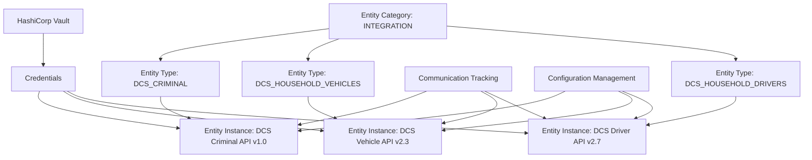
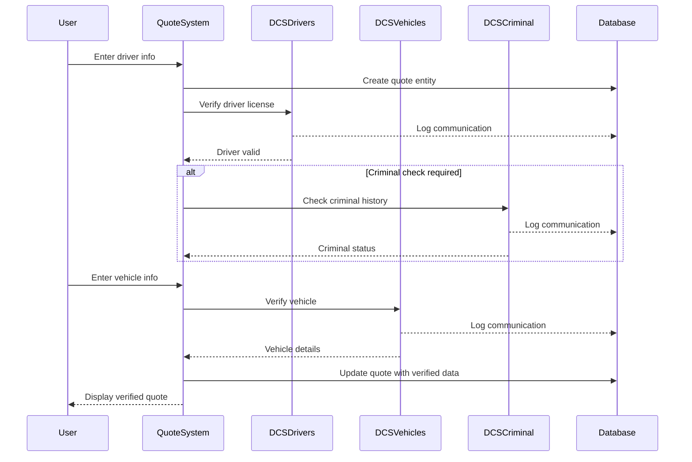
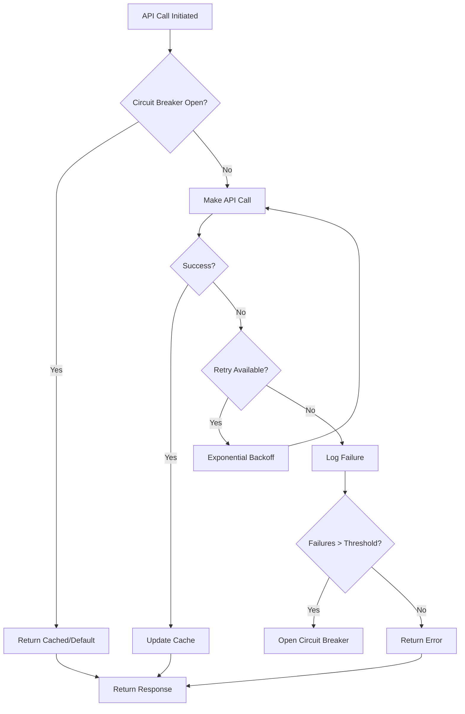

# DCS Entity Specifications

**Status:** DRAFT - Awaiting Implementation Approval  
**Date:** 2025-01-07  
**Version:** 1.0  
**Domain:** EntityIntegration  
**Purpose:** Comprehensive entity specifications for language model implementation

---

## Executive Summary

This document provides detailed specifications for implementing DCS (Driver Control Systems) entities within the Universal Entity Management architecture. DCS provides three critical APIs for insurance verification:
- **Criminal Background Checks** - Name/DOB-based criminal history searches
- **Household Drivers** - Address-based driver license verification
- **Household Vehicles** - Vehicle registration and title information

### Implementation Context
DCS entities follow the **Universal Entity Management pattern (GR-52)** as they are external API integrations. This approach provides:
- Zero code changes for new entity types
- Flexible JSON metadata storage
- Three-tier configuration management
- Built-in communication tracking
- Standardized security patterns

### Key Design Decisions
1. **Entity Pattern**: Use universal entity/entity_type tables (not custom tables)
2. **Authentication**: HTTP Basic Auth credentials stored in HashiCorp Vault
3. **Communication**: All API calls tracked in universal communication table
4. **Configuration**: Three-level hierarchy (system → program → entity)
5. **Caching**: Driver (24hr), Vehicle (7 days), Criminal (no cache)

---

## Entity Architecture Overview

### Universal Entity Management System



### Why Universal Entity Pattern?

**Integration Entities (DCS, Verisk, SendGrid)**
- Dynamic metadata storage as JSONB
- No schema changes for new integrations
- Configuration via hierarchy
- Polymorphic communication tracking
- Standardized across all external APIs

**Core Business Entities (quote, driver, vehicle)**
- Dedicated tables for query performance
- Structured columns with indexes
- Direct foreign key relationships
- Domain-specific validations

---

## Detailed Entity Specifications

### 1. DCS_HOUSEHOLD_DRIVERS Entity Type

#### Entity Type Definition
```json
{
  "code": "DCS_HOUSEHOLD_DRIVERS",
  "name": "DCS Household Drivers API",
  "description": "Driver license verification and criminal history via address or individual lookup",
  "category": "INTEGRATION",
  "subcategory": "BACKGROUND_CHECK",
  "metadata_schema": {
    "type": "object",
    "required": ["provider", "base_url", "api_version", "endpoint", "auth_type", "capabilities"],
    "properties": {
      "provider": {
        "type": "string",
        "const": "DCS"
      },
      "base_url": {
        "type": "string",
        "pattern": "^https://",
        "default": "https://ws.dcsinfosys.com:442"
      },
      "api_version": {
        "type": "string",
        "default": "v2.7"
      },
      "endpoint": {
        "type": "string",
        "default": "/apidevV2.7/DcsSearchApi/HouseholdDrivers"
      },
      "auth_type": {
        "type": "string",
        "const": "http_basic"
      },
      "capabilities": {
        "type": "array",
        "items": {
          "type": "string",
          "enum": [
            "address_search",
            "individual_search",
            "criminal_history",
            "alias_search",
            "associated_licenses",
            "prior_addresses"
          ]
        }
      },
      "max_records_per_response": {
        "type": "integer",
        "default": 100
      },
      "cache_ttl_seconds": {
        "type": "integer",
        "default": 86400,
        "description": "24 hour cache for driver lookups"
      },
      "rate_limit": {
        "type": "object",
        "properties": {
          "requests_per_minute": {"type": "integer", "default": 60},
          "requests_per_hour": {"type": "integer", "default": 1000}
        }
      },
      "circuit_breaker": {
        "type": "object",
        "properties": {
          "failure_threshold": {"type": "integer", "default": 3},
          "timeout_seconds": {"type": "integer", "default": 30},
          "half_open_requests": {"type": "integer", "default": 2}
        }
      },
      "retry_policy": {
        "type": "object",
        "properties": {
          "max_attempts": {"type": "integer", "default": 3},
          "backoff_type": {"type": "string", "default": "exponential"},
          "initial_delay_ms": {"type": "integer", "default": 1000}
        }
      }
    }
  }
}
```

#### Entity Instance Configuration
```json
{
  "name": "DCS Household Drivers API Production",
  "entity_type_id": "[DCS_HOUSEHOLD_DRIVERS type id]",
  "status_id": "[active status id]",
  "metadata": {
    "provider": "DCS",
    "base_url": "https://ws.dcsinfosys.com:442",
    "api_version": "v2.7",
    "endpoint": "/apidevV2.7/DcsSearchApi/HouseholdDrivers",
    "auth_type": "http_basic",
    "capabilities": [
      "address_search",
      "individual_search", 
      "criminal_history",
      "alias_search",
      "associated_licenses",
      "prior_addresses"
    ],
    "max_records_per_response": 100,
    "cache_ttl_seconds": 86400,
    "rate_limit": {
      "requests_per_minute": 60,
      "requests_per_hour": 1000
    },
    "circuit_breaker": {
      "failure_threshold": 3,
      "timeout_seconds": 30,
      "half_open_requests": 2
    },
    "retry_policy": {
      "max_attempts": 3,
      "backoff_type": "exponential",
      "initial_delay_ms": 1000
    },
    "address_status_codes": {
      "FOUND": "Address found and matched",
      "ANNF": "Apartment not found",
      "ANNS": "Apartment not supplied", 
      "HNNF": "House number not found",
      "SNNF": "Street name not found"
    }
  }
}
```

### 2. DCS_HOUSEHOLD_VEHICLES Entity Type

#### Entity Type Definition
```json
{
  "code": "DCS_HOUSEHOLD_VEHICLES",
  "name": "DCS Household Vehicles API",
  "description": "Vehicle registration, title, and lienholder information via address, VIN, or tag",
  "category": "INTEGRATION",
  "subcategory": "VEHICLE_VERIFICATION",
  "metadata_schema": {
    "type": "object",
    "required": ["provider", "base_url", "api_version", "endpoints", "auth_type", "capabilities"],
    "properties": {
      "provider": {
        "type": "string",
        "const": "DCS"
      },
      "base_url": {
        "type": "string",
        "pattern": "^https://",
        "default": "https://ws.dcsinfosys.com:442"
      },
      "api_version": {
        "type": "string",
        "default": "v2.3"
      },
      "endpoints": {
        "type": "object",
        "properties": {
          "household": {"type": "string", "default": "/apidevV2.3/DcsSearchApi/HouseholdVehicles"},
          "vin": {"type": "string", "default": "/apidevV2.3/DcsSearchApi/VehicleVin"},
          "tag": {"type": "string", "default": "/apidevV2.3/DcsSearchApi/VehicleTag"}
        }
      },
      "auth_type": {
        "type": "string",
        "const": "http_basic"
      },
      "capabilities": {
        "type": "array",
        "items": {
          "type": "string",
          "enum": [
            "address_search",
            "vin_search",
            "tag_search",
            "title_history",
            "lienholder_info",
            "registration_status"
          ]
        }
      },
      "cache_ttl_seconds": {
        "type": "integer",
        "default": 604800,
        "description": "7 day cache for vehicle lookups"
      },
      "vehicle_flags": {
        "type": "array",
        "items": {
          "type": "string",
          "enum": [
            "stolen",
            "flood_damage",
            "salvage_title",
            "rebuilt_title",
            "privacy_opt_out"
          ]
        }
      }
    }
  }
}
```

### 3. DCS_CRIMINAL Entity Type

#### Entity Type Definition
```json
{
  "code": "DCS_CRIMINAL",
  "name": "DCS Criminal Background API",
  "description": "Criminal history search by name and date of birth",
  "category": "INTEGRATION",
  "subcategory": "BACKGROUND_CHECK",
  "metadata_schema": {
    "type": "object",
    "required": ["provider", "base_url", "api_version", "endpoint", "auth_type", "capabilities"],
    "properties": {
      "provider": {
        "type": "string",
        "const": "DCS"
      },
      "base_url": {
        "type": "string",
        "pattern": "^https://",
        "default": "https://ws.dcsinfosys.com:442"
      },
      "api_version": {
        "type": "string",
        "default": "v1.0"
      },
      "endpoint": {
        "type": "string",
        "default": "/apidevV2.8/DcsSearchApi/Criminal"
      },
      "auth_type": {
        "type": "string",
        "const": "http_basic"
      },
      "capabilities": {
        "type": "array",
        "items": {
          "type": "string",
          "enum": [
            "name_dob_search",
            "offense_history",
            "conviction_details",
            "alias_names",
            "disposition_tracking"
          ]
        }
      },
      "cache_ttl_seconds": {
        "type": "integer",
        "default": 0,
        "description": "No caching for criminal searches (compliance requirement)"
      },
      "compliance": {
        "type": "object",
        "properties": {
          "fcra_compliant": {"type": "boolean", "default": true},
          "retention_days": {"type": "integer", "default": 2555},
          "purpose_required": {"type": "boolean", "default": true}
        }
      }
    }
  }
}
```

---

## Data Models and Schemas

### Database Tables (Following GR-41 Standards)

#### 1. Entity Category Table
```sql
-- Already exists in universal entity system
CREATE TABLE entity_category (
    id BIGINT UNSIGNED AUTO_INCREMENT PRIMARY KEY,
    code VARCHAR(50) NOT NULL UNIQUE,
    name VARCHAR(255) NOT NULL,
    description TEXT,
    status_id BIGINT UNSIGNED NOT NULL,
    created_by BIGINT UNSIGNED,
    updated_by BIGINT UNSIGNED,
    created_at TIMESTAMP DEFAULT CURRENT_TIMESTAMP,
    updated_at TIMESTAMP DEFAULT CURRENT_TIMESTAMP ON UPDATE CURRENT_TIMESTAMP,
    FOREIGN KEY (status_id) REFERENCES lu_status(id),
    INDEX idx_entity_category_code (code),
    INDEX idx_entity_category_status (status_id)
);

-- DCS uses existing INTEGRATION category
```

#### 2. Entity Type Table
```sql
-- Already exists in universal entity system
CREATE TABLE entity_type (
    id BIGINT UNSIGNED AUTO_INCREMENT PRIMARY KEY,
    category_id BIGINT UNSIGNED NOT NULL,
    code VARCHAR(50) NOT NULL UNIQUE,
    name VARCHAR(255) NOT NULL,
    description TEXT,
    metadata_schema JSON NOT NULL,
    status_id BIGINT UNSIGNED NOT NULL,
    created_by BIGINT UNSIGNED,
    updated_by BIGINT UNSIGNED,
    created_at TIMESTAMP DEFAULT CURRENT_TIMESTAMP,
    updated_at TIMESTAMP DEFAULT CURRENT_TIMESTAMP ON UPDATE CURRENT_TIMESTAMP,
    FOREIGN KEY (category_id) REFERENCES entity_category(id),
    FOREIGN KEY (status_id) REFERENCES lu_status(id),
    INDEX idx_entity_type_code (code),
    INDEX idx_entity_type_category (category_id),
    INDEX idx_entity_type_status (status_id)
);

-- Insert DCS entity types
INSERT INTO entity_type (category_id, code, name, description, metadata_schema, status_id)
VALUES 
    ([INTEGRATION_ID], 'DCS_HOUSEHOLD_DRIVERS', 'DCS Household Drivers API', '...', '{...}', [ACTIVE_ID]),
    ([INTEGRATION_ID], 'DCS_HOUSEHOLD_VEHICLES', 'DCS Household Vehicles API', '...', '{...}', [ACTIVE_ID]),
    ([INTEGRATION_ID], 'DCS_CRIMINAL', 'DCS Criminal Background API', '...', '{...}', [ACTIVE_ID]);
```

#### 3. Entity Table
```sql
-- Already exists in universal entity system
CREATE TABLE entity (
    id BIGINT UNSIGNED AUTO_INCREMENT PRIMARY KEY,
    entity_type_id BIGINT UNSIGNED NOT NULL,
    tenant_id BIGINT UNSIGNED,
    name VARCHAR(255) NOT NULL,
    metadata JSON NOT NULL,
    status_id BIGINT UNSIGNED NOT NULL,
    created_by BIGINT UNSIGNED,
    updated_by BIGINT UNSIGNED,
    created_at TIMESTAMP DEFAULT CURRENT_TIMESTAMP,
    updated_at TIMESTAMP DEFAULT CURRENT_TIMESTAMP ON UPDATE CURRENT_TIMESTAMP,
    FOREIGN KEY (entity_type_id) REFERENCES entity_type(id),
    FOREIGN KEY (tenant_id) REFERENCES tenant(id),
    FOREIGN KEY (status_id) REFERENCES lu_status(id),
    INDEX idx_entity_type (entity_type_id),
    INDEX idx_entity_tenant (tenant_id),
    INDEX idx_entity_status (status_id),
    INDEX idx_entity_name (name)
);

-- Insert DCS entity instances
INSERT INTO entity (entity_type_id, name, metadata, status_id)
VALUES 
    ([DCS_DRIVERS_TYPE_ID], 'DCS Household Drivers API Production', '{...}', [ACTIVE_ID]),
    ([DCS_VEHICLES_TYPE_ID], 'DCS Household Vehicles API Production', '{...}', [ACTIVE_ID]),
    ([DCS_CRIMINAL_TYPE_ID], 'DCS Criminal Background API Production', '{...}', [ACTIVE_ID]);
```

#### 4. Communication Type Table
```sql
-- Define DCS-specific communication types
INSERT INTO communication_type (code, name, description, category, status_id)
VALUES 
    -- Driver API Operations
    ('DCS_DRIVER_ADDRESS_SEARCH', 'DCS Driver Address Search', 'Search drivers by address', 'API_CALL', [ACTIVE_ID]),
    ('DCS_DRIVER_INDIVIDUAL_SEARCH', 'DCS Individual Driver Search', 'Search driver by DL or name/DOB', 'API_CALL', [ACTIVE_ID]),
    ('DCS_DRIVER_CRIMINAL_CHECK', 'DCS Driver Criminal Check', 'Criminal history for specific driver', 'API_CALL', [ACTIVE_ID]),
    
    -- Vehicle API Operations
    ('DCS_VEHICLE_ADDRESS_SEARCH', 'DCS Vehicle Address Search', 'Search vehicles by address', 'API_CALL', [ACTIVE_ID]),
    ('DCS_VEHICLE_VIN_SEARCH', 'DCS Vehicle VIN Search', 'Search vehicle by VIN', 'API_CALL', [ACTIVE_ID]),
    ('DCS_VEHICLE_TAG_SEARCH', 'DCS Vehicle Tag Search', 'Search vehicle by license plate', 'API_CALL', [ACTIVE_ID]),
    
    -- Criminal API Operations
    ('DCS_CRIMINAL_NAME_SEARCH', 'DCS Criminal Name Search', 'Criminal search by name/DOB', 'API_CALL', [ACTIVE_ID]);
```

#### 5. Communication Table Structure
```sql
-- Universal communication table (already exists)
CREATE TABLE communication (
    id BIGINT UNSIGNED AUTO_INCREMENT PRIMARY KEY,
    tenant_id BIGINT UNSIGNED,
    correlation_id VARCHAR(255),
    source_type VARCHAR(50) NOT NULL, -- 'system', 'user', 'entity'
    source_id BIGINT UNSIGNED NOT NULL,
    target_type VARCHAR(50) NOT NULL, -- 'entity' for API calls
    target_id BIGINT UNSIGNED NOT NULL, -- DCS entity ID
    communication_type_id BIGINT UNSIGNED NOT NULL,
    channel_id BIGINT UNSIGNED NOT NULL, -- DCS_API channel
    subject VARCHAR(500),
    request_data JSON,
    response_data JSON,
    status_id BIGINT UNSIGNED NOT NULL,
    error_message TEXT,
    scheduled_at TIMESTAMP NULL,
    sent_at TIMESTAMP NULL,
    delivered_at TIMESTAMP NULL,
    failed_at TIMESTAMP NULL,
    retry_count INT DEFAULT 0,
    created_by BIGINT UNSIGNED,
    updated_by BIGINT UNSIGNED,
    created_at TIMESTAMP DEFAULT CURRENT_TIMESTAMP,
    updated_at TIMESTAMP DEFAULT CURRENT_TIMESTAMP ON UPDATE CURRENT_TIMESTAMP,
    INDEX idx_communication_correlation (correlation_id),
    INDEX idx_communication_source (source_type, source_id),
    INDEX idx_communication_target (target_type, target_id),
    INDEX idx_communication_type (communication_type_id),
    INDEX idx_communication_status (status_id),
    INDEX idx_communication_scheduled (scheduled_at)
);
```

---

## Communication Patterns

### API Call Tracking Example

```json
{
  "correlation_id": "QUOTE-12345-DRIVER-VERIFY",
  "source_type": "entity",
  "source_id": "[quote_entity_id]",
  "target_type": "entity", 
  "target_id": "[dcs_drivers_entity_id]",
  "communication_type_id": "[DCS_DRIVER_ADDRESS_SEARCH]",
  "channel_id": "[DCS_API_CHANNEL]",
  "subject": "Driver verification for Quote #12345",
  "request_data": {
    "transaction_info": {
      "department_id": "INS001",
      "user_id": "system",
      "user_name": "Quote System"
    },
    "search_address": {
      "address": "123 Main St",
      "city": "Austin",
      "state": "TX",
      "zip_code": "78701"
    },
    "new_driver_criminal_history_flag": "Yes"
  },
  "response_data": {
    "address_search_status": "Found",
    "drivers_found": 2,
    "drivers_licenses": [
      {
        "dl_number": "***5678",
        "dl_state": "TX",
        "first_name": "John",
        "last_name": "Doe",
        "criminal_status": "Clear"
      }
    ],
    "response_status_code": "200",
    "response_status_message": "Success"
  },
  "status_id": "[SUCCESS_STATUS]",
  "sent_at": "2025-01-07 10:30:00",
  "delivered_at": "2025-01-07 10:30:02"
}
```

### Correlation ID Pattern

```
Format: {CONTEXT}-{ID}-{ACTION}-{SEQUENCE}

Examples:
- QUOTE-12345-DRIVER-VERIFY
- QUOTE-12345-VEHICLE-LOOKUP-01
- POLICY-67890-CRIMINAL-CHECK
- CLAIM-11111-VEHICLE-HISTORY
```

---

## Configuration Management

### Three-Tier Hierarchy (Most Specific Wins)

#### 1. System Level Configuration
```json
{
  "configuration_type_id": "[DCS_SETTINGS_TYPE]",
  "scope_type": "system",
  "scope_id": null,
  "config_data": {
    "default_timeout_ms": 30000,
    "max_retry_attempts": 3,
    "circuit_breaker_enabled": true,
    "audit_retention_days": 2555,
    "pii_masking_enabled": true,
    "ssl_verification": true,
    "connection_pool_size": 10
  }
}
```

#### 2. Program Level Configuration
```json
{
  "configuration_type_id": "[DCS_SETTINGS_TYPE]",
  "scope_type": "program",
  "scope_id": "[AGUILA_DORADA_PROGRAM_ID]",
  "config_data": {
    "criminal_check_required": true,
    "max_drivers_per_address": 10,
    "vehicle_history_depth_years": 5,
    "exclude_minor_offenses": true,
    "state_restrictions": ["TX", "CA", "FL"]
  }
}
```

#### 3. Entity Level Configuration
```json
{
  "configuration_type_id": "[DCS_SETTINGS_TYPE]",
  "scope_type": "entity",
  "scope_id": "[DCS_DRIVERS_ENTITY_ID]",
  "config_data": {
    "rate_limit_override": {
      "requests_per_minute": 100,
      "burst_allowed": true
    },
    "cache_override": {
      "ttl_seconds": 43200
    },
    "retry_policy_override": {
      "max_attempts": 5,
      "backoff_multiplier": 2
    }
  }
}
```

---

## Security and Credentials

### HashiCorp Vault Integration

#### Credential Storage Path
```
/secret/data/integrations/dcs/{environment}/{api_type}/credentials

Examples:
/secret/data/integrations/dcs/production/drivers/credentials
/secret/data/integrations/dcs/production/vehicles/credentials
/secret/data/integrations/dcs/production/criminal/credentials
```

#### Credential Structure
```json
{
  "account_number": "DCS-ACCOUNT-123",
  "user_id": "api_user_prod",
  "password": "encrypted_password_here",
  "rotation_policy": "90_days",
  "last_rotated": "2024-10-07T00:00:00Z",
  "notification_email": "security@insurance.com"
}
```

#### Apache Camel Vault Integration
```xml
<camelContext>
  <vaultConfiguration>
    <vault id="hashicorp">
      <address>https://vault.company.com:8200</address>
      <token>{{vault.token}}</token>
      <engine>secret</engine>
    </vault>
  </vaultConfiguration>
  
  <route id="dcs-driver-search">
    <from uri="direct:dcs-driver-search"/>
    <setHeader name="Authorization">
      <simple>Basic ${vault:secret:integrations/dcs/production/drivers/credentials:auth_header}</simple>
    </setHeader>
    <to uri="https4://ws.dcsinfosys.com:442/apidevV2.7/DcsSearchApi/HouseholdDrivers"/>
  </route>
</camelContext>
```

---

## Integration Workflows

### Quote Creation Workflow



### Error Handling Workflow



---

## Implementation Examples

### 1. Creating DCS Entity Types

```python
# Example: Creating DCS entity types during migration
def create_dcs_entity_types():
    # Get INTEGRATION category
    integration_category = EntityCategory.objects.get(code='INTEGRATION')
    
    # Define DCS entity types
    dcs_types = [
        {
            'code': 'DCS_HOUSEHOLD_DRIVERS',
            'name': 'DCS Household Drivers API',
            'description': 'Driver license verification and criminal history',
            'metadata_schema': {
                'type': 'object',
                'required': ['provider', 'base_url', 'api_version', 'endpoint', 'auth_type'],
                # ... full schema as defined above
            }
        },
        {
            'code': 'DCS_HOUSEHOLD_VEHICLES',
            'name': 'DCS Household Vehicles API',
            'description': 'Vehicle registration and title information',
            'metadata_schema': {
                # ... full schema
            }
        },
        {
            'code': 'DCS_CRIMINAL',
            'name': 'DCS Criminal Background API',
            'description': 'Criminal history search by name and DOB',
            'metadata_schema': {
                # ... full schema
            }
        }
    ]
    
    for type_def in dcs_types:
        EntityType.objects.create(
            category=integration_category,
            code=type_def['code'],
            name=type_def['name'],
            description=type_def['description'],
            metadata_schema=type_def['metadata_schema'],
            status_id=Status.ACTIVE
        )
```

### 2. Making a DCS API Call

```python
# Example: Driver verification during quote creation
def verify_driver_for_quote(quote_id, driver_data):
    # Get DCS entity
    dcs_entity = Entity.objects.get(
        entity_type__code='DCS_HOUSEHOLD_DRIVERS',
        status_id=Status.ACTIVE
    )
    
    # Prepare request
    request_data = {
        'transaction_info': {
            'department_id': 'INS001',
            'user_id': f'quote_{quote_id}',
            'user_name': 'Quote System'
        },
        'drivers': [{
            'id': driver_data['id'],
            'first_name': driver_data['first_name'],
            'last_name': driver_data['last_name'],
            'birth_date': driver_data['birth_date'],
            'dl_state': driver_data['dl_state'],
            'dl_number': driver_data['dl_number'],
            'household_flag': 'No',
            'criminal_history_flag': 'Yes'
        }]
    }
    
    # Create communication record
    communication = Communication.objects.create(
        correlation_id=f'QUOTE-{quote_id}-DRIVER-VERIFY',
        source_type='entity',
        source_id=quote_id,
        target_type='entity',
        target_id=dcs_entity.id,
        communication_type_id=CommunicationType.DCS_DRIVER_INDIVIDUAL_SEARCH,
        channel_id=Channel.DCS_API,
        subject=f'Driver verification for Quote #{quote_id}',
        request_data=request_data,
        status_id=Status.PENDING
    )
    
    # Send to Apache Camel for processing
    camel_client.send('direct:dcs-driver-search', {
        'communication_id': communication.id,
        'entity_id': dcs_entity.id,
        'request': request_data
    })
    
    return communication.id
```

### 3. Handling DCS Response

```python
# Example: Processing DCS response
def process_dcs_driver_response(communication_id, response_data):
    communication = Communication.objects.get(id=communication_id)
    
    # Update communication with response
    communication.response_data = response_data
    communication.delivered_at = timezone.now()
    
    if response_data.get('response_status_code') == '200':
        communication.status_id = Status.SUCCESS
        
        # Extract driver information
        drivers = response_data.get('drivers_licenses', [])
        
        # Update quote with verified driver data
        for driver in drivers:
            # Check criminal status
            criminal_status = driver.get('criminal_status', 'Unknown')
            
            # Cache driver data (24 hours)
            cache_key = f"dcs_driver_{driver['dl_number']}"
            cache.set(cache_key, driver, timeout=86400)
            
            # Update quote driver entity
            QuoteDriver.objects.filter(
                quote_id=communication.source_id,
                dl_number=driver['dl_number']
            ).update(
                verification_status='verified',
                criminal_status=criminal_status,
                verified_at=timezone.now()
            )
    else:
        communication.status_id = Status.FAILED
        communication.error_message = response_data.get('response_status_message')
        communication.failed_at = timezone.now()
    
    communication.save()
```

---

## Development Guidelines

### For Language Model Implementation

1. **Entity Creation Order**
   - Ensure INTEGRATION category exists
   - Create entity types with full metadata schemas
   - Create entity instances with environment-specific configs
   - Set up communication types for all operations

2. **Database Considerations**
   - Use existing universal tables (no custom tables needed)
   - Follow GR-41 naming conventions exactly
   - Include all audit fields (created_by, updated_by, etc.)
   - Add appropriate indexes for performance

3. **Security Implementation**
   - Never store credentials in database
   - Use HashiCorp Vault for all secrets
   - Implement credential rotation reminders
   - Mask PII in logs and communication records

4. **Communication Tracking**
   - Generate meaningful correlation IDs
   - Track both request and response data
   - Include timing information
   - Handle all error states

5. **Configuration Management**
   - Implement three-tier hierarchy resolution
   - Most specific configuration wins
   - Support runtime configuration changes
   - Validate configurations against schemas

6. **Error Handling**
   - Implement circuit breakers
   - Use exponential backoff for retries
   - Log all failures with context
   - Provide meaningful error messages

7. **Performance Optimization**
   - Implement caching per specifications
   - Use connection pooling
   - Batch requests where possible
   - Monitor API rate limits

8. **Testing Requirements**
   - Create mock DCS responses
   - Test all error scenarios
   - Validate circuit breaker behavior
   - Test configuration hierarchy

### Code Quality Standards

```python
# Good: Clear, follows patterns
dcs_entity = Entity.objects.get(
    entity_type__code='DCS_HOUSEHOLD_DRIVERS',
    status_id=Status.ACTIVE
)

# Bad: Hard-coded values
dcs_url = "https://ws.dcsinfosys.com:442/api/drivers"  # Don't do this
```

### Naming Conventions

- Entity Type Codes: `DCS_[API_NAME]` (uppercase with underscores)
- Communication Types: `DCS_[API]_[ACTION]` (uppercase with underscores)
- Correlation IDs: `[CONTEXT]-[ID]-[ACTION]-[SEQUENCE]` (uppercase with hyphens)
- Cache Keys: `dcs_[api]_[identifier]` (lowercase with underscores)

---

## Approval Checklist

- [ ] Entity specifications align with Universal Entity Management (GR-52)
- [ ] All three DCS APIs fully specified with metadata schemas
- [ ] Database structure follows GR-41 naming conventions
- [ ] Communication patterns include proper tracking and correlation
- [ ] Security patterns use HashiCorp Vault appropriately
- [ ] Configuration hierarchy supports all use cases
- [ ] Integration workflows cover quote creation process
- [ ] Implementation examples provide clear guidance
- [ ] Development guidelines are comprehensive for language model

---

**Note**: This specification provides complete context for implementing DCS entities within the existing Universal Entity Management system. The approach ensures consistency with established patterns while providing the flexibility needed for external API integrations.