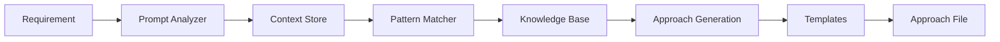

# Shared Infrastructure

## Overview

The shared-infrastructure directory contains actively maintained components that are essential to the requirements generation system's operation. These components provide templates, context management, agent configurations, and a knowledge base for pattern reuse.

## Directory Structure

```
shared-infrastructure/
├── templates/                  # Standardized templates for consistency
├── context-store/             # Context preservation and management
├── agent-configurations/      # 5-agent system configurations
└── knowledge-base/            # Reusable patterns and entity catalogs
```

## Active Components

### Templates (`/templates/`)

#### approach-template.md
- **Purpose**: Template for generating approach files that require user approval
- **Features**: 
  - Comprehensive requirement analysis sections
  - Pattern reuse calculations
  - Risk assessment framework
  - Enhanced validation sections for stakeholder review
- **Recent Updates**: Added sections for business summaries, technical summaries, database schemas, and validation criteria

#### requirement-template.md
- **Purpose**: Template for final requirement documents after approval
- **Features**:
  - Complete implementation specifications
  - Database schemas (Section E)
  - API definitions
  - Quality validation criteria

### Context Store (`/context-store/`)

#### domain-contexts/
- **Purpose**: Maintain domain-specific processing knowledge
- **Files**:
  - `producer-portal.json`: Producer Portal patterns and rules
  - `accounting.json`: Accounting domain specifics
  - `[domain].json`: Other domain contexts
- **Usage**: Loaded by agents to understand domain-specific requirements

#### pattern-applications.json
- **Purpose**: Track pattern usage across requirements
- **Format**: 
  ```json
  {
    "requirement_id": "patterns_applied",
    "reuse_metrics": "percentage"
  }
  ```
- **Benefits**: Helps achieve 85%+ pattern reuse target

#### simplification-decisions.json
- **Purpose**: Record simplification choices for consistency
- **Content**: Trade-offs, rationale, and outcomes
- **Usage**: Referenced by Simplification Enforcer agent

#### approval-history.json
- **Purpose**: Maintain audit trail of approval decisions
- **Tracks**: User feedback, revision counts, decision rationale
- **Benefits**: Learning from past decisions

### Agent Configurations (`/agent-configurations/`)

#### Current 5-Agent System
1. **prompt-analyzer.yaml**: Deep requirement understanding
2. **pattern-matcher.yaml**: Pattern discovery and reuse
3. **simplification-enforcer.yaml**: Complexity reduction
4. **implementation-generator.yaml**: Requirement generation
5. **quality-validator.yaml**: Standards compliance

#### Historical Reference
- `archived-11-agent-system/`: Previous architecture (reference only)

### Knowledge Base (`/knowledge-base/`)

#### entity-catalogs/
- **Purpose**: Reusable entity definitions
- **Contents**: Common entities across domains
- **Benefits**: Prevents duplicate entity creation

#### pattern-libraries/
- **Purpose**: Common implementation patterns
- **Examples**: Form patterns, API patterns, validation patterns
- **Usage**: Referenced by Pattern Matcher agent

#### relationship-mappings/
- **Purpose**: Standard entity relationships
- **Format**: Graph-based relationship definitions
- **Benefits**: Consistent data modeling

#### architecture-decisions/
- **Purpose**: Architecture Decision Records (ADRs)
- **Contents**: Key design choices and rationale
- **Usage**: Guide consistent architectural patterns

## Usage Guidelines

### For Requirement Processors
1. Templates are automatically applied by the system
2. Context is preserved throughout processing
3. Patterns are discovered and suggested automatically
4. Agent configurations control the processing flow

### For System Administrators
1. Update templates when new sections are needed
2. Monitor context store for accuracy
3. Review agent configurations for optimization
4. Maintain knowledge base with new patterns

### For Developers
1. Reference templates for output format
2. Use context store APIs for state management
3. Follow agent configuration schemas
4. Contribute new patterns to knowledge base

## Integration with Processing Flow



## Best Practices

### Template Management
- Keep templates concise but comprehensive
- Update both approach and requirement templates together
- Document any template changes in this README

### Context Preservation
- Clean up old contexts periodically
- Ensure domain contexts stay current
- Back up approval history regularly

### Pattern Library Growth
- Add new patterns as they're discovered
- Document pattern usage and effectiveness
- Remove obsolete patterns quarterly

### Agent Configuration
- Test configuration changes thoroughly
- Keep archived configs for reference
- Document why changes were made

## Recent Updates

### 2025-01-14: Enhanced Validation Sections
- Added business summary sections to approach template
- Added technical summary for developers
- Added suggested database schemas section
- Added comprehensive validation criteria
- Updated all 23 approach files with new sections

## Maintenance Schedule

- **Weekly**: Review context store for accuracy
- **Monthly**: Update pattern libraries with new discoveries
- **Quarterly**: Archive old contexts and patterns
- **Annually**: Major template reviews and updates

## Support

For questions or issues with shared infrastructure:
1. Check agent logs for configuration issues
2. Verify template syntax if generation fails
3. Review context store for missing data
4. Consult architecture decisions for guidance

---

**Last Updated**: 2025-01-14  
**Maintained By**: Requirements Generation Team  
**Status**: Actively Used and Maintained